# (APPENDIX) Appendix {-}

```{r, include = FALSE}
source("common.R")
```

# CSS Crash Course {#css-crash}


Every element of a website that you see, from links to pictures to paragraphs, has a category label. These labels can be tags (for example, all links on websites have `a` tags, all big headers have `h1` tags), or they can be IDs or classes (described later).  If you know the label for something on a website, then you can style its appearance by using a `.css` file. In a CSS file, you write style rules that will apply to all elements of the same category. This is a very useful thing to be able to do because it allows you to break free from the limitations of built-in templates and themes that come with R Markdown.

Below is a quick example of some CSS that would change all link colors to the color "orchid" and all link text from being uppercase:

```{r, eval=FALSE}
a {
  color: orchid;
  text-transform: uppercase;
}
```

You begin with the element's "label" (technically called a *selector*). Within curly braces, `{ }`, you can include as many different style properties as you'd like for that element. Each new property must end with a `;`.  What are your options for properties to style? [There are many](https://www.w3schools.com/cssref/), but don't feel overwhelmed-- just pick one or two things to change as you start out.

## What's in a name?

How could you have known that the selector for links was an `a`? The answer is by opening up your existing website, and right-clicking anywhere on the page and clicking on *Inspect* (in Chrome browsers) or *Inspect Element* (in Firefox).

<center> 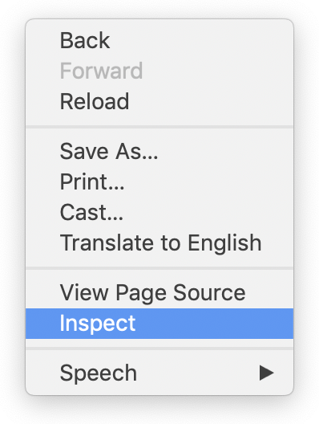{width=300px} </center>

Clicking on this will open a small set of windows inside of your browser called the Developer Tools (a.k.a "devtools") or the inspector. These give you an inside peek into all the CSS styles that are being applied to every element in the site. (The examples that follow use the Chrome developer tools.)

In the lower left pane of the subwindow, click on the icon of a rectangle with an arrow. Now as you hover and then click on anything in your website, you will see the contents of the developer tools change. The pane on the right shows the CSS styles that are applied. 

<br>

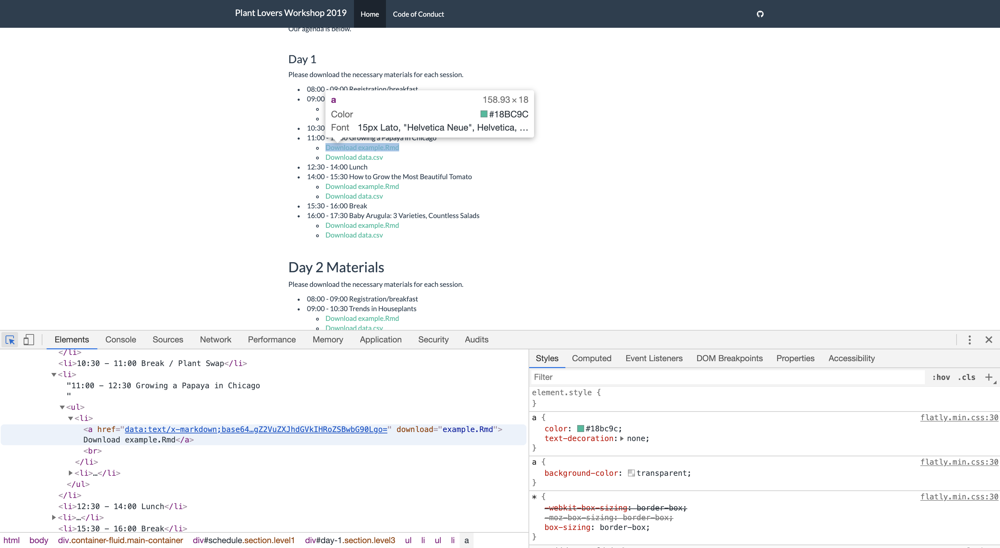
<br>

Taking a closer look at the CSS pane on the right, we can see that the link we are hovering over does indeed have an `a` as its selector. 

<br>

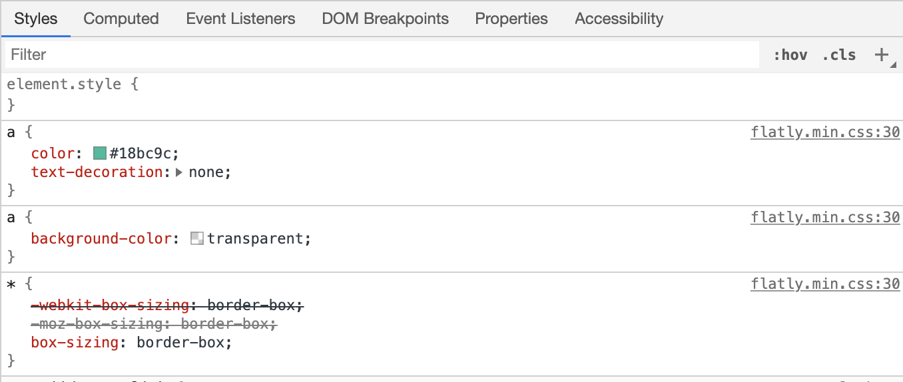

<br>


One neat thing about the developer tools is that you can click and temporarily edit the CSS properties in this very window and  simlutaneously see the changes take effect on the page. These edits only happen in your browser, so nothing in your R Markdown document will change (in fact, your edits will be lost as soon as you refresh the page in your browser), but editing here is a fast way to test out any CSS ideas.

[ALSO ADD TEXTTRANSFORM IN SCREENSHOT TO MATCH ABOVE EXAMPLE]

<br>

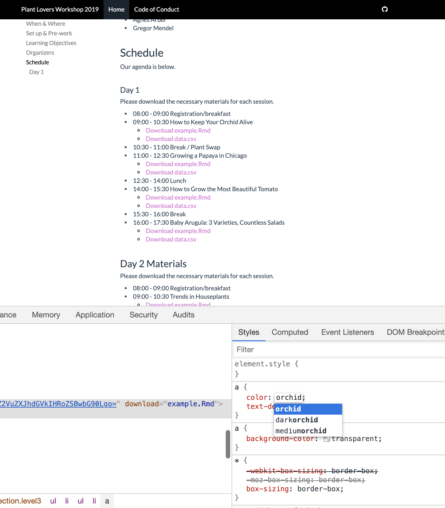
<br>

There's a lot more we could say about CSS here. But it's faster and more rewarding to learn via real examples. Let's start tinkering!

[OTHER TOPICS TO MENTION:]
[1. EXAMPLES OF CLASSES AS CSS SELECTORS. (WHY DO SOME SELECTORS BEGIN WITH . AND OTHERS DON'T?)]
[2. MULTIPLE ATTRIBUTES. COMBINING THEM WITH `.` vs separated by spaces ]

## How do I change the color of....?

I'm going to model how I would go about changing the color of the navbar of an RMD site. We'll use the developer tools to try out different options in real time.

1. Pull up your site and right click to open the developer tools. 
1. When we click on the navigation bar, we see that it highlights a certain line of HTML in the left pane of the developer tools. Look for anything that says `class = `. The values that follow `class` are the CSS selectors that are currently styling our navigation bar. 

In this case, our navbar has three classes `navbar`, `navbar-default`, and `navbar-fixed-top`. 

    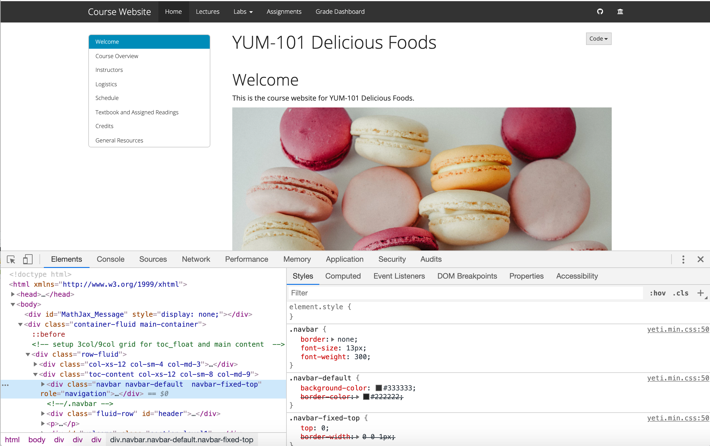


In the righthand pane of the developer tools. we see these classes being used in the CSS (notice that a class needs to have a `.` before it in when it's a selector--but a tag, like the link example above, does not). 

[SAY SOMETHING ABOUT THE ORDER EACH ARE LISTED?]


1. Let's choose the first CSS selector `.navbar` and play around with it in this pane to decide what color we'd like.
1. Type `background-color:` followed by any [HEX code or rgb code](https://www.google.com/search?q=color+picker) and press `Enter`. You can also click on the small color square to use sliders to set the color and transparency of your navigation bar. I'm selecting _________ color.  

    <center>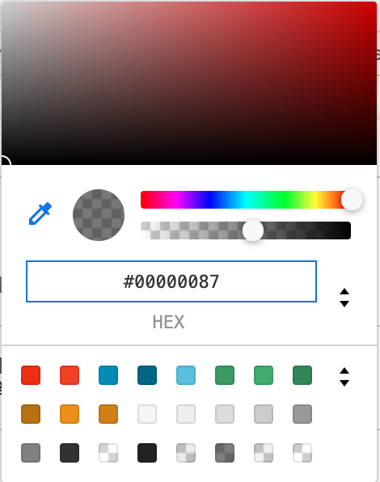{width=200px}</center>

<br>

1. When you change the color in the developer tools, you should see the element on your site also changing in real-time. Cool, huh? If you don't see the color changing on your site, then it means you either have the wrong selector OR it means that something else is overriding your color choice (do you see a strikethrough line through what you just wrote?). You can force it to go with your choice by adding `!important` to the end of line you added, right before the `;`.


1. Now we need to immortalize your color choice by putting your selector and your color choice in a CSS file. 

1. Make a CSS file (file > new file > text file > save as style.css) and paste something like this into it.

```style.css

.navbar {
  background-color: #fcfcfc;
}

```

1. Link your CSS file to your R Markdown site/blog/tool...see the specific cookbook for how to do this for your particular tool.

1. Build your site--do you see your CSS style taking effect?


    
# Backlog

Here is a list of items that would be cool to include, but are lower priority. 

\

\

* [timer function for workshops]

* Continuous integration? https://github.com/chris-prener/travis-test

* pandoc/ knitr/ addressing a letter version of R Markdown and YAML

# Miscellaneous

* Consistent use of pronouns in the book: our site, your site, we suggest, I suggest....?
* Rmd, R Markdown doc, `.Rmd` -- which to use?
* A growing yaml----show each feature getting added on? Or just focus on the one at hand?


Other pursuits:
* PR to Hugo Academic Themes
* rmd4edu: Template package
* writing function and doing a PR for the roxygen comment stuff for package
* word doc template

# Spillover from distill

**Unique to R Markdown** [ Probably remove]

* `rmarkdown:::site_skeleton(getwd())`
* What happens to Rmd's placed in subdirectories?
    ** They're still knit...but not compiled in an automatic and *smart* way (?)
* A logo can only be added with HTML/CSS-- unless you create your own pandoc template (Ahh!)
* Footer must be constructed using HTML/CSS manually with `includes....` in YAML. And it doesn't go all the way across the page easily. 
* Google analytics need to be inserted manually within HTML file and `includes.. before body` in YAML
* Appendix not an option unless manually built into footer.
* Favicon: can you not do this in r Markdown within the YAML?
* `output: html_document`....or whatever else you want.


# Teaching and Learning with Jupyter Book Review

Desiree's thoughts: 


__Good stuff__

* Description of the use cases
* Screenshots of examples of activities/questions in notebooks (e.g. in Section [2](https://jupyter4edu.github.io/jupyter-edu-book/why-we-use-jupyter-notebooks.html#why-do-we-use-jupyter).3.22.
* Inclusion of 'pro-tips content' throughout content
* I do like the pedagogical patterns section, though I see how including something like this greatly increases the scope of our project. I think what I like most about it, is that they're concrete examples of creative use-cases.
* The [tips and tricks section](https://jupyter4edu.github.io/jupyter-edu-book/jupyter.html#tips-and-tricks) I find to be useful, practical advice. In thinking of how this applies toour own project, I think a lot of this could be condensed into little "tips" boxes.
* Different ways of running Jupyter w/ pros and cons. Useful for educators to know ahead of time


__Stuff I don't like as much__

* Needs way more color, pictures, graphics. I think there is too much text for this to be an effective way of "selling" the notebooks. You have to read a lot of prefaces before you get to the practical implementations and concrete examples.
* Tone is kinda dry
* Not sure if it's the layout, but I think just by nature of it being a book, it doesn't feel like as a user that I can or should skip around to only the sections I need. It's hard to know which sections will be most useful to me when I "arrive" to this resource.


# R Markdown Themes {#rmd-themes}

Theme options include the following. Click through the tabs to see what they each look like on our [basic course demo site](https://rstudio4edu.github.io/basic-course-website/).

### `default` 

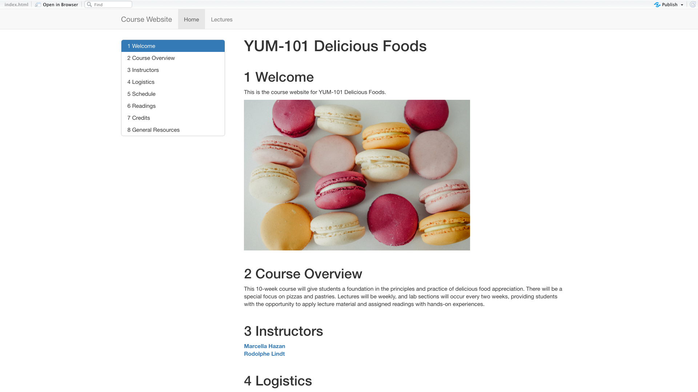{width=100%}

### `cerulean`

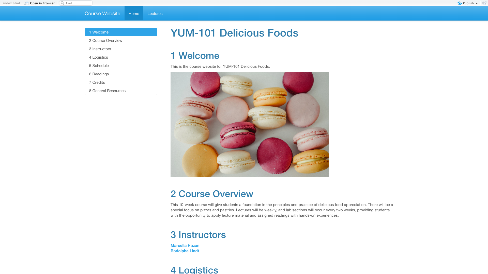{width=100%}

### `journal`

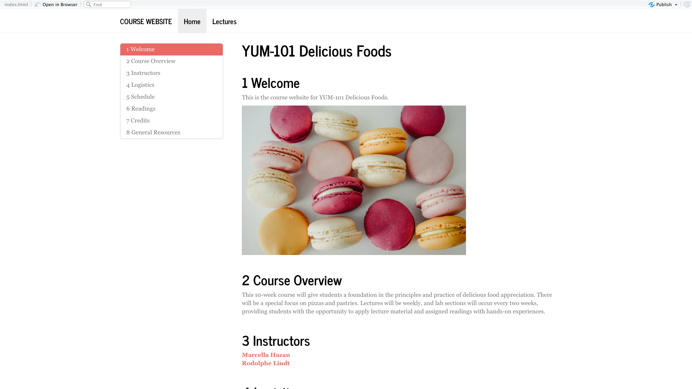{width=100%}


### `flatly`

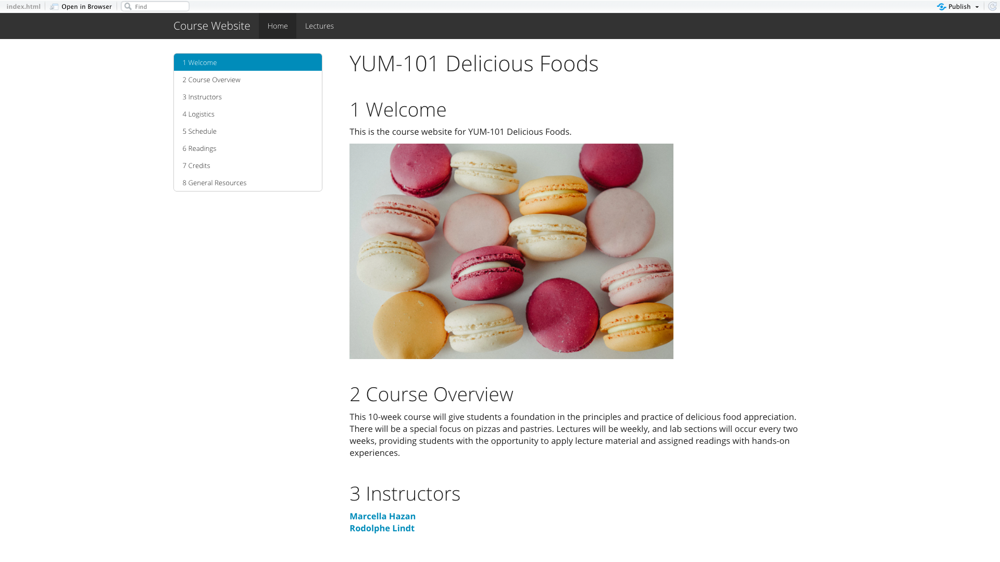{width=100%}

### `darkly`

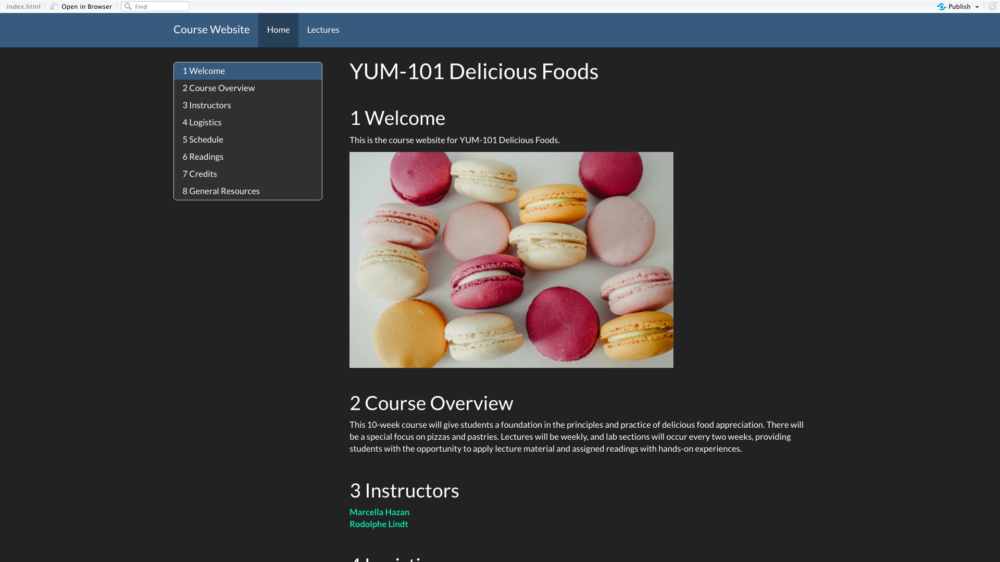{width=100%}


### `readable`

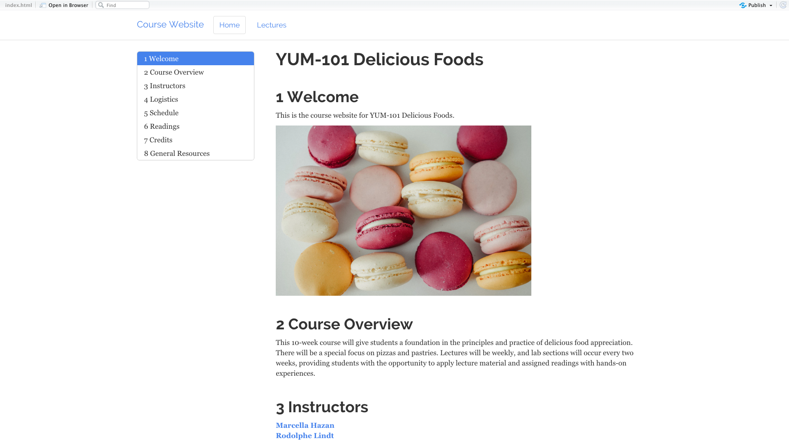{width=100%}


### `spacelab`

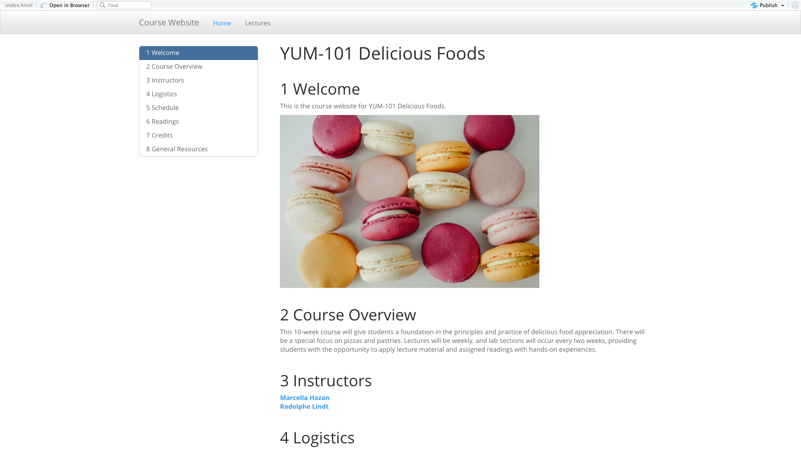{width=100%}


### `united`

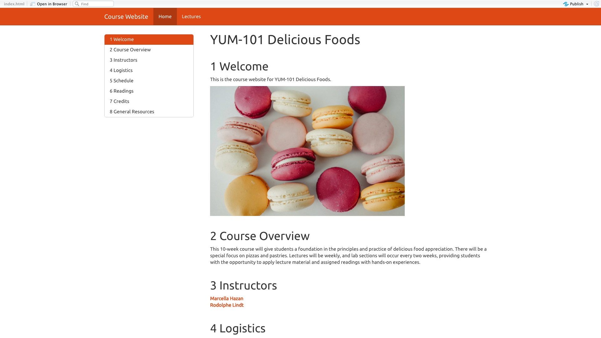{width=100%}


### `cosmo`

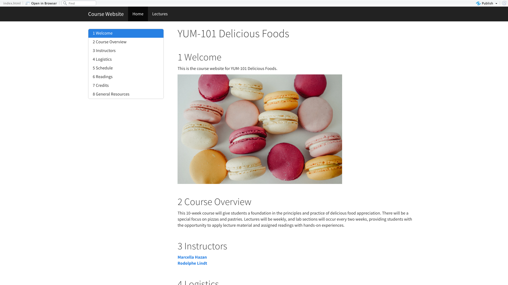{width=100%}


### `lumen`

{width=100%}


### `paper`

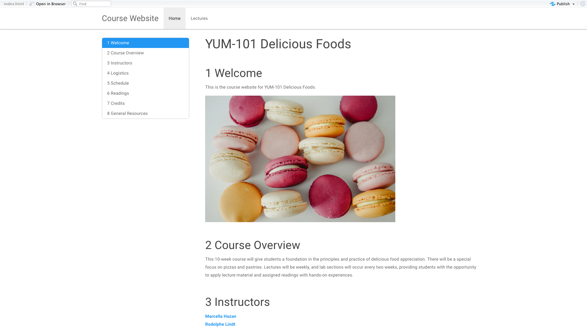{width=100%}


### `sandstone`

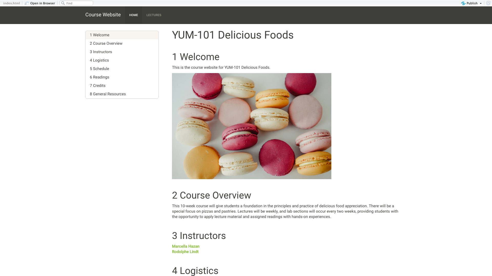{width=100%}


### `simplex`

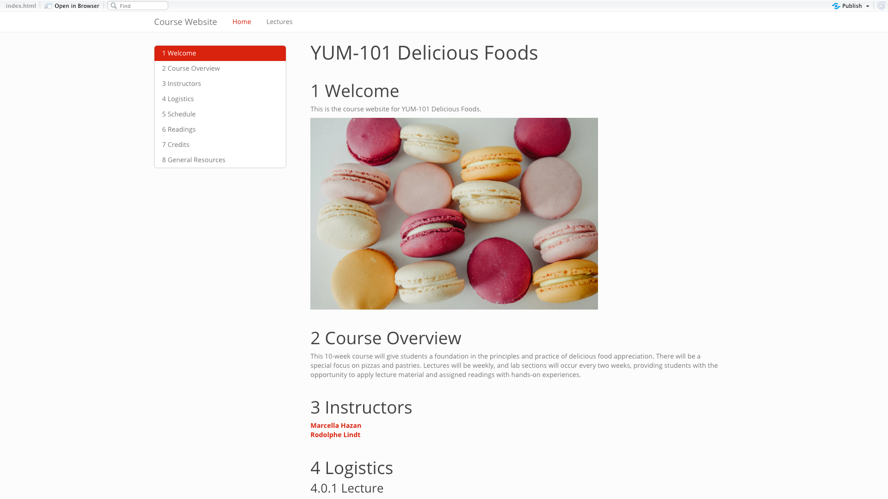{width=100%}


### `yeti`

{width=100%}


# What should I make {#teach-offer}

```{r child = "modules/clickable-toc.Rmd"}

```

\


I think that quite early on in this book, we should try to answer the question "I'm an educator...what should/can I make here?".  
I'm not sure whether this should happen here or in the preface, but one way we can do this is with the flowchart. Below is just a *very rough* conceptual sketch of how a flowchart here might be a fun way to give users a visual map of where they could end up after using the rstudio4edu resource. [This is the idea I'm riffing off of.](https://www.beckysimpson.co/flowcharts) 

Needless to say, right now the example below is yucky, too small, and incomplete. And it's also just kind of acting as funny eye-candy. But if we make it nicer (and perhaps summarize it more efficiently with a table beneath it), would this be the spot for it? (Could alternatively place this in the introductory section for the Cookbooks Section--and only include tools that we have cookbooks for (ie. leave out stuff like Connect)).

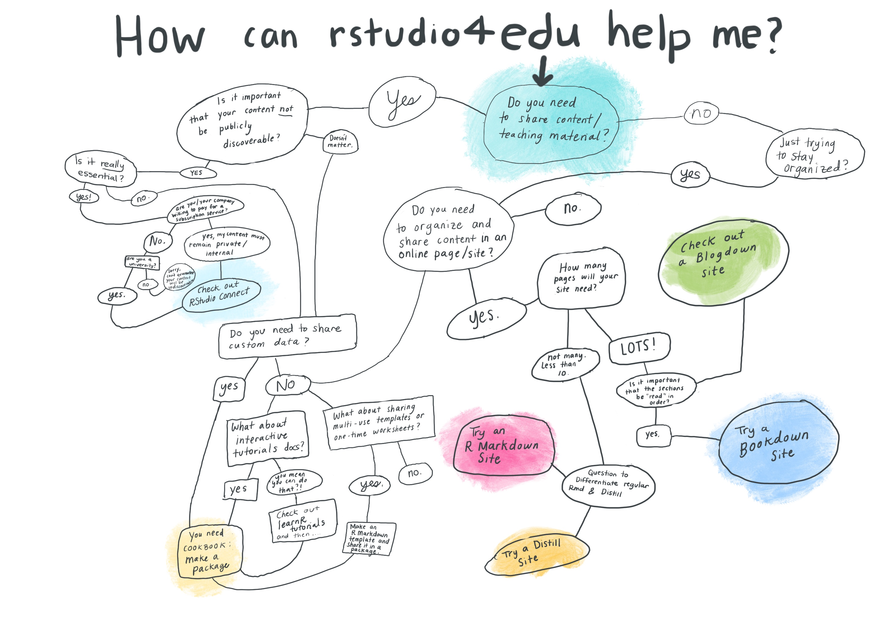

# Teaching learners {#teach-learners}

+ teaching to make reprexes

+ teaching about community/SO/etc

# What to do on day 1 {#teach-day1}

See: https://github.com/rstudio-education/datascience-box/issues/47

- Link to mine's eat cake first stuff.
- start with a data package (if you can); caveat: you are teaching importing data.
- link to mine's dsinabox, perhaps garrett's latest repro research stuff
- orient to IDE (great tip by kierisi: play with RStudio IDE themes?)
- start with Rmd (if you can)- you can teach minimal markdown etc.

# Licensing your content

Some opinionated guidance.

Does it make sense to move the Licensing section closer to the end of the book-- after they've created new content (or remixed ours or others') with the cookbooks?

# Remixing licensed content

Recommended ways to offer attribution

If you are reusing others' content in say a workshop with slides, add your attributions on the last slide, and include an "Attributions" section in the repository's READ ME file.

So if it’s a workshop, once on the last slide + in the repo readme. 

If it’s a semester long course, just somewhere on the course website

# Community

https://community.rstudio.com/c/teaching
