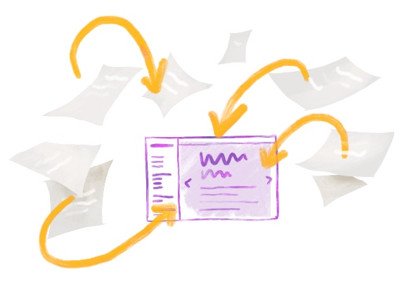
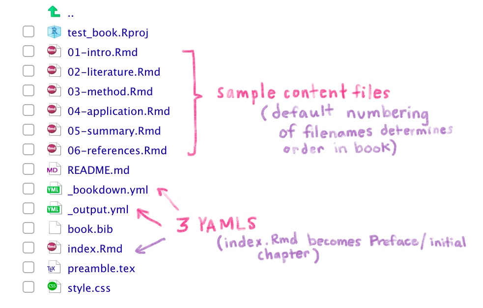
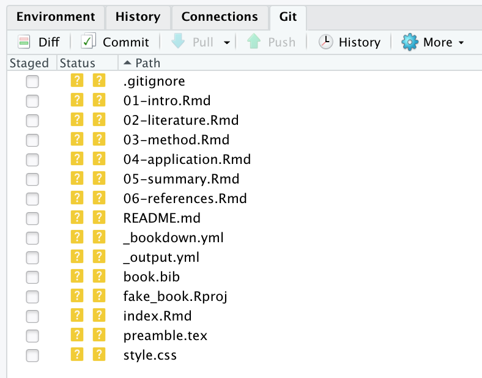
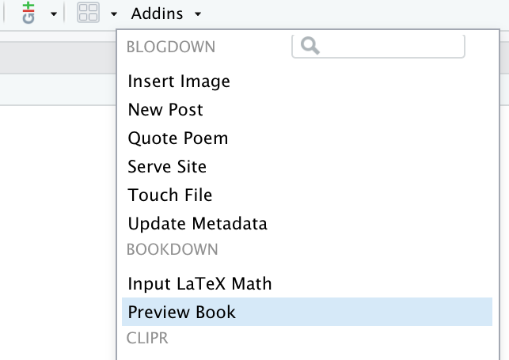

# (PART) Cookbook: Bookdown book {-}

```{r, include = FALSE}
source("common.R")
knitr::opts_chunk$set(fig.align="center")
```

# Introduction {-#intro-bookdown}

```{r echo = FALSE, out.width="40%"}
knitr::include_graphics("images/illos/bookdown-base.jpg")
```

This is a cookbook for educators who would like to use bookdown to organize and deliver educational content for their audience. Despite the name, using bookdown doesn't mean that what you make *has* to be a book--but a bookdown site does come with some built-in features (e.g. its hallmark heavy-duty table of contents) that make it well-suited for long-form content (or many R Markdown files that can be organized in a chronological way). This, and the lack of a navbar make a bookdown site feel somewhat less like a typical website and a bit more like a textbook, but how you use it is up to you. You can place an entire course-worth's of materials in a bookdown book, or you could pare down your TOC headers and create a site for a short workshop. This rstudio4edu resource is itself a bookdown! 

**In short, bookdown's main features include:**

* A very prominent table of contents
* Cross-references
* Numbered figures, equations, and tables
* Distribution of your book as a PDF, an HTML website, etc.
* A built-in search feature (that's a bit unintuitive to use)


<div class = "side-by-side no-anchor">
<div class = "side1">

```{r echo = FALSE, fig.link = "#make-book"}

```

</div>
<div class = "side2">

#### [Make a book](#make-book)
Here, we'll guide you through creating an out-of-the-box bookdown book. We make only the most minimal changes to content and style necessary to get you a shareable bookdown site.

</div>
</div>

\

<div class = "side-by-side no-anchor">
<div class = "side1">

```{r, echo= FALSE, fig.link = "#book-yours"}
knitr::include_graphics("images/illos/insert.jpg")
```

</div>
<div class = "side2">

#### [Make it yours](#book-yours)
You'll personalize your book's content here by adding chapters.

</div>
</div>

\

<div class = "side-by-side no-anchor">
<div class = "side1">

```{r, echo= FALSE, fig.link = "#book-care"}

```

</div>
<div class = "side2">

#### [Caring for your book](#book-care)
You'll develop a workflow for editing your book, adding new content, and hiding pages that are works-in-progress.

</div>
</div>

\

<div class = "side-by-side no-anchor">
<div class = "side1">

```{r, echo= FALSE, out.width="52%", fig.link = "#book-dress"}
knitr::include_graphics("images/illos/bookdown-dressup.jpg")
```

</div>
<div class = "side2">

#### [Dress it up](#book-dress)

Here, you'll find instructions for no-fuss website customizations that leverage built-in features that *do not* rely on knowing, learning, or using CSS.

</div>
</div>

\

<div class = "side-by-side no-anchor">
<div class = "side1">

```{r, echo= FALSE, out.width="50%", fig.link = "#book-fancy"}
knitr::include_graphics("images/illos/bookdown-fancy.jpg")
```

</div>
<div class = "side2">

#### [Make it fancier](#book-fancy)

If you want to take your customization further, we show you how to make your book look like the crème de la crème with some CSS, HTML, and (a teensy bit of) JavaScript.

</div>
</div>

## What are we making? {-}

If you have experience making basic R Markdown sites, then you can think of a bookdown as an R Markdown site with additional YAML files (there are *three*, which take care of configuration and stitching the site together) and some more rigid rules about what can start each document. 


[INSERT ANALOGY HERE FOR THE FILE TYPES]

As we build our first book, we'll want to keep in mind these elements:

* **Level 1 headers**, become new site pages/ book chapters
* **Three YAMLS**, one of which is `index.Rmd`and works as it does for RMD sites
* **.Rmd file order**, can be set manually in one of the YAMLs

Additionally, just like we did for R Markdown sites, we'll demo how to publish your bookdown site for free using GitHub Pages, so we'll also need:

* **A `docs/` folder** which will be the folder that we will use as the “boarding area” for your rendered site files to deploy on GitHub Pages.
* To **turn on GitHub Pages for your repository**.

There are certainly other options for publishing (aka deploying) a bookdown website. For an overview of other options, you may reference: https://rstudio.github.io/distill/publish_website.html.


## Pros and cons of using bookdown sites {-}

* Pros: Feels like working with a regular RMD site, once you get the hang of the YAMLS and the Level 1 headers. 

* Cons: Three YAMLs. Can't use tabsets. Your directory will be likely be filled with many `.Rmd`s, and there's no good way to organize them into subdirectories.


## Is this cookbook for you? {-}

**Pre-requisites:**

* You have a [GitHub account](https://github.com/)
* You are comfortable with the basics of using R and RStudio
* You understand how R projects work
* You understand the difference between a regular R script and an R Markdown document
* You have some familiarity working with R Markdown documents
* It is helpful, but not necessary if you have some familiarity with making regular RMD sites

**What you’ll learn:**

* How to compile multiple R Markdown files into a Bookdown site
* How to publish your Bookdown for free via GitHub Pages
* How to add basic customization using built in options
* How to take the customization even further by using HTML, CSS, and a little bit of JavaScript


## Learning resources {-}

* Bookdown examples from competition
*
* 

# Make a book {#make-book}


```{r, echo= FALSE, out.width="70%"}

```

## tl;dr

This tl;dr is for readers who are already experienced with GitHub and want to see our “cheatsheet” version of the rest of this chapter. If you are looking for screenshots plus some hand-holding, we think you’ll benefit from reading the rest of this chapter.

**Here’s how you make an bookdown site from scratch, using a built-in site skeleton as a template:**

1. Start with an empty RStudio project linked to a remote GitHub repository that you can push/pull to from your local copy in RStudio.

1. In your project, create a simple shell for a bookdown website shell by running the following code in your R console:

    ```{r book-skeleton, eval = FALSE}
    bookdown:::bookdown_skeleton(getwd())
    ```

1. In your `_bookdown.yml` file, prep for publishing to GitHub Pages by changing the output directory of your book to a folder named `"docs"`.
    
    ```{r, echo= FALSE, eval = FALSE}
    ymlthis::yml_empty() %>%
      yml_bookdown_opts(book_filename = "fake-book",
                        output_dir = "docs",
                        delete_merged_file = TRUE) %>%
      yml_toplevel(language = list(list(ui = list(chapter_name = "Chapter ")))) %>%
      yml_toplevel(new_session = TRUE) %>%
      asis_yaml_output(fences = FALSE)

    # Add note about how quotes don't matter?

    ```
    
1. Tell GitHub Pages to bypass using Jekyll to build your book by adding a single empty file named `.nojekyll` to your project root directory.

    ```{r eval = FALSE}
    file.create(".nojekyll")
    ```


1. Build your book using the RStudio "Build" pane or by going to *Addins* > *Preview Book*

1. Push and commit to send your book online to GitHub- do you see your `.html` files in the `"docs"` folder?

1. Turn on GitHub Pages by going to your repository online. Click on the repository’s settings and under GitHub Pages, change the Source to be the `master branch /docs` folder.

1. Edit your book, build it, then push and commit to GitHub to publish your changes online.

1. Rinse and repeat! Every push to your `master` branch triggers the online version of your site to update.


## Getting set up

```{r echo = FALSE, out.width = "20%"}
knitr::include_graphics("images/illos/Gears.jpg")
```

### Packages needed

We'll use the following packages:

```{r, eval=FALSE}
#install.packages("bookdown")
library(bookdown)
```

### Make a project {#book-proj-first}

For your first bookdown site, we recommend starting by creating a GitHub repository online first, then making a project in RStudio. 

<!--TODO: add link to other workflow that we recommend later-->

```{r child = 'modules/github-first-project.Rmd'}

```


### Make a book skeleton {#book-site-skeleton}

We'll start by creating the shell for a minimal bookdown website, and we'll publish this to GitHub Pages straight away. In your R console, type and run the following code:

```{r, eval = FALSE}
bookdown:::bookdown_skeleton(getwd())
```

:::gotcha
Note that we use ::: here (with three colons!) to generate these files.
:::

You will end up with the files in your working directory shown in Figure \@ref(fig:bookdown-dir).

Close RStudio and re-open your book by clicking on the project file (`.Rproj`). When you re-open the project, you may notice the `.Rproj` file shows up in your Git pane, which means that the file has changed. What happened? RStudio has detected that you have built a book, so a single line has been added to your `.Rproj` file:

```yaml
BuildType: Website
```

## A mini-orientation {#book-site-orientation}

Our skeleton created several out-of-the-box content files for our site, three of which contain YAML content:  

```{r bookdown-dir, echo = FALSE, out.width="500px", fig.cap="Book skeleton"}

```

1. `index.Rmd`. Any content in this file will be your bookdown site’s homepage. It will also be the initial chapter in your book, usually a preface or introductory chapter. This is also the only `.Rmd` file in the book that will begin with YAML (aka configuration) info. This file *must* be named `“index.Rmd”`.

1. `.Rmd` files starting with `"01-"`, `"02-"`, etc. These make up the other book content. By default, our book skeleton prefaces their filenames with numbers, which is what bookdown will use to order our content after `index.Rmd.` We'll eventually change these filenames (and the way we order files), but for now let's leave them as is. 

1. The other 2 YAMLs: `_bookdown.yml` and `_output.yml` contain other configuration info that we'll detail later. Highlights include that `_bookdown.yml` will be the place where we specify custom ordering of our bookdown `.Rmd`s, and `_output.yml` is where we'll link to supporting files like custom HTML and CSS. 

When we build our book, all of the `.Rmd` files will eventually be rendered as HTML files (i.e., website-ready pages). 

Nothing to do here, but good to know these things! We'll circle back to editing these files later.


## Push to GitHub {#book-push}

Let's get these website files pushed up to our remote repository on GitHub. Do the following from RStudio:

1. **Click *Git* ** in the same RStudio pane that also contains the *Environment* tab.

2. **Check the box(es)** under the "Staged" column and click *Commit*.

3. **Add a commit message** like "Creates book skeleton" and then click *Push*.

```{r echo = FALSE, fig.out="300px" }

```

## Change output directory {#book-output}

Now let's make a small change. In order to publish to GitHub pages, we'll want to send all of our rendered site files (i.e., the HTML files we'll soon have) to a folder named `docs/`. We do this by editing one of bookdown's YAML files.

* **Open `_bookdown.yml` and add `output_dir: docs`** on its own line:

    ```{r yml-book-docs, echo = FALSE}

    ymlthis::yml_empty() %>%
          yml_bookdown_opts(book_filename = "fake-book",
                            output_dir = "docs",
                            delete_merged_file = TRUE) %>%
          yml_toplevel(language = list(list(ui = list(chapter_name = "Chapter ")))) %>%
          asis_yaml_output(fences = FALSE)

    # Add note about how quotes don't matter?
    ```


:::gotcha
You might think that changing for the output directory to the `/docs` folder would be something that would be handled by the `_output.yml`, given its name, but confusingly, this is added to the `_bookdown.yml` instead.
:::

This step is a one-time step. It says: 
    
> "Please take all of my `.html` files that will get made when I *build*, and place them in the `docs/` folder. And if there's not a `docs/` folder, then make one." 
    
Having our HTML files live in `docs/` is necessary for using GitHub pages to make our pages go live, which we'll do soon. You do *not* need this step if you will not be publishing to GitHub Pages.


While we have `_bookdown.yml` open, let's add an additional line that will have each `.Rmd` in our book be processed independently. This is preferable, but if you think you have a use-case where this wouldn't be what you want, read up more about the alternative [here](https://bookdown.org/yihui/bookdown/new-session.html). 

* **In `_bookdown.yml`, add** `new_session: yes`.

    ```{r yml-new-session, echo = FALSE}

    ymlthis::yml_empty() %>%
          yml_bookdown_opts(book_filename = "fake-book",
                            output_dir = "docs",
                            delete_merged_file = TRUE) %>%
          yml_toplevel(language = list(list(ui = list(chapter_name = "Chapter ")))) %>%
          yml_toplevel(new_session = TRUE) %>%
          asis_yaml_output(fences = FALSE)

    # Add note about how quotes don't matter?
    ```


## Turn off Jekyll {#book-nojekyll}

This bit is only necessary if you plan to use GitHub Pages for publishing your website. We need to tell GitHub Pages to bypass using Jekyll to build your site. Jekyll works behind the scenes in GitHub Pages as a static site generator, but is not needed for R Markdown-related sites. Turning it off ensures that later down the line we won't run into problems with including formulas, equations, and folders that start with an `_` underscore, should we decide to do that. We complete this step by adding a single empty file named `.nojekyll` to your project root directory by running the following in the console:

```{r eval = FALSE}
file.create(".nojekyll")
```
    
This is a hidden file, so don't worry if you don't see it in your *Files* pane after it's been created.

## Build your book {#build-book}

```{r echo = FALSE, fig.link = "#build-book"}
knitr::include_graphics("images/pkg/Build.jpg")
```

The files we have so far are enough to build our skeletal book. We "build", or render, our book each time we want to preview what our book likes like locally, and this is something you'll likely do many times over the course of making your book.

This step will render the HTML files we need and place them in a `docs/` folder. You can render your book a few different ways from either the RStudio IDE or the R console. Choose one of these for now, but we discuss other options later in @\ref(render-book).

<div class="side-by-side">
<div class= "side1">

**Option 1**: *From the R console*, you can run: 

```{r, eval = FALSE}
bookdown::serve_book()
```

</div>
<div class = "side2">

**Option 2**: *In the RStudio toolbar menu*, click on *Addins* > *Preview Book*

```{r echo = FALSE, fig.cap="The Addins menu in RStudio"}

```

</div>
</div>

:::rstudio-tip
Do not click on *Knit* to render your book! **[WHY?]** If you've already knit, then just clear out the `_book` folder. 
:::

<!-- or docs/ folder?-->

After running this, you should now see:

* A **`docs/` folder** in your project directory that has HTML files, among a few other files
* A **local preview of your book**, either automatically opened in a new window or in the *Viewer* tab in one of the RStudio panes.

:::tip
If at this point you somehow ended up with a folder called `_book/` in your project directory, go ahead and delete it. You don't need it. This is just bookdown's default version of the `docs/` folder, and if you have it, it just means you must have built your book before we specified `output_dir: "docs"` in `_bookdown.yml`.
:::

<!--todo: we need to tell them how to remove that dir if pushed-->


## Push to GitHub (again) {#book-push2}

Let's get these *new* website files pushed up to our remote repository on GitHub. 

* **You did render everything, right?** If you want your site to have the most recent updates you've made, then every single `.Rmd` file with a change must be rendered *right before* pushing to GitHub. We just did this in the last step, but just in case you felt inspired to make edits after seeing your book's local preview, then make sure each file with edits is rendered again. These can be done in one fell swoop, using either *Preview Book* or `bookdown::serve_book()`. 

:::gotcha
Watch out! Each time you build your book, the `docs/` folder will be overwritten with updated HTML versions of your `.Rmd`s. This means you shou NEVER EDIT FILES IN THE `docs/` FOLDER! Nothing catastrophic will happen if you do, but you will overwrite and lose all your changes the next time you build your book.
:::

* Go ahead and **stage** all your changed files, **commit**, and **push** to GitHub.

Everything should now be in your GitHub repo, but it's not yet a working bookdown site. In the next step we make the bookdown site live!

## Make a living, breathing site! {#book-living}

```{r echo = FALSE, out.width="65%"}

```


It's now time to tell GitHub where to find our website-ready files:

```{r, child= "modules/github-pages.Rmd"}

```

Now that the bare bones of the site are up, you can go back and add more `.Rmd` content to your book anytime. Your changes will go live as soon as you build your book, followed by a push to GitHub.


## Uplevel your workflow {#book-uplevel}

We followed a "GitHub first" workflow above, but if you'll be using GitHub regularly, we recommend evolving this workflow. First, install the `usethis` package:

```{r eval = FALSE}
install.packages("usethis")
```

Then load it to use it:

```{r message = FALSE, warning = FALSE}
library(usethis)
```

Now, follow the instructions from [Happy Git with R setting up a GitHub personal access token or PAT](https://happygitwithr.com/github-pat.html).

Once you have a GitHub PAT set up in your `.Renviron` file, you can stay in RStudio and use the RStudio project wizard to create a new bookdown site:

1. **Click** *File* > *New Project* > *New Directory*
1. **Scroll down and select:** *Book Project using bookdown*
1. Then use your R console to **run** this code: 

    ```{r, eval=FALSE}
    use_git()
    use_github() # you have to have a PAT setup
    ```
    
1. Then follow all of our instructions above starting at [changing the site output directory](#book-site-output).


