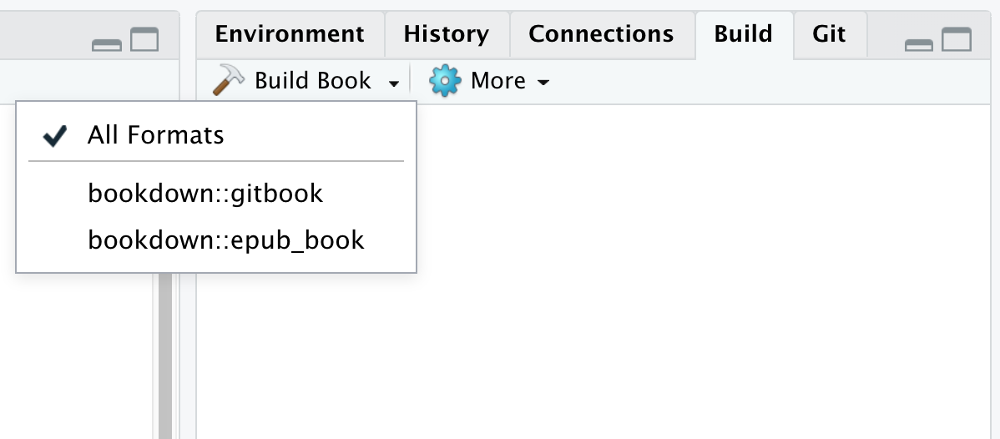

# Caring for your book {#book-care}

<center>{width=65%}</center>

In this chapter, we'll cover things you should keep in mind as you create content and start to use your book. 

## Creating new chapters {#book-new-ch}

When it's time to edit the `.Rmd`s in your book, there are a couple of rules to bear in mind: 

* The `index.Rmd` is the only `.Rmd` file that can have its own YAML at the top.
* All chapter `.Rmd` files MUST begin with a `# Level 1 Header` no matter what. Any content before that in your `.Rmd` will *not* appear.

**Why, you ask?**

In broad strokes, a bookdown site is created when several `.Rmd` files get merged together into a single (sometimes massive) `.Rmd` file. This monolith of an `.Rmd` then gets rendered into website-ready, HTML files. The `index.Rmd` is the first `.Rmd` in line, so it's the only one that gets its own YAML. 

What is sometimes unintuitive (especially for those coming from R Markdown sites) is that new pages are determined by the `# Level 1 headers` in your content (i.e., any heading beginning with a single `#`), not necessarily by distinct `.Rmd` documents in your project. Anytime you use a level 1 header, this becomes a new book chapter with a top level entry in your TOC and also manifests as its own "page" in your book. And voilà, this is how your book chapters are made. 


<center>{width=90%}</center>


## Putting your chapters in order {#book-order}

For our book content to get pasted together in the monolithic `.Rmd` in the correct order automatically, you would need to create `.Rmd` file names that continue with a numbering scheme `"01-"`, `"02-"`, etc. This seems fine and dandy, until you realize how annoying it would be if you later decided to switch around the order of your chapters --you would have to rename multiple files (ugh!). 

We're in the business of trying to make life *easier* for your future self, so we recommend setting the chapter order within `_bookdown.yml` with this approach instead: 

As an example, let's make a change so that the `04-application.Rmd` chapter from our skeletal book comes right after `01-intro.Rmd`.

1. In RStudio, **open** `_bookdown.yml`.
2. **Add the `rmd-files` option** followed by a list of all the `.Rmd` files in the order you want (`index.Rmd` must still come first):

    ```{r yml-ch-order, echo = FALSE}
library(ymlthis)
    ymlthis::yml_empty() %>%
          yml_bookdown_opts(book_filename = "fake-book",
                            output_dir = "docs",
                            delete_merged_file = TRUE,
                            rmd_files = list(
                              html = c("index.Rmd", 
                                        "01-intro.Rmd",
                                         "04-application.Rmd",
                                         "02-literature.Rmd", 
                                         "03-method.Rmd", 
                                         "05-summary.Rmd", 
                                         "06-references.Rmd"))) %>%
          yml_toplevel(language = list(list(ui = list(chapter_name = "Chapter ")))) %>%
          yml_toplevel(new_session = 'yes') %>%
          asis_yaml_output(fences = FALSE)

    # Add note about how quotes don't matter?
    ```

As this example demonstrates, the specific filenames no longer bear any significance on chapter order. Swap your `.Rmds` around as much as you'd like in this single document and be done.

## Workflow for maintenance

Now you know how to order your `.Rmd`s, so what does the workflow look like to add more `.Rmd`s as you update your book? Here's what it's like for us:

1. **Open** my existing site RStudio project
2. **Go to *Addins* > *Preview Book* ** to render the book
3. **Create** a new `.Rmd` document in RStudio using *File > New File > R Markdown*, and delete its default YAML entirely.
4. **Begin with a fresh `#` Level 1 header** and then go about creating new content.
5. **Update `_bookdown.yml`** to include the new page.
6. **Go to *Addins* > *Preview Book* ** to render the book again
7. **Rinse and repeat** if needed!
8. **Commit and push** all changes to GitHub.


## Rendering {#render-book}

In \@ref(build-book), we mentioned that there were several options for rendering your book locally. Here are the others, and some notes about when/ why you would choose one over the other:

* **Addins > Preview Book:** renders only the gitbook version of the book. 
* The line below does the exact same thing as *Preview Book*:
```{r, eval=FALSE}
bookdown::render_book('index.Rmd')
```

* Or you can use:
```{r, eval=FALSE}
bookdown::serve_book()
```

* Using the *Build Book* tab in the IDE: this renders all specified book formats, unless you specifically choose something different from the Build Book dropdown menu. 

{width=50%}

* `preview_chapter("my-chapter.Rmd")`: Is rendering the entire book taking way too long? Run `preview_chapter()` instead to render just a single chapter. One caveat is that any cross-references to other chapters won't work, since only the chapter being previewed is updated. 

* Remember, never Knit!

:::gotcha
When rendering your book with a previous preview window open, you might experience a never-ending loop of book-rendering. This is a common problem! Exit out of this by going to *Session* > *Terminate R...*. 
:::


## Using your book {#use-book}

<!-- or maybe: "Populating your book", "Finding your way around your book", "Navigating your book" --> 

### Components

As you build content for your book, don't forget about the bells and whistles you can use in bookdown, like the ones below. For guidance on how to use these, check out the bookdown documentation:

* [**Internal cross-references**](https://bookdown.org/yihui/bookdown/cross-references.html)
* [**Numbering and referencing equations**](https://bookdown.org/yihui/bookdown/markdown-extensions-by-bookdown.html#equations)
* [**Figures captions**](https://bookdown.org/yihui/bookdown/figures.html)
* [**Tables**](https://bookdown.org/yihui/bookdown/tables.html)
* [**Citations**](https://bookdown.org/yihui/bookdown/citations.html)
* [**Footnotes**](https://bookdown.org/yihui/bookdown/markdown-syntax.html#inline-formatting)


### Search

The built in search feature in your book can be useful for both you and your learners--but the way it works is a little [tricky](https://github.com/rstudio/bookdown/issues/216)! You can see the instructions for it by clicking on the <i class="fa fa-info"></i> in the toolbar.

* As you enter your search term into the box, the TOC is filtered to show only the sections were your search term appears.
* Don't move that cursor-- keeping it hovered over the box, you can use your arrow `UP` and `DOWN` keys to navigate from the term's first occurence to the next through the book. 

## Hiding Chapters

```{r, out.width = "40%", echo = FALSE, fig.align = "center"}

```

Books can take a while to write-- and that's okay. Don't be afraid to put your book on GitHub pages or another platform before you think it's completely finished. Sharing your bookdown site publicly, even as the content and chapters evolve, can be an important part of the making-process (and is also really great for soliciting community feedback). 

It's not possible to keep your files completely concealed once you've pushed them to a public repo on GitHub, but there are some ways you can make works-in-progress difficult enough to discover that it's unlikely anyone will stumble across them. If you do want to keep all or some of your book under wraps, then you have a couple of options:

1. **Easy:** Upload your source to GitHub, but don't share the GitHub pages link in the GitHub repo description. Savvy GitHubbers can still guess your URL if you have turned on GitHub pages, or they'd be able to clone the repo and build it locally, but it would take some grit!). 

1. **Medium:** Hide individual chapters by not adding their `.Rmd` file to the `_bookdown.yml`. OR, if you've been following our configuration settings and have used `new_session: yes`, then placing your `.Rmd` in a sub-folder within your project will also keep it hidden.

1. **Advanced**: A more advanced workflow would involve creating a GitHub branch for works in progress and waiting to merge those into the master branch until they're ready for showtime.

<!--TO DO: Add table the summarizes what we learned in this section --->

## Staying organized {#book-organized}
You may find that as your book content grows, your project directory (and possibly your mind) will start swimming in `.Rmd`s and other files. Unfortunately, there's no good way to keep your `.Rmd`s organized with subdirectories if you're following our suggestion to use `new_session: yes`. But, you can do a little bit of clean up by creating folder for your images (`images/`) and another one like `assets/` to place HTML and CSS files. But if the Marie Kondo within you is *still* not satisfied, then you might consider creating a Blogdown site. 
