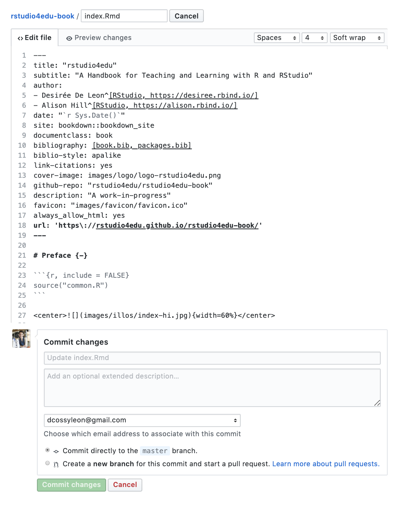

# Dress it up! {#book-dress}


In this section, we cover optional ways to make your bookdown site look ✨faaaabulous ✨. The features we cover below do not require knowing CSS nor HTML, and they're all built-in things you can add to your bookdown now. There are a lot of different options here, and you certainly don't have to implement all of them. Take an à la carte approach and pick the stuff you like!

We'll need to use the three different bookdown YAML files to turn on these features. And sometimes, we don't even need a YAML file and any old `.Rmd` doc will do. Here's a cheatsheet of what file is in charge of what (including features we may have already covered earlier that we link to):

<div class="split">

<div class="split1">
**`_output.yml`**

* Add an edit link
* Make the page downloadable as an `.Rmd`
* Link to your GitHub in the toolbar, Part 1 (also need `index.Rmd`)
* Add other sharing links
* Header and footer of your TOC
* Collapse the TOC by (sub)section
* Code highlighting

</div>

<div class="split2">
**`_bookdown.yml`**

* Change the chapter name
* Change [chapter order](#book-order)
* Set [`new_session: yes`](#book-output)
* Set [`output_dir: docs`](#book-output)

</div>
</div>

<div class="split">
<div class="split1">

**`index.Rmd`**

* Link to your GitHub in the toolbar, Part 2 (also need `_output.yml`)
* Add a favicon 
* Book cover and description

</div>

<div class="split2">

**Within any `.Rmd`**

* Group chapters into Parts
* Add an appendix
* Section (un)numbering

</div>
</div>

## Before you begin {#before-book-dress}

1. **Open up all three YAMLS** and keep them open as tabs in RStudio. We'll be bouncing in between these files:
    * `_output.yml`
    * `_bookdown.yml`
    * `index.Rmd`
    
1. **Remove output types we don't need:** from `_output.yml`. All of our cookbook content will only deal with the `gitbook` output from here on out. This means you can get rid of this part of the YAML in `_output.yml`:

    ```output.yml
    bookdown::pdf_book:
      includes:
        in_header: preamble.tex
      latex_engine: xelatex
      citation_package: natbib
      keep_tex: yes
    bookdown::epub_book: default
    ```

We'll fill out our YAML options one line at a time and show you what the growing YAMLs look like as we go. 

## Organizing

* Collapse TOC by (sub)sections
* Change the chapter name
* Section (un)numbering
* Group chapters into parts 
* Add an appendix

### Collapse TOC by (sub)sections

We can control whether our TOC will show all sections or subsections by default. If you have very deep heading and section hierarchies, then you might want to play around with this option. You can read more about it in the [bookdown documentation](https://bookdown.org/yihui/bookdown/html.html#gitbook-style).


* **Open `_output.yml`**
* **Add `collapse: section`** as a `toc:` option.

    ```_output.yml
    bookdown::gitbook:
      css: style.css
      config:
        toc:
          collapse: section
          before: |
           <li><a href="./">A Minimal Book Example</a></li>
          after: |
            <li><a href="https://github.com/rstudio/bookdown" target="blank">Published with bookdown</a></li>
        download: ["pdf", "epub"]
    ```

### Change the chapter name

The **`chapter_name:`** option is what determines whether your level one headers will say "Chapter 1" or "Section 1" or "Module 1"---whatever prefix you'd like. In our example demo book, we'll leave this as `"Chapter "`, but if you wanted to change it, you would do this:

1. **Open** `_bookdown.yml`.
1. **Replace `"Chapter "` with your prefix of choice**. Don't forget the space after the name within the quotes.

    ```yaml
    book_filename: fake-book
    delete_merged_file: true
    rmd_files:
      html:
      - index.Rmd
      - 01-intro.Rmd
      - 04-application.Rmd
      - 02-literature.Rmd
      - 03-method.Rmd
      - 05-summary.Rmd
      - 06-references.Rmd
    output_dir: docs
    language:
      ui:
        chapter_name: 'Chapter '
    new_session: 'yes'
    ```

### Section (un)numbering

By default bookdown numbers all of your headings. If you don't like this, then you have to un-number them manually. **Within any `.Rmd`** you can do this if you:

* Add an `{-}` after each heading you want unnumbered.
* If your section has an ID within brackets already, just add the `-` in front, for example:

```
## My Section {-#section-id}
```

:::design
We recommend keeping the numbering on for all of your chapters, except for the headings in your `index.Rmd`, which you should use as your preface or introduction. 
:::

Let's remove numbering for the initial chapter of our minimal book, to make it clear it's a preface:

1. Open `index.Rmd`.
1. Change the level one header to be `# Prerequisites {-}`
1. Save and build your book.
1. Notice that once you do, the numbering of all the following sections is automatically adjusted. 

### Group chapters into parts {#book-parts}
If you have a bunch of chapters, it can be helpful to group some of them together (e.g., by semester, quarter, or content themes). You can create a book part **within any `.Rmd` file** by adding the following at the top of any `.Rmd`:

```
# (PART) My Part Title {-}
```
If you don't want your part to be numbered with a Roman numeral, then you must instead write: 

```
# (PART\*) My Part Title {-}
```

Let's create two unnumbered parts for our demo book:

1. **Open** the `01-intro.Rmd` file.
1. **Add** `# (PART\*) First Semester {-}` as the first line. 
1. **Open** `04-methods.Rmd` file.
1. **Add** `# (PART\*) Second Semester {-}` as the first line. 


### Appendix {#book-appendix}
Similar to ["Parts"](#book-parts), you can create an appendix for your book with a header like:

```
# (APPENDIX) Appendix {-}
```

Any level one headers that come after this will be appendix chapters and will be "numbered" with letters. See more [here](https://bookdown.org/yihui/bookdown/markdown-extensions-by-bookdown.html#special-headers).

Let's create an appendix for our demo book by making a new `.Rmd`.

1. In the IDE, **create a fresh `.Rmd`** by going to *File* > *New File* > *R Markdown*.
1. **Delete everything** in this file.
1. **Add your appendix header** at the top  of the `.Rmd`:
    ```
    # (APPENDIX) Appendix {-}
    ```
1. Optionally, some appendix chapters and content, like so:

    ```appendix.Rmd
    # (APPENDIX) Appendix {-} 

    # Appendix A
    Here is the first appendix chapter.

    # Appendix B
    Here is the second appendix chapter.
    ```
1. **Save** this file in your project directory as `appendix.Rmd`. You can choose a different name.
1. **Open `_bookdown.yml`** and **add** this new appendix `.Rmd` to the end of your list of `.Rmds` files.


    ```yaml
    book_filename: fake-book
    delete_merged_file: true
    rmd_files:
      html:
      - index.Rmd
      - 01-intro.Rmd
      - 04-application.Rmd
      - 02-literature.Rmd
      - 03-method.Rmd
      - 05-summary.Rmd
      - 06-references.Rmd
      - appendix.Rmd
    output_dir: docs
    language:
      ui:
        chapter_name: 'Chapter '
    new_session: 'yes'
    ```


## Aesthetics

* Header and footer of the TOC
* Code highlighting

### Header and footer of the TOC

Let's personalize the TOC a little bit by changing the text that we see at the top (or at the bottom) of it. Usually this means only changing the text. Sometimes it can mean adding a logo (but for this you'll have to stop by the [Make it Fancy](#book-fancy)). 

Let's make the following changes to our TOC header:

1. **Open `_output.yml`**. We can change the `before:` and `after:` options. There's a little bit of HTML on these lines, but don't let that scare you.
1. Create a new TOC header with the `before:` option by **replacing the `"A Minimal Book Example"`** with **`"Demo Book"`** instead.
1. FYI, the **`after:`** field is for the TOC footer. We'll leave this as-is for now.

    ```_output.yml
    bookdown::gitbook:
      css: style.css
      config:
        toc:
          collapse: section
          before: |
            <li><a href="./">Demo Book</a></li>
          after: |
            <li><a href="https://github.com/rstudio/bookdown" target="blank">Published with bookdown</a></li>
        download: ["pdf", "epub"]
    ```
### Code highlighting

Let's style the colors that we'll be used in our code chunks. Highlight styles work the same as they would in an RMD site. The options here are `default`, `tango`, `pygments`, `kate`, `monochrome`, `espresso`, `zenburn`, and `haddock`.

Let's try it:

1. **Open** `_output.yml`.
1. **Add** the `highlight:` field and choose `tango`.

    ```_output.yml
    bookdown::gitbook:
     highlight: tango
      css: style.css
      config:
        toc:
          collapse: section
          before: |
            <li><a href="./">Demo Book</a></li>
          after: |
           <li><a href="https://github.com/rstudio/bookdown" target="blank">Published with bookdown</a></li>
        download: ["pdf", "epub"]
    ```

## Edits and source code

* Solicit edits via GitHub
* See the `.Rmd` source code

Let's add an edit icon the toolbar so that it's easier for collaborators to give feedback and suggestions. When they click it, it will invite them to make changes on GitHub to the current book page. 

<center>{width=50%}</center>
1. **Open** `_output.yml`.
1. Create **`edit:`**, **`link:`**, and **`text`:** fields like you see below:

    ```_output.yml
    bookdown::gitbook:
     highlight: tango
      css: style.css
      config:
        edit:
          link: https://github.com/username/repository/edit/master/%s
          text: "Suggest an edit"
        toc:
          collapse: section
          before: |
            <li><a href="./">Demo Book</a></li>
          after: |
            <li><a href="https://github.com/rstudio/bookdown" target="blank">Published with bookdown</a></li>
        download: ["pdf", "epub"]
    ```

1. **Replace** the parts of the URL that say "username" and "respository" with your own. 
1. Make sure the URL ends with `/edit/master/%s`.
1. **Add a message** to the `text:` field. Something like `"suggest an edit"`. This is what your user will see when they hover over the Edit link in the toolbar.

Save, build, and see that your edit icon works!
    
### Share the source code

While we're in `_output.yml`, we can add another field that will let your user see the source `.Rmd` code for the page. When your user clicks on the "download" icon, a new tab will open that shows them the `.Rmd` code used to generate the page they're viewing (you have to have an `edit:` field for this to work). This isn't technically a download, but still useful. Without specifying anything for this option, bookdown will look for other versions of your book (like PDFs or EPUB) to provide as a download. If you don't want this, then you need to set `download: no`. 

1. **Open** `_output.yml`.
1. After the `download:` option, **replace** `"pdf", "epub"` with `"rmd"`. Since we [removed](#before-book-dress) the `pdf_book` and `epub_book` output, the "download" PDF and EPUB options wouldn't have worked anyway. 

    ```_output.yml
    bookdown::gitbook:
     highlight: tango
      css: style.css
      config:
       edit:
          link: https://github.com/username/repository/edit/master/%s
          text: "Suggest an edit"
        toc:
          collapse: section
          before: |
            <li><a href="./">Demo Book</a></li>
          after: |
            <li><a href="https://github.com/rstudio/bookdown" target="blank">Published with bookdown</a></li>
        download: ["rmd"]
    ```

## Polishing and sharing

* Sharing to Twitter, etc.
* Directing to GitHub
* Favicon
* Book cover and description

### Twitter and GitHub
When you turn sharing on, it's easier for people to give your book a shoutout on twitter or find their way to your repo. This is good! We suggest using only these sharing icons and disabling the rest with `all: no`. Setting `github: yes` here is just one of the steps you need for the GitHub link to work. You also have to add your GitHub account and repo name to the `index.Rmd` YAML as we described above. 

1. **Open** `_output.yml`.
1. **Add** a `sharing:` field. 
1. **Set** `github: yes`, `facebook: no`, `twitter: yes`, `all: no`.
    * Mind your indentation (remember, YAMLS are fussy!)  
    

    ```_output.yml
    bookdown::gitbook:
      highlight: tango
      css: style.css
      config:
        toc:
          collapse: section
          before: |
            <li><a href="./">Demo Book</a></li>
          after: |
            <li><a href="https://github.com/rstudio/bookdown" target="blank">Published with bookdown</a></li>
        download: ["rmd"]
        edit:
          link: https://github.com/username/repository/edit/master/%s
          text: "Suggest an edit"
        sharing:
          github: yes
          facebook: no
          twitter: yes
          all: no
    ```
    * The Twitter icon is now set--but we're only halfway there to get the GitHub icon to work. 
    
1. **Open** `index.Rmd`. 
1. **Add** the field `github-repo:` followed by your `"username/repo"`. 

    ```yaml
    ---
    title: A Minimal Book Example
    author: Yihui Xie
    date: '`r Sys.Date()`'
    site: bookdown::bookdown_site
    documentclass: book
    bibliography:
    - book.bib
    - packages.bib
    link-citations: true
    biblio-style: apalike
    description: This is a minimal example of using the bookdown package to write a book.
      The output format for this example is bookdown::gitbook.
    github-repo: your-github/your-repo
    ---
    ```

Now, the GitHub icon will go to your book's repo.

Next, we'll move on to other polishing bits involved in sharing your book. 

### Add a favicon
You know the little tiny icon that gets placed in the corner of your browser tab? That's a favicon! It's also the icon that shows up when you've bookmarked a page. Let's add one:


1. **Create a folder called `images`** in your project directory. You don't technically *have to* create this folder, but you will [thank us later](#book-organized) as you add more images to your book. 
1. **Save the image you'd like to use** (for best results it should be square) in `images/`.
    * Don't have an image? Make one in less than a minute with text or an emoji:
        1. Go to [free favicon generator](https://favicon.io/) and create a favicon
        2. Download and move the `.ico` file into your `images/`.
1. **Open** `index.Rmd`.
1. **Add** `favicon: <"images/favicon.ico">` in the YAML, replacing the filepath in quotes with your own.

    ```yaml
    ---
    title: A Minimal Book Example
    author: Yihui Xie
    date: '`r Sys.Date()`'
    site: bookdown::bookdown_site
    documentclass: book
    bibliography:
    - book.bib
    - packages.bib
    link-citations: true
    biblio-style: apalike
    description: This is a minimal example of using the bookdown package to write a book.
      The output format for this example is bookdown::gitbook.
    favicon: images/favicon.ico
    cover-image: images/logo-black.png
    github-repo: your-github/your-repo
    url: https://github.com/dcossyleon/fake_book
    ---
    ```

:::tip
**Note**: In the example above, we can use ICO files (with the `.ico` extension) which are preferred because of better rendering across most browsers, but other images types like PNGs work too. 
:::

### Book cover and description

Finally, we'll change what happens what happens when we share preview links of our book.

* **`cover-image:`** This lets you set an image that will act as your book's cover. This will show up when we share a link of our book. 
* **`description:`** This is the short blurb that will also be part of the preview when your share the link of your book. 

Let's update our `index.Rmd` with the following: 

1. **Update the description** of our demo book to say "A work in progress."  

1. **Add a cover image** by adding a path to our logo (or a url to any image--you can always try one of [these](https://unsplash.com/) if you need a placeholder). 

1.  Now is also a good time to update your `Title` and `Author` fields if you haven't already. 


    ```yaml
    ---
    title: Demo Book
    author:
    - Desiree De Leon
    - Alison Hill
    date: '`r Sys.Date()`'
    site: bookdown::bookdown_site
    documentclass: book
    bibliography:
    - book.bib
    - packages.bib
    link-citations: true
    biblio-style: apalike
    description: This is a minimal example of using the bookdown package to write a book.
      The output format for this example is bookdown::gitbook.
    favicon: images/favicon.ico
    cover-image: images/logo-black.png
    github-repo: your-github/your-repo
    url: https://dcossyleon.github.io/fake_book/
    ---
    ```


:::gotcha
The formatting for `url` is really important, and weird: 

+ You must use a forward slash `\` before the colon to "escape" it. 
+ The `url` **must** end with a back slash `/` in order for the `cover-image` to render. 
:::

<!---do we REALLY need url? What does it do?? -->


\

Alright, we've done all we can here with bookdown's built-in options. Time to checkout the options in [Make it fancy](#book-fancy) if you're still wanting more!


