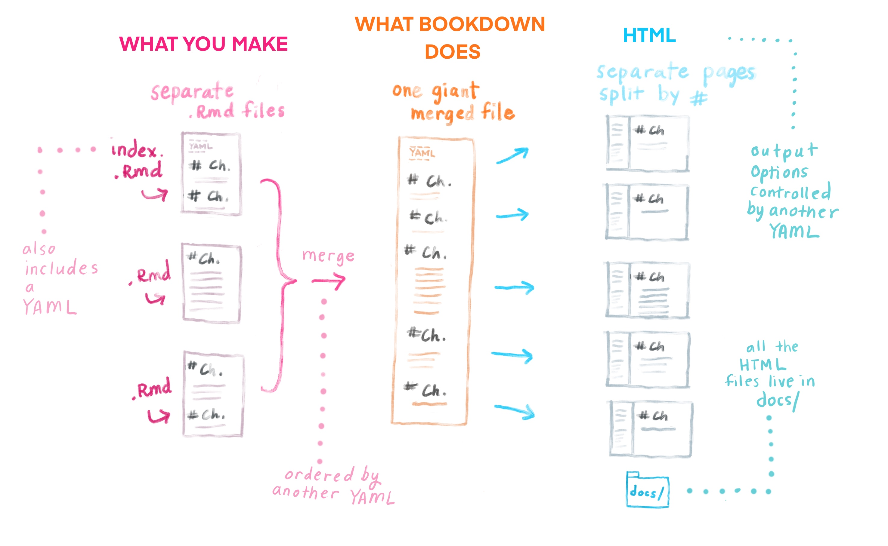

# Make it yours {#book-yours}


## Creating new chapters {#book-new-ch}

When it's time to edit the `.Rmd`s in your book, there are a couple of rules to bear in mind: 

* The `index.Rmd` is the only `.Rmd` file that can have its own YAML at the top.
* All chapter `.Rmd` files MUST begin with a `# Level 1 Header` no matter what. Any content before that in your `.Rmd` will *not* appear.

**Why, you ask?**

In broad strokes, a bookdown site is created when several `.Rmd` files get merged together into a single (sometimes massive) `.Rmd` file. This monolith of an `.Rmd` then gets rendered into website-ready, HTML files. The `index.Rmd` is the first `.Rmd` in line, so it's the only one that gets its own YAML. 

What is sometimes unintuitive (especially for those coming from R Markdown sites) is that new pages are determined by the `# Level 1 headers` in your content (i.e., any heading beginning with a single `#`), not necessarily by distinct `.Rmd` documents in your project. Anytime you use a level 1 header, this becomes a new book chapter with a top level entry in your TOC and also manifests as its own "page" in your book. And voilà, this is how your book chapters are made. 


<center>{width=90%}</center>


## Putting your chapters in order {#book-order}

For our book content to get pasted together in the monolithic `.Rmd` in the correct order automatically, you would need to create `.Rmd` file names that continue with a numbering scheme `"01-"`, `"02-"`, etc. This seems fine and dandy, until you realize how annoying it would be if you later decided to switch around the order of your chapters --you would have to rename multiple files (ugh!). 

We're in the business of trying to make life *easier* for your future self, so we recommend setting the chapter order within `_bookdown.yml` with this approach instead: 

As an example, let's make a change so that the `04-application.Rmd` chapter from our skeletal book comes right after `01-intro.Rmd`.

1. In RStudio, **open** `_bookdown.yml`.
2. **Add the `rmd-files` option** followed by a list of all the `.Rmd` files in the order you want (`index.Rmd` must still come first):

    ```yaml
    book_filename: fake-book
    delete_merged_file: true
    rmd_files:
    - index.Rmd
    - 01-intro.Rmd
    - 04-application.Rmd
    - 02-literature.Rmd
    - 03-method.Rmd
    - 05-summary.Rmd
    - 06-references.Rmd
    output_dir: docs
    language:
      ui:
        chapter_name: 'Chapter '
    new_session: 'yes'
    ```

As this example demonstrates, the specific filenames no longer bear any significance on chapter order. Swap your `.Rmds` around as much as you'd like in this single document and be done.
