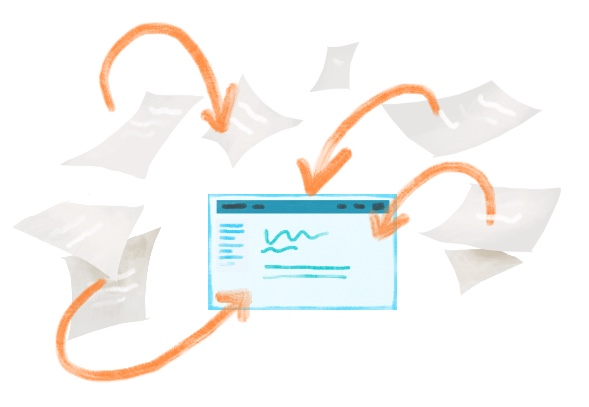

# (PART) Cookbook: Distill sites {-}

```{r, include = FALSE}
library(ymlthis)
source("common.R")
knitr::opts_chunk$set(fig.align="center")
```

# Introduction {-#intro-distill}

Distill is R Markdown's sibling with technical and scientific interests. It is essentially a slightly souped-up R Markdown document that has some built-in features that would otherwise need to be included rather manually in a regular `.Rmd`. 

The original intended use-case for Distill was to create a platform where authoring scientific, collaborative content would be made easier. 

**Why Distill?**

* You're creating content that will use citations, appendicies, and footnotes.
* You want a site that can acknowledge multiple authors and affiliations.
* You want built-in options for things like a logo.
* You're fine sticking to the default Distill theme (or you don't mind getting your hands messy with CSS to change your site's aesthetic) and you don't need `code_folding`, `code_download`, or numbered sections. 

You may also want to learn how to use Distill so that you can then create Distill templates that your learners can then use to generate reports, etc. 

<div class = side-by-side>
<div class = side1>

```{r echo = FALSE, fig.link = "#make-distill"}

```

</div>
<div class = side2>

#### [Make a Distill site](#make-distill)
You will build a bare-bones Distill website from a site skeleton and publish it. We make only the most minimal changes to content and style necessary to get you a shareable website.

</div>
</div>


\

<div class = side-by-side>
<div class = side1>

```{r, fig.align='center', echo= FALSE, fig.link = "#distill-care"}
knitr::include_graphics("images/illos/Caring.jpg")
```

</div>
<div class = side2>

#### [Caring for your Distill site](#distill-care)
You'll develop a workflow for editing your site, adding new content, and hiding pages that are works-in-progress.

</div>
</div>

\

<div class = side-by-side>
<div class = side1>

```{r, fig.align='center', echo= FALSE, out.width="50%", fig.link = "#distill-dress"}

```

</div>
<div class = side2>

#### [Dress it up](#distill-dress)

Here, you'll find instructions for no-fuss website customizations that leverage built-in features that *do not* rely on knowing, learning, or using CSS.

</div>
</div>

\

<div class = side-by-side>
<div class = side1>

```{r, fig.align='center', echo= FALSE, out.width="50%", fig.link = "#distill-fancy"}
knitr::include_graphics("images/illos/Dressup.jpg")
```

</div>

<div class = side2>

#### [Make it fancier](#distill-fancy)

In the final chapter, you'll learn about website customizations that require some CSS and HTML.

</div>
</div>


## What are we making? {-}

<center></center>

Same idea as an [R Markdown site](#make-rmd). We need a `_site.yml` that will stitch our pages together, an `index.Rmd` that will be our homepage, + (optional) `.Rmd`s of the Distill variety. 


## Distill vs R Markdown site {-}

Since the R Markdown `.Rmd` file is essentially the fundamental unit of most of these sites, it makes sense to compare the other rstudio4edu tools to it.

[Venn Diagram?]


<center> {width=40%} </center>


**Similarities**

* Distill and R Markdown can both exist as single pages
* Collections can be combined into a set to create a website
* `rmarkdown::render_site()` or *Build Website* within RStudio will build your site
* Same core website features and configurations for YAML apply
* Messy-ish directories (compared to blogdown where you can bundle things)
* `styles.css` can be added to both in the YAML under `output:`


**Unique to Distill**

* `create_website(dir = "<your-directory-name>", title = "<your-site-name>")`
    ** Is `library(distill)` necessary prior to running?
* Allows blog posts to be put into a posts sub-directory, in contrast to an R Markdown site
* Built-in options for a logo within the YAML
* Add a footer to all pages with the inclusion of a `_footer.html` to your main project folder (and the footer goes all the way across)
* Built-in option to include Google Analytics 
* Built-in options for creating a little appendix (with optional Licensing and "Corrections" links)
    ** [https://rstudio.github.io/distill/website.html#site_metadata](https://rstudio.github.io/distill/website.html#site_metadata)
* Built-in way to specify a custom favicon (the little icon for your site that shows up in your browser tab)
* Built-in option for sharing twitter
* `output: distill::distill_article`


## Is this tutorial for you? {-}

```{r child ="modules/is-this-tutorial-for-you.Rmd"}

```

* How to compile multiple R Markdown pages into a Distill site
* How to add basic customization to a Distill page that are not easily added to an R Markdown site


## Other learning resources {-}

### Existing Distill sites

You can check out the links below as other examples of Distill websites in the wild:

* [Distill for R Markdown](https://rstudio.github.io/distill/)
* [R-Music](https://r-music.rbind.io/about.html)
* [https://m-clark.github.io/](https://m-clark.github.io/)

### If you like Distill...
...then you may also like the tools below. These are not unique to Distill (you could use them in any R Markdown doc), but they're useful and cool for communicating technical content.

\

**For Visualizations**
You can see some examples of the two tools below in action [here](https://rstudio.github.io/distill/interactivity.html)

* [r2d3](https://rstudio.github.io/r2d3/)
* [html widgets]()

```{r, layout="l-screen-inset"}
library(leaflet)
leaflet() %>%
  addTiles() %>%  # Add default OpenStreetMap map tiles
  addMarkers(lng=174.768, lat=-36.852, popup="The birthplace of R")
```

\

**For Tables**

There are different ways to include tables in your site. None are unique to Distill, but they're useful to know about. You can see examples [here](https://rstudio.github.io/distill/tables.html).


# Make a Distill site {#make-distill}

<center>{width=70%}</center>

```{r echo = FALSE, results = 'asis', include = FALSE}
build_toc("cookbook-distill.Rmd")
```

## tl;dr

This tl;dr is for readers who are already experienced with GitHub and want to see our "cheatsheet" version of the rest of this chapter. If you are looking for screenshots plus some hand-holding, we think you'll benefit from reading the [rest](#distill-site-setup) of this chapter.

**Here's how you make an Distill site from scratch, using a built-in site skeleton as a template:**

1. Start with an empty RStudio project linked to a remote GitHub repository that you can push/pull from your local copy in RStudio.

1. Make sure the Distill package is installed:

    ```{r distill-package, eval = FALSE}
    remotes::install_github("rstudio/distill")
    ```

1. In your project, create a simple shell for a Distill website by running the following code in your R console and entering a same for your site when prompted:

    ```{r distill-skeleton, eval = FALSE}
    distill::create_website(dir = getwd())
    ```
    
1. Prep for publishing to GitHub Pages by changing the output directory of your website (in your `_site.yml` file) to a folder named `"docs"`.
    
    ```{r yml-docs, echo = FALSE}
    ymlthis::yml_empty() %>%
        yml_site_opts(output_dir = "docs",
                      name = "my-website") %>% 
        asis_yaml_output(fences = FALSE)
    ```
    
    
1. Tell GitHub Pages to bypass using Jekyll to build your site by adding a single empty file named `.nojekyll` to your project root directory.

    ```{r eval = FALSE}
    file.create(".nojekyll")
    ```

1. Build your site using the RStudio "Build" pane.

1. Push and commit to send your site online to GitHub- do you see your `.html` files in the `"docs"` folder?

1. Turn on GitHub Pages by going to your repository online. Click on the repository’s settings and under GitHub Pages, change the Source to be the `master branch /docs` folder. Note your new site's URL!

1. Edit your site, build it, then push and commit to GitHub to publish your changes online.

1. Rinse and repeat! Every push to your `master` branch triggers the online version of your site to update.

## Getting set up {#distill-site-setup}
```{r, out.width = "20%", fig.align='center', echo= FALSE}
knitr::include_graphics("images/illos/Gears.jpg")
```

### Packages

The `distill` package needs to be installed from GitHub. You only need to do this once per computer.

```{r, eval=FALSE}

remotes::install_github("rstudio/distill")

```

If you'll want to add a `README` to your Distill site GitHub repo, then you should also install the `xfun` package so that the step for rendering your site becomes more convenient. 

:::tip
As another tip, if you're used to using `install.packages()` for CRAN packages, try using [`pak`](https://github.com/r-lib/pak) instead for installs. It's more efficient.

```{r, eval=FALSE}
install.packages("pak")
pak::pkg_install("xfun")
```
:::

### Make a project {#distill-proj-first}

For your first Distill site, we recommend starting by creating a GitHub repository online first, then making a project in RStudio (if this is not your first rodeo, then you could checkout out the [more advanced GitHub last workflow](#uplevel-distill)).


```{r child = 'modules/github-first-project.Rmd'}

```

### Make a Distill site skeleton {#distill-site-skeleton}

We'll start by creating the shell for a basic Distill website and publishing this site to GitHub Pages straight away. In your R console, type and run the following code, entering a same for your site when prompted:

```{r ref.label = 'distill-skeleton', eval = FALSE}
```


You will end up with the following files in your working directory, as shown in Figure \@ref(fig:distill-site-dir). The most critical files are the `index.Rmd` and the `_site.yml`, and we mention a little about them below. 

```{r ref.label = 'distill-site-dir', eval = FALSE, fig.cap = "Distill site skeleton", out.width = "40%"}

knitr::include_graphics("images/screenshots/distill-getting-started-directory.png")

```

```{r, eval = TRUE, echo= FALSE, fig.align = "center", out.width = "40%"}

knitr::include_graphics("images/screenshots/distill-getting-started-directory.png")

```

Close RStudio and re-open your site by clicking on the project file (`.Rproj`). When you re-open the project, you may notice the `.Rproj` file shows up in your Git pane, which means that the file has changed since your last commit. What happened? RStudio has detected that you have built a website, so a single line has been added to your `.Rproj` file:

```yaml
BuildType: Website
```
## A mini-orientation {#distill-site-orientation}

Our skeleton created two out-of-the-box content files for our site: 

1. `index.Rmd` Any content in this file will be your site’s homepage. This file must be named `“index.Rmd”`. 

1. `about.Rmd` This will be a second, distinct page of your site. This file can have any name, but we will stick to `“about”` for now.

When we build our site, R Markdown will *knit* each of these, and create `.html` (i.e. website-ready) versions of them that we can preview locally. 

The third file in our skeleton, `_site.yml`, is *not* a file that gets turned into a site page, but *is* necessary for site setup. 

Nothing to do here, but good to know these things! We'll circle back to editing these files later.


## Edit and preview {#distill-edit}

Your project directory now has four new important items. We'll touch on the them below:

1. **Delete `_site/` folder.** This is the default output folder, where knitted versions of our `.Rmd`s live once they've been processed to become `.html` files. We're going to replace this folder with a `docs/` folder instead so we can host our site on GitHub pages--we'll set that up soon. 

2. **Open the `_site.yml` file in your root directory, and change the output directory from `"_site"` to `"docs"`**. In general, the `_site.yml` file lets us set options that will affect all pages in our site, and it has the same function here as it does in a typical R Markdown site. 

```{r, eval = FALSE}
name: "basic-course-distill"
title: "Demo Website"
description: |
  Demo Website
output_dir: "docs"
navbar:
  right:
    - text: "Home"
      href: index.html
    - text: "About"
      href: about.html
output: distill::distill_article
```

A few things you'll notice about this YAML, if you're comparing it to an R Markdown site's: 

* The output here has to be `distill::distill_article`. It's okay for this to be on the same line as `output:` or indented on the line beneath it. 

* Weirdly, the `description:` field in `_site.yml` is non-functional (as far as I can tell). But we will use it to create a subtitle of sorts in other YAMLS of our other Distill pages.

3. **Open `index.Rmd`**. This will be our site's homepage. This file *must* be named `index.Rmd`, and it *must* at minimum have `title:`, `description:`, and `site:` lines. Optionally, make a small change to its YAML like changing the text in the `description:`. Something like:

```
---
title: "Demo Website"
description: |
  Welcome to my Distill course page. Here you can find all course logistics and content.
site: distill::distill_website
---

```
4. **Open `about.Rmd`**. Optionally edit it by adding a new line of text. This will be an additional page on our site, and you can change the name of this file to be whatever you want. Additional pages, like this one, at a minimum need to have a non-empty `title:`, but they don't require a `description:` or `site:` line. 

5. **Render your site** with the line below to knit all of your pages in one fell swoop. 
```{r, eval = FALSE}
rmarkdown::render_site()` 
```

You must *always* render your site's pages as the last step before you push to GitHub. Once all of your site's `.Rmd`s have been rendered at least once, then it's okay to knit only the individual pages that you've made changes to (you might want to do this if you have some pages that knit slowly and want to avoid re-rendering everything each time you push). But if you forget to knit or `render_site()`, then you will be wondering why your site hasn't updated on GitHub pages.

:::tip
If the rendered site does not open up automatically in a new window, you can go to the `docs/` folder in your project, click on the `.html` file you want to view, and then `View it in Web Browser`.
:::


## Push to GitHub

1. **Click *Git* ** in the same RStudio pane that also contains the *Environment* tab.

2. **Check the box(es)** under the "Staged" column and click *Commit*.

3. **Add a commit message** and then click *Push*.

<center>{width=400px}<center>


Now we'll get to the good stuff! Let's put this on the internet!

## Make a living, breathing site
```{r, child= "modules/github-pages.Rmd"}

```

You can now edit and knit your `.Rmd` pages to your heart's content. 


## Uplevel your workflow {#distill-uplevel}

We followed a "GitHub first" workflow above, but if you'll be using GitHub regularly, we recommend evolving this workflow. 

```{r, child= "modules/gh-pat.Rmd"}

```

Now, here is your advanced workflow for creating a new Distill site inside a project:


1. **Click** *File* > *New Project* > *New Directory*

1. **Scroll down and select** *Simple R Markdown Website*

1. Then use your R console to **run** this code: 

    ```{r, eval=FALSE}
    use_git()
    use_github() # you have to have a PAT setup
    ```
    
1. Then follow all of our instructions above starting at [changing the site output directory](#rmd-site-output).

## Distill features

After adding some page content, we now demo some core features of Distill sites that you can't get with a regular R Markdown site as easily.


### Authors and affiliations

Within the YAML of an individual Distill page (a.k.a article), you can add multiple author fields with an (optional) affiliation field for each author. Below is an example of what this looks like when it's added to the index page.

While you're here you can optionally add in a `date:` field (which must always be in the order of month, day, then year). Use `"r Sys.Date()`"` to show the current date each time you knit the page. 

All of this info will be placed in a "Title" section at the top of the page. 

<div class = side-by-side>
<div class = side1>

```{r, eval = FALSE}
---
title: "Demo Website"
description: |
  Welcome to my Distill course page. Here you can find all course logistics and content.
author:
  - name: Desirée De Leon
    url: https://desiree.rbind.io
    affiliation: RStudio
    affiliation_url: https://rstudio.com
  - name: Alison Hill
    url: https://alison.rbind.io
    affiliation: RStudio
    affiliation_url: https://rstudio.com
date: "`r Sys.Date()`"
site: distill::distill_website
---
```

</div>
<div class = side2> 


</div> 
</div>

### Citations

Including internal citations is made easier with Distill. They appear as numbers, and when hovering over them, you see the full citation info.

To include citations of your own, you'll need to have two things: (1) a file with a list of your references and (2) a link to this file in the YAML of your `.Rmd` page

* **Create the file of listed citations**. This has to be a BibTeX file with citation entries like the ones below, for example. If you use a citation manager (like Endnote or Mendeley), then the easiest way to get a BibTex file is to export a BibTeX file from there (there are many online tutorials that show you how, e.g.  [Endnote](https://www.reed.edu/cis/help/LaTeX/EndNote.html), [Mendeley](https://blog.mendeley.com/tag/bibtex/)). However, you can also make a BibTeX file manually if want to, by creating a regular new text file (*File* > *New File* > *Text File*) and saving it with a `.bib` file extension (we named our `refs.bib`, but you can choose a different name). 


* **Save your BibTeX file** in your project directory.

```
@book{r4ds,
 author = {Wickham, Hadley and Grolemund, Garrett},
 title = {R for Data Science: Import, Tidy, Transform, Visualize, and Model Data},
 year = {2017},
 isbn = {1491910399, 9781491910399},
 edition = {1st},
 publisher = {O'Reilly Media, Inc.},
 url = {https://r4ds.had.co.nz/},
}

@misc{loremipsum,
  title = {Lorem Ipsum},
  author = {Wasai},
  year = {2015-2019},
  url = {https://loremipsum.io/},
}
```

* **Add a `bibliography:` field to the YAML of your individual `.Rmd`** whose content will contain the citations, then specify the name of your BibTex file. Now you can create inline citations of any reference that exists in this file. 


* **Cite your sources** in the body of the text. The citation should be in brackets and start with an `@` followed by the source's unique ID from the BibTex file (e.g.`[@loremipsem]`). The unique ID is whatever is on the first line of its BibTeX entry, immediately following the `{`. When you cite a source, an appendix will be created at the end of the page (if it doesn't already exist) with a list of all your cited references.

<div class = side-by-side>
<div class = side1>
```{r, eval = FALSE}
---
title: "Demo Website"
description: |
  Welcome to my Distill course page. Here you can find all course logistics and content.
author:
  - name: Desirée De Leon
    url: https://desiree.rbind.io
    affiliation: RStudio
    affiliation_url: https://rstudio.com
  - name: Alison Hill
    url: https://alison.rbind.io
    affiliation: RStudio
    affiliation_url: https://rstudio.com
bibliography: refs.bib
date: "`r Sys.Date()`"
site: distill::distill_website
---
```
</div>

<div class = side2>

{width=100%}
<br>

{width=100%}

</div>
</div>

The citation feature within Distill was originally intended for citing academic sources, so the display of the citation data in the hovered box and in the appendix looks best when fields like "publisher" and "year" are filled out, but having blank entries for these won't prevent you from creating a citation.

You can read more of the nitty-gritty details about citations, as well as about making your Distill page itself easily citable to others [here](https://rstudio.github.io/distill/citations.html).


### Site footer

A footer is added to your all your pages when you make a file named `_footer.html` that has the content you want. It's automatically applied to all pages when you drop this file into your main project directory. 

1. **Create a new text file** by going to *File* > *New File* > *Text file*.
2. **Save this as `_footer.html`** in your main project directory. Its contents will be used as a footer for each of your Distill pages.
3. **Enter some footer content** and save.

For example, contents could be something like this:

<div class = side-by-side>
<div class =side1>

```
Your Name, youremail@example.com

Your Collaborator's Name, anotheremail@example.com

This content was created using 
the Distill for R Markdown template in RStudio.

```
</div>
<div class= side2>


</div>
</div>

You'll be stuck with the default teal color for the footer unless you change the CSS file, which we demo in the "Make it fancy" chapter. But the nice thing about the Distill footer is that it will carry all across the page, which is not an easy feat to accomplish in some regular R Markdown sites (even if you're not afraid to mess with CSS). 

### Appendix

If there's other content you'd like to add to the Appendix, you can add it by creating a new level 1 or 2 header followed by `{.appendix}` in the body of your Distill page. This will move that content of that section to the appendix, with footnotes and the reference list placed afterwards. 

```
# Acknowledgments {.appendix}

We'd like to thank the following funding sources for making this work possible: 
Source 1, Source 2, and Source 3. 

```


### Hoverable footnotes

Want footnotes to be read more easily? No problem. Just include `^[footnote here]` whereever you'd like the footnote to go, and it will be automatically numbered, added to the appendix, and expanded when you hover over the number. 

<div class = side-by-side>
<div class = side1>
```
# Credits

This course is assigned 
3 credit hours^[A footnote goes here!].    

```
</div>

<div class = side2>

</div>
</div>

### Asides

You can also include small notes, images, or plots in the margins of the page by enclosing content within `<aside>` tags, like this (note that the second tag needs a `/`):

**A note**
<div class = side-by-side>
<div class = side1>
```
<aside>
Here is a small side note.
</aside>

```
</div>

<div class = side2>

</div>
</div>

**An image**

<div class = side-by-side>
<div class = side1>
```
<aside>

</aside>

```
</div>

<div class = side2>

</div>
</div>

**A plot**

<div class = side-by-side>
<div class = side1>
```
<aside>
```{r, eval = TRUE, echo = FALSE}
library(tidyverse)
library(gapminder)
 
p <- gapminder %>%
  filter(year==1977) %>%
  ggplot( aes(x = gdpPercap, y = lifeExp, size = pop, color=continent)) +
  geom_point() +
  scale_x_log10() +
  theme_bw()

p
```
</aside>

```
</div>

<div class = side2>

</div>
</div>

### Figure width

Distill allows you do change the width of figures that you produce within code chunks. This includes all sorts of plots but also plain, static `jpg`s and `png`s. The coolest application of the variable widths is being able to produce a figure, plot, or image that extends across the full width of the page. This would work well with figures that have a lot of visual interest -- likes maps or photographs.

To try this out, you can apply `layout = "l-screen"` to the specific code chunk that contains your image or plot. Don't have an image? [Try these](https://unsplash.com/), and then download and move the file into your project directory (or to an `images/` folder in your project directory folder to keep your files more organized).

````clike
```{r layout = "l-screen"}`r ''`
knitr::include_graphics("images/curves.png")
```
````
Produces this output:


:::tip
You can use the `l-screen` option creatively to make your image a page banner or a section divider. 
:::

It's also an option to expand the plot or image to be just a bit wider than the main body content. We're not a huge fan of this option aesthetically and recommend avoiding it unless you truly feel there's no other way to effectively display your output.

Nonetheless, here are all the [width options available](https://rstudio.github.io/distill/figures.html#wider-layouts):

* `l-body`: (Default) As wide as the body of text.
* `l-body-outset`: Overflows the text-width a bit (Not recommended).
* `l-page`: About 3/4 of the screen width.
* `l-screen-inset`: Stretches across the entire page, except for 15px padding around the sides. 
* `l-screen`: Fully-committed, full screen. Works best for wide, short figures.

You can check out the specifics of Distill figure widths [here](https://rstudio.github.io/distill/figures.html#wider-layouts). 

### Figure captions and cross-references

You can also include captions for your figures by including `fig.cap =` in the code chunk options. 

````clike
```{r gdpplot, eval = TRUE, echo = FALSE, fig.cap = "Reference for Assignment 1"}`r ''`
library(tidyverse)
library(gapminder)
 
p <- gapminder %>%
  filter(year==1977) %>%
  ggplot( aes(x = gdpPercap, y = lifeExp, size = pop, color=continent)) +
  geom_point() +
  scale_x_log10() +
  theme_bw()

p
```
````

If you give the code chunk a name, you can use that name later to reference the plot in the body of the text, like so: Figure `\@ref(fig:gdpplot)`. You would replace `gdpplot` with the name of your code chunk. 


:::tip
If the image or figures you're using come from an external source, in addition to using a figure caption, you should also add an `out.extra="class=external"` to the chunk option. This will add a bit of formatting that makes it clear that outside images you're using may not necessarily fall under the same license as the rest of your content, should someone else want to use your materials.
:::

