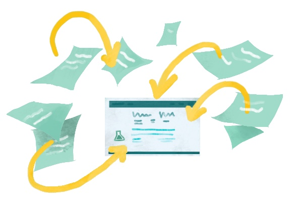
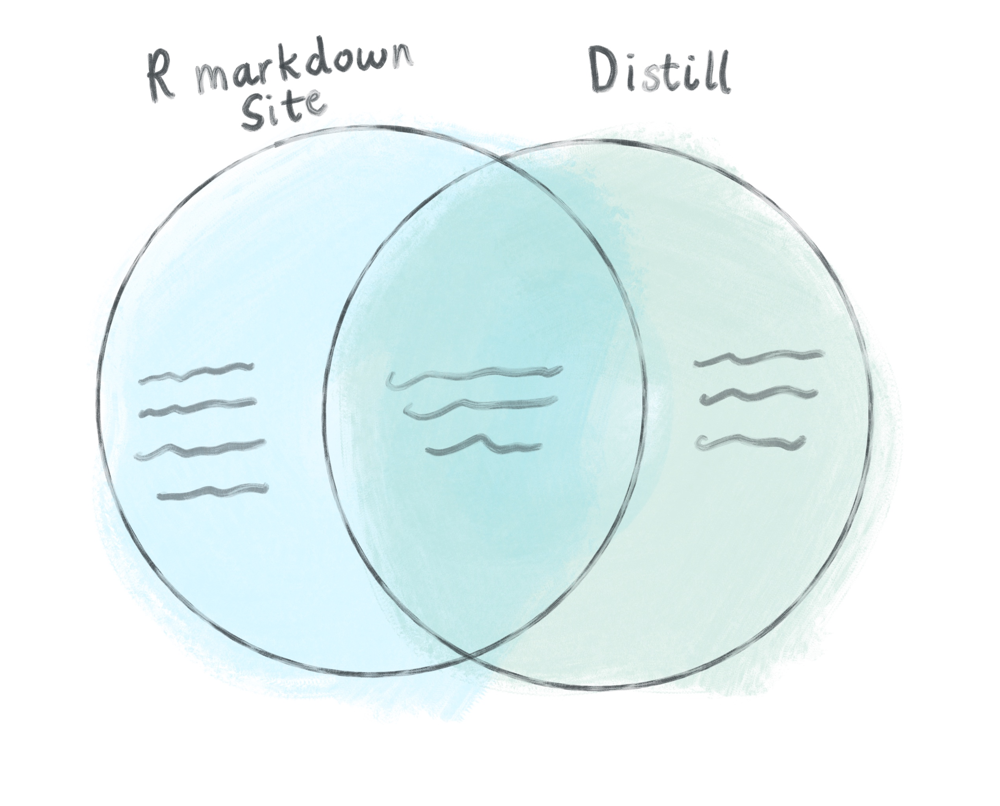

# (PART) Cookbook: Distill sites {-}


# Introduction {-#intro-distill}

Distill is R Markdown's sibling with technical and scientific interests. It is essentially a slightly souped-up R Markdown document that has some built-in features that would otherwise need to be included rather manually in a regular `.Rmd`. 

The original intended use-case for Distill was to create a platform where authoring scientific, collaborative content would be made easier. 

**Why Distill?**

* You're creating content that will use citations, appendicies, and footnotes.
* You want a site that can acknowledge multiple authors and affiliations.
* You want built-in options for things like a logo.
* You're fine sticking to the default Distill theme (or you don't mind getting your hands messy with CSS to change your site's aesthetic) and you don't need `code_folding`, `code_download`, or numbered sections. 

You may also want to learn how to use Distill so that you can then create Distill templates that your learners can then use to generate reports, etc. 

<div class = "side-by-side no-anchor">
<div class = "side1">

<a href="#make-distill" target="_blank"></a>

</div>
<div class = "side2">

#### [Make a Distill site](#make-distill)
You will build a bare-bones Distill website from a site skeleton and publish it. We make only the most minimal changes to content and style necessary to get you a shareable website.

</div>
</div>


\

<div class = "side-by-side no-anchor">
<div class = "side1">

<a href="#distill-yours" target="_blank"></a>

</div>
<div class = "side2">

#### [Make it yours](#distill-yours)

You'll personalize your content here by adding new pages or blog posts to your site.

</div>
</div>

\

<div class = "side-by-side no-anchor">
<div class = "side1">

<a href="#distill-care" target="_blank"></a>

</div>
<div class = "side2">

#### [Caring for your Distill site](#distill-care)
You'll develop a workflow for editing your site, adding new content, and hiding pages that are works-in-progress.

</div>
</div>

\

<div class = "side-by-side no-anchor">
<div class = "side1">

<a href="#distill-dress" target="_blank"></a>

</div>
<div class = "side2">

#### [Dress it up](#distill-dress)

Here, you'll find instructions for no-fuss website customizations that leverage built-in features that *do not* rely on knowing, learning, or using CSS.

</div>
</div>

\

<div class = "side-by-side no-anchor">
<div class = "side1">

<a href="#distill-fancy" target="_blank"></a>

</div>

<div class = "side2">

#### [Make it fancier](#distill-fancy)

In the final chapter, you'll learn about website customizations that require some CSS and HTML.

</div>
</div>


## What are we making? {-}

<center></center>

Same idea as an [R Markdown site](#make-rmd). We need a `_site.yml` that will stitch our pages together, an `index.Rmd` that will be our homepage, + (optional) `.Rmd`s of the Distill variety. 


## Distill vs R Markdown site {-}

Since the R Markdown `.Rmd` file is essentially the fundamental unit of most of these sites, it makes sense to compare the other rstudio4edu tools to it.





**Similarities**

* Distill and R Markdown can both exist as single pages
* Collections can be combined into a set to create a website
* `rmarkdown::render_site()` or *Build Website* within RStudio will build your site
* Same core website features and configurations for YAML apply
* Messy-ish directories (compared to blogdown where you can bundle things)
* `styles.css` can be added to both in the YAML under `output:`


**Unique to Distill**

* `create_website(dir = "<your-directory-name>", title = "<your-site-name>")`
    ** Is `library(distill)` necessary prior to running?
* Allows blog posts to be put into a posts sub-directory, in contrast to an R Markdown site
* Built-in options for a logo within the YAML
* Add a footer to all pages with the inclusion of a `_footer.html` to your main project folder (and the footer goes all the way across)
* Built-in option to include Google Analytics 
* Built-in options for creating a little appendix (with optional Licensing and "Corrections" links)
    ** [https://rstudio.github.io/distill/website.html#site_metadata](https://rstudio.github.io/distill/website.html#site_metadata)
* Built-in way to specify a custom favicon (the little icon for your site that shows up in your browser tab)
* Built-in option for sharing twitter
* `output: distill::distill_article`


## Is this tutorial for you? {-}


**Pre-requisites:**

* You have a [GitHub account](https://github.com/)
* You are comfortable with the basics of using R and RStudio
* You understand how R projects work
* You understand the difference between a regular R script and an R Markdown document


**What you'll learn:**

* How to compile multiple R Markdown pages into a Distill site
* How to add basic customization to a Distill page that are not easily added to an R Markdown site


## Other learning resources {-}

### Existing Distill sites

You can check out the links below as other examples of Distill websites in the wild:

* [Distill for R Markdown](https://rstudio.github.io/distill/)
* [R-Music](https://r-music.rbind.io/about.html)
* [https://m-clark.github.io/](https://m-clark.github.io/)


# Make a Distill site {#make-distill}


## tl;dr

This tl;dr is for readers who are already experienced with GitHub and want to see our "cheatsheet" version of the rest of this chapter. If you are looking for screenshots plus some hand-holding, we think you'll benefit from reading the [rest](#distill-site-setup) of this chapter.

**Here's how you make an Distill site from scratch, using a built-in site skeleton as a template:**

1. Start with an empty RStudio project linked to a remote GitHub repository that you can push/pull from your local copy in RStudio.

1. Make sure the Distill package is installed:

    
    ```r
    remotes::install_github("rstudio/distill")
    ```

1. In your project, create a simple shell for a Distill website by running the following code in your R console and entering a same for your site when prompted:

    
    ```r
    distill::create_website(dir = getwd(), gh_pages = TRUE)
    ```

1. Build your site using the RStudio "Build" pane.

1. Push and commit to send your site online to GitHub- do you see your `.html` files in the `"docs"` folder?

1. Turn on GitHub Pages by going to your repository online. Click on the repository’s settings and under GitHub Pages, change the Source to be the `master branch /docs` folder. Note your new site's URL!

1. Edit your site, build it, then push and commit to GitHub to publish your changes online.

1. Rinse and repeat! Every push to your `master` branch triggers the online version of your site to update.

## Getting set up {#distill-site-setup}


### Packages

The `distill` package needs to be installed from CRAN. You only need to do this once per computer.


```r
install.packages("distill")
```

<!--
If you'll want to add a `README` to your Distill site GitHub repo, then you should also install the `xfun` package so that the step for rendering your site becomes more convenient. 

:::tip
As another tip, if you're used to using `install.packages()` for CRAN packages, try using [`pak`](https://github.com/r-lib/pak) instead for installs. It's more efficient.


```r
install.packages("pak")
pak::pkg_install("xfun")
```
:::

-->

### Make a project {#distill-proj-first}

For your first Distill site, we recommend starting by creating a GitHub repository online first, then making a project in RStudio (if this is not your first rodeo, then you could checkout out the [more advanced GitHub last workflow](#uplevel-distill)).


We recommend following the tips on [Happy Git with R](https://happygitwithr.com/new-github-first.html) and starting in GitHub before switching to RStudio:

1. [**Create a new repository on GitHub**](https://happygitwithr.com/new-github-first.html#make-a-repo-on-github-2) for your work. 

    + Do *not* initialize the repo with a `.gitignore` or a `README` file (we'll add these later!).  
<br>
1. **Copy the repository URL** to your clipboard. 

    + Do this by clicking the green Clone or Download button.
    
    + Copy the HTTPS clone URL (looks like: `https://github.com/{yourname}/{yourrepo}.git`).
    
    + **Or** copy the SSH URL if you chose to set up SSH keys (looks like: `git@github.com:{yourname}/{yourrepo}.git`).  
<br> 
1. [Create a new RStudio Project via git clone](https://happygitwithr.com/new-github-first.html#new-rstudio-project-via-git-clone). **Open RStudio.** 

    + Do this by clicking *File* > *New Project* > *Version Control*> *Git*. 
    
    + Paste the copied URL. 
    
    + Be intentional about where you tell RStudio to create this new Project.  
<br>
1. **Click Create Project.**

:::tip
Follow these instructions from [Happy Git with R](https://happygitwithr.com/) to start with a new repo on [GitLab](https://happygitwithr.com/new-github-first.html#gitlab) or [Bitbucket](https://happygitwithr.com/new-github-first.html#bitbucket), instead of GitHub.
:::


### Make a Distill site skeleton {#distill-site-skeleton}

We'll start by creating the shell for a basic Distill website and publishing this site to GitHub Pages straight away. In your R console, type and run the following code, entering a same for your site when prompted:


```r
distill::create_website(dir = getwd(), gh_pages = TRUE)
```


\

<div class = "split">
<div class = "split1">

You will end up with these files in your project. The most critical files are the `index.Rmd` and the `_site.yml`, and we mention a little about them below. 

</div>
<div class = "split2">

```yaml
.
├── .Rproj.user
├── .nojekyll
├── _site.yml
├── about.Rmd
├── docs
├── index.Rmd
└── mydistillsite.Rproj
```
</div>
</div>

\

Close RStudio and re-open your site by clicking on the project file (`.Rproj`).


:::rstudio-tip
When you re-open the project, you may notice the `.Rproj` file shows up in your Git pane, which means that the file has changed since your last commit. What happened? RStudio has detected that you have built a website, so a single line has been added to your `.Rproj` file:
```yaml
BuildType: Website
```
:::


## A mini-orientation {#distill-site-orientation}

Our project directory now has four new important items. Open and take a peek at each file as we touch on the them below:

1. **`index.Rmd`**: This will be our site's homepage. This file *must* be named `index.Rmd`, and it *must* at minimum have `title:`, `description:`, and `site: distill::distill_website` fields.

1. **`about.Rmd`**: This will be an additional page on our site, and you can change the name of this file to be whatever you want. Additional pages, like this one, at a minimum need to have a non-empty `title:`, but they don't require a `description:` or `site:` line.

1. **`_site.yml`**  is *not* a file that gets turned into a site page, but it *is* necessary for site setup. In general, the `_site.yml` file lets us set options that will affect all pages in our site, and it has the same function here as it does in a typical R Markdown site. A few things you'll notice about this YAML, if you're comparing it to an R Markdown site's: 

      <!-- TODO: use ymlthis -->

      
      ```r
      name: "basic-course-distill"
      title: "Demo Website"
      description: |
        Demo Website
      output_dir: "docs"
      navbar:
        right:
          - text: "Home"
            href: index.html
          - text: "About"
            href: about.html
      output: distill::distill_article
      ```


      The output here has to be `distill::distill_article`. It's okay for this to be on the same line as `output:` or indented on the line beneath it. 

      Weirdly, the `description:` field in `_site.yml` is non-functional (as far as we can tell). But we will use it to create a subtitle of sorts in other YAMLS of our other Distill pages.

1. **`docs/` folder**: This is the output folder, where knitted versions of our `.Rmd`s live once they've been processed to become `.html` files. 

Nothing else to do here, just good info to know. We'll be circling back to these files later. 

## Push to GitHub {#distill-push}

Let's get these website files pushed up to our remote repository on GitHub. Do the following from RStudio:

1. **Click *Git* ** in the same RStudio pane that also contains the *Environment* tab.

2. **Check the box(es)** under the "Staged" column and click *Commit*.

3. **Add a commit message** like "initial commit" and then click *Push*.

<!-- TODO: Update w/ screenshot: <center>{width=400px}<center>
-->


## Build your site {#distill-site-build}

<a href="#make-distill" target="_blank"></a>

In the lifecycle of your Distill site, you'll be doing lots of building. What does building the site do? This processes your `.Rmd`s and creates the `docs/` folder (if it doesn't already exist), which houses `.html` versions of each of your `.Rmd` files. AND each of these pages now has a common navigation bar at the top that links your site together (this is thanks to our `_site.yml` file--but more on that later).

In RStudio, you can render your site locally (knit + preview all `.Rmd` files in one fell swoop) from the either the IDE or the R console.

<div class = "split">
<div class = "split1">


*From the R console*, you can run: 


```r
rmarkdown::render_site()
```

</div>

<div class = "split2">

**OR** *from the IDE*, find the Build tab and select **Build Website**:

<div class="figure" style="text-align: center">
<a href="https://bookdown.org/yihui/rmarkdown/" target="_blank"></a>
<p class="caption">(\#fig:unnamed-chunk-19)The build pane in RStudio</p>
</div>

</div>
</div>

:::tip
If the rendered site does not open up automatically in a new window, you can go to the `docs/` folder in your project, click on the `index.html` file, and `View it in Web Browser`.
:::

## Push to GitHub (again) {#distill-push2}

Let's get these *new* Distill website files pushed up to our remote repository on GitHub. If you want your site to have the most recent updates you've made, then every single `.Rmd` file with a change must be built right *before* pushing to GitHub. Using either the build pane or `rmarkdown::render_site()`, you don't need to knit each `.Rmd` file one at a time, but you do need to build your site locally first every time.

:::tip
Watch out! Each time you run `rmarkdown::render_site()`, the `docs/` folder will be overwritten with updated HTML versions of your `.Rmd`s. This means DON'T EVER EDIT FILES IN THE `docs/` FOLDER! Nothing catastrophic will happen if you do, but you will overwrite and lose all your changes the next time you knit or `render_site()`.
:::  


Go ahead and stage all your changed files, commit, and push to GitHub.

Now we'll get to the good stuff! Let's put this on the internet!


## Make a living, breathing site! {#distill-living}

We have built some out-of-the-box content and pushed to GitHub. Now we'll go back to the GitHub website and tell it where to find our website-ready files:


1. **Back on GitHub, click the *Settings* tab** of your project repository.


2. **Scroll down** until you get to "GitHub Pages" and select "master branch/docs folder". (This is why we had to set up `output_dir: docs` in our `site.yml` file previously. If your file doesn't end up in the `docs/` folder, GitHub pages won't find it.)

<center>{width=600px}</center>

\

3. **Congratulations! A url is generated**--this is your website address. You can share it, tweet it, send it to your mom--it's now live!


4. **Add this url to the repo description** so that it's easy to find. 

<center>{width=80%}</center>

\
\

Now that the bare bones of the site are up, you can go back and add more content to your Distill documents anytime. Your changes will go live as soon as you build or `render_site()`, followed by a push to GitHub. 


## Uplevel your workflow {#distill-uplevel}

We followed a "GitHub first" workflow above, but if you'll be using GitHub regularly, we recommend evolving this workflow. 


First, install the [`usethis` package](https://usethis.r-lib.org/):


```r
install.packages("usethis")
```

Then load it to use it:


```r
library(usethis)
```

\

Now, follow the instructions from [Happy Git with R for setting up a GitHub personal access token or PAT](https://happygitwithr.com/github-pat.html).

:::gotcha
Be sure to restart your R session after setting up the PAT, and pay close attention that your `.Renviron` file has at least one empty line at the bottom.
:::

\

Once you have a GitHub PAT set up in your `.Renviron` file, you can stay in the comfort of your project in the RStudio IDE to do all the GitHub things we were doing before online in your browser. 

Now, here is your advanced workflow for creating a new Distill site inside a project:


1. **Click** *File* > *New Project* > *New Directory*

1. **Scroll down and select** *Distill Website*, and check the box to "Configure for GitHub Pages"

1. Then use your R console to **run** this code: 

    
    ```r
    use_git()
    use_github() # you have to have a PAT setup
    ```
    


