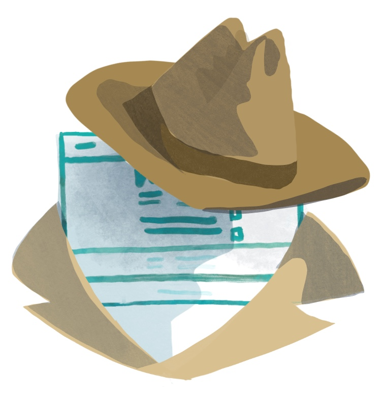
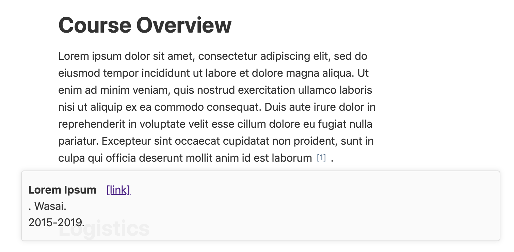
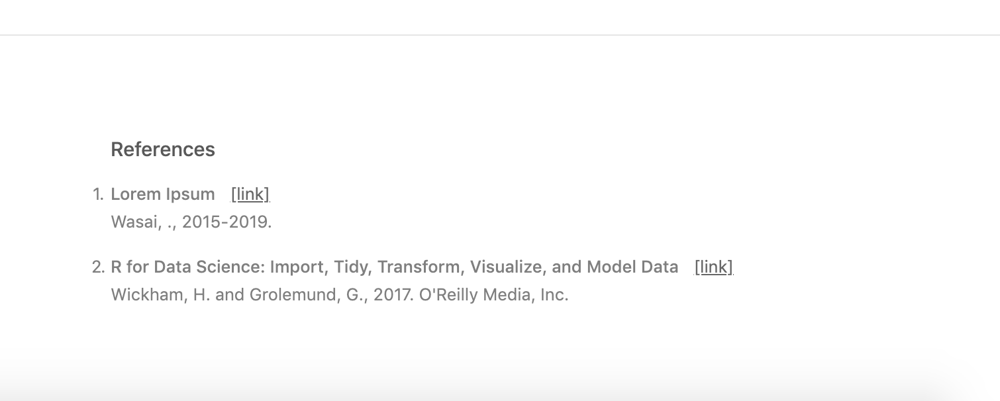
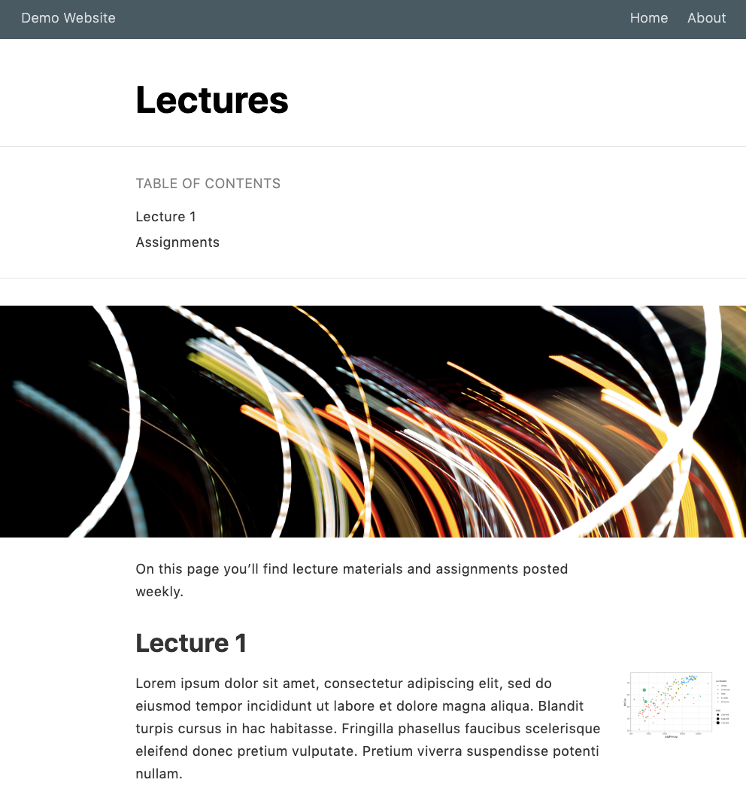
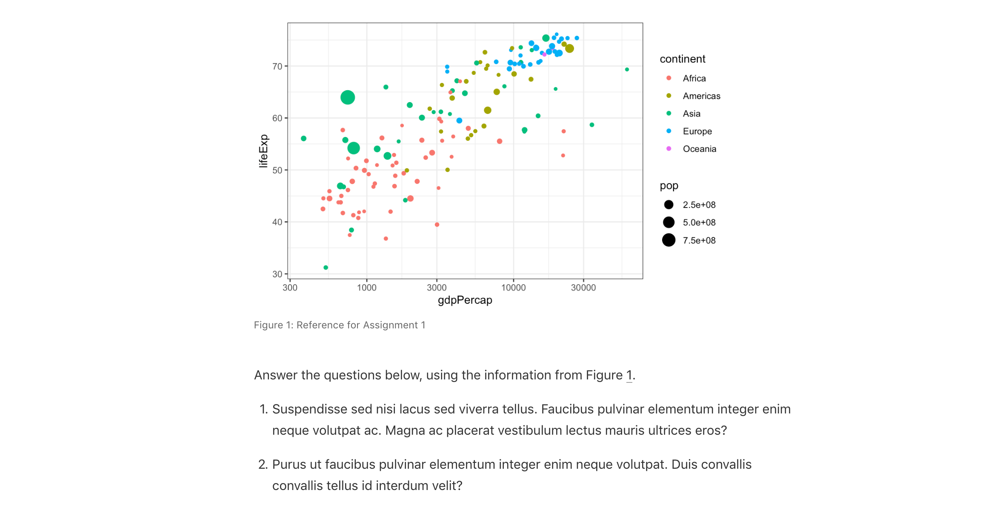

# Caring for your Distill site {#distill-care}

```{r, include = FALSE}
source("common.R")
knitr::opts_chunk$set(fig.align="center")
```


```{r echo = FALSE, fig.link = "#make-distill", out.width="65%"}

```

Caring for a Distill site is the same as caring for a typical R Markdown site. Once you have a site in place, the time comes to update it or add new pages. The key to updating is that you must build your site or use `rmarkdown::render_site()` each time before you push to GitHub--otherwise your changes wouldn't make it into your `docs/` folder. If it's not in the `docs/` then GitHub pages will not be able to find it. 

In summary, here's what the add-new-pages workflow looks like for us:

1. **Open** the existing site RStudio project
1. **Run** "Build Site" or `rmarkdown::render_site()` right away to see where things left off.
1. **Create** a new `.Rmd` document in RStudio using *File > New File > R Markdown*. When the dialogue box opens, go to *From Template* and choose "Distill Article".
1. **Update** your `_site.yml` by adding the new Distill page's `.html` file to the navbar section (see [Grow your navbar](#distill-grow) for how). **Note: It's very easy to forget this step!!**
1. **Run** `rmarkdown::render_site()` to stitch everything together.
1. **Rinse and repeat** if needed!
1. **Commit and push** all changes to GitHub.


## Hiding pages {#hide-distill}

```{r, out.width = "40%", echo= FALSE}

```

Have a Distill article that you'd like to keep under wraps? If you leave it off of your navbar and don't link to it elsewhere, then it's unlikely anyone will ever see it, but it will still be rendered when you build your site. If you don't want the `.Rmd` to be rendered at all, then save it with a filename that begins with an underscore `_`. All files with underscores get passed over when it's time to render the site (but they'll still be in your repository).


### Switching from an existing R Markdown site to a Distill site
<!-- TODO, talk about how to take an existing RMD site and change it to distill? -->

## Alternatives and drawbacks

One drawback to Distill is that it's not very straightforward to include a README file in your GitHub repository. It can be done if you move the entire site's contents into the `docs/` folder and change the output directory to `output_dir: "."`.

**But I really want a README.md:**

Assuming that you currently have your output directory set to `docs/` for GitHub pages and you don't yet have a README:

1.  Move all of your site-specific content to the `docs/` folder. This includes your `Rmd`s, image folders, etc.-- but not the `.gitignore` or `.Rproj` files.)
2.  Change the output directory in `site.yml` to `output_dir: "."`
3.  Now render all of your pages. The fool proof way to do this is to run the line below in the console (make sure you've installed the `xfun` package (`pak::pkg_install("xfun")`).
```
xfun::in_dir('docs/', rmarkdown::render_site())
```
4. Now you can create a `README.md` in your original project directory. 
5. Commit and push to GitHub


## Using your Distill site

## Distill features

As you start to add content to your Distill page, don’t forget about the bells and whistles you can use in Distill (that aren't easily made available in an R Markdown site), like the ones below. For more guidance on how to use these, check out the Distill documentation:

* Authors and affliations
* Citations
* Hoverable footnotes
* Asides
* Figure width
* Figure captions and cross-references


### Authors and affiliations

Ah, so easy to write up collaborative reports and projects in groups when Distill's YAML gives you the space to include multiple authors and (optionally) their affiliations. Below is an example of what this looks like when it's added to the index page.

While you're here you can optionally add in a `date:` field (which must always be in the order of month, day, then year). Use `"r Sys.Date()`"` to show the current date each time you knit the page.  

All of this info will be placed in a "Title" section at the top of the page. 

<div class = side-by-side>
<div class = side1>

```{r, eval = FALSE}
---
title: "Demo Website"
description: |
  Welcome to my Distill course page. Here you can find all course logistics and content.
author:
  - name: Desirée De Leon
    url: https://desiree.rbind.io
    affiliation: RStudio
    affiliation_url: https://rstudio.com
  - name: Alison Hill
    url: https://alison.rbind.io
    affiliation: RStudio
    affiliation_url: https://rstudio.com
date: "`r Sys.Date()`"
site: distill::distill_website
---
```

</div>
<div class = side2> 


</div> 
</div>

### Citations

Including citations is built in to both Distill and Bookdown sites. In Distill, your citations will appear as numbers, and when hovering over them, you see the full citation info.

To include citations of your own, you'll need two things: 

* A file with a list of your references (aka a BibTex file)
* A link to this file in the YAML of your `.Rmd` page

Here's a walkthrough of what this looks like:

* **Create the file of listed citations**. This has to be a BibTeX file with citation entries like the ones below, for example. If you use a citation manager (like Endnote or Mendeley), then the easiest way to get a BibTex file is to export a BibTeX file from there (there are many online tutorials that show you how, e.g.[Endnote](https://www.reed.edu/cis/help/LaTeX/EndNote.html), [Mendeley](https://blog.mendeley.com/tag/bibtex/)). However, you can also make a BibTeX file manually if want to, by creating a regular new text file (*File* > *New File* > *Text File*) and saving it with a `.bib` file extension (we named our `refs.bib`, but you can choose a different name). 


* **Save your BibTeX file** in your project directory.

```
@book{r4ds,
 author = {Wickham, Hadley and Grolemund, Garrett},
 title = {R for Data Science: Import, Tidy, Transform, Visualize, and Model Data},
 year = {2017},
 isbn = {1491910399, 9781491910399},
 edition = {1st},
 publisher = {O'Reilly Media, Inc.},
 url = {https://r4ds.had.co.nz/},
}

@misc{loremipsum,
  title = {Lorem Ipsum},
  author = {Wasai},
  year = {2015-2019},
  url = {https://loremipsum.io/},
}
```

* **Add a `bibliography:` field to the YAML of your individual `.Rmd`** whose content will contain the citations, then specify the name of your BibTex file. Now you can create inline citations of any reference that exists in this file. 


* **Cite your sources** in the body of the text. The citation should be in brackets and start with an `@` followed by the source's unique ID from the BibTex file (e.g.`[@loremipsem]`). The unique ID is whatever is on the first line of its BibTeX entry, immediately following the `{`. When you cite a source, an appendix will be created at the end of the page (if it doesn't already exist) with a list of all your cited references.

<div class = "side-by-side">
<div class = "side1">
```{r, eval = FALSE}
---
title: "Demo Website"
description: |
  Welcome to my Distill course page. Here you can find all course logistics and content.
author:
  - name: Desirée De Leon
    url: https://desiree.rbind.io
    affiliation: RStudio
    affiliation_url: https://rstudio.com
  - name: Alison Hill
    url: https://alison.rbind.io
    affiliation: RStudio
    affiliation_url: https://rstudio.com
bibliography: refs.bib
date: "`r Sys.Date()`"
site: distill::distill_website
---
```
</div>

<div class = "side2">

{width=100%}
<br>

{width=100%}

</div>
</div>

The citation feature within Distill was really built for citing academic sources, so the display of the citation data in the hovered box and in the appendix looks best when fields like "publisher" and "year" are filled out, but having blank entries for these won't prevent you from creating a citation.

You can read more of the nitty-gritty details about citations, as well as about making your Distill page itself easily citable to others [here](https://rstudio.github.io/distill/citations.html).


### Hoverable footnotes

Hoverable footnotes are little magical nuggets of Distill. No other `.Rmd`-based sites that we describe in our cookbooks have these built-in. In addition to the satisfaction that your user will get when they discover they don't have to be jolted away to the bottom of the page to see your footnote, the hoverable footnotes are just as satisfyingly easy to include. Insert a `^[footnote here]` whereever you'd like the footnote to go, and they'll be automatically numbered, added to the appendix, and expanded when you hover over the number. 

<div class = "side-by-side">
<div class = "side1">
```
# Credits

This course is assigned 
3 credit hours^[A footnote goes here!].    

```
</div>

<div class = "side2">

</div>
</div>

### Asides

You can also include small notes, images, or plots in the margins of the page by enclosing content within `<aside>` tags, like this (note that the second tag needs a `/`):

**A note**
<div class = "side-by-side">
<div class = "side1">
```
<aside>
Here is a small side note.
</aside>

```
</div>

<div class = "side2">

</div>
</div>

**An image**

<div class = "side-by-side">
<div class = "side1">
```
<aside>

</aside>

```
</div>

<div class = "side2">

</div>
</div>

**A plot**

<div class = "side-by-side">
<div class = "side1">
```
<aside>
```{r, eval = TRUE, echo = FALSE}
library(tidyverse)
library(gapminder)
 
p <- gapminder %>%
  filter(year==1977) %>%
  ggplot( aes(x = gdpPercap, y = lifeExp, size = pop, color=continent)) +
  geom_point() +
  scale_x_log10() +
  theme_bw()

p
```
</aside>

```
</div>

<div class = "side2">

</div>
</div>

### Figure width

Distill allows you to change the width of figures that you produce within code chunks. This can be a plot or a regular image file. We think the coolest application of this is being able to produce a big image that extends across your entire page. This would work well with figures that have a lot of visual interest -- likes maps or photographs.

To try this out, you can apply `layout = "l-screen"` to the specific code chunk that contains your image or plot. Don't have an image? [Try one of these](https://unsplash.com/). Download and move the file into your project directory (or to an `images/` folder in your project directory folder to keep your files more organized).

````
```{r layout = "l-screen"}`r ''`
knitr::include_graphics("images/curves.png")
```
````

Produces this output:



:::design
You can use the `l-screen` option creatively to make your image a page banner or a section divider. 
:::

Distll also gives you the option to make your figures just a bit wider than the main body content-- (e.g. using `l-body-outset`) but we're not a huge fan of this option aesthetically because it kind of looks like the figure just doesn't quite fit into its clothes. We take a "go big or go home" approach and recommend either going the full page width, or staying with the regular options, unless you truly feel there's no other way to effectively display your output.

Nonetheless, here are all the [width options available](https://rstudio.github.io/distill/figures.html#wider-layouts):

* `l-body`: (Default) As wide as the body of text.
* `l-body-outset`: Overflows the text-width a bit (Not recommended).
* `l-page`: About 3/4 of the screen width.
* `l-screen-inset`: Stretches across the entire page, except for 15px padding around the sides. 
* `l-screen`: Fully-committed, full screen. Works best for wide, short figures.

You can check out the specifics of Distill figure widths [here](https://rstudio.github.io/distill/figures.html#wider-layouts). 

### Figure captions and cross-references

You can also include captions for your figures by including `fig.cap =` in the code chunk options. 

````
```{r gdpplot, eval = TRUE, echo = FALSE, fig.cap = "Reference for Assignment 1"}`r ''`
library(tidyverse)
library(gapminder)
 
p <- gapminder %>%
  filter(year==1977) %>%
  ggplot( aes(x = gdpPercap, y = lifeExp, size = pop, color=continent)) +
  geom_point() +
  scale_x_log10() +
  theme_bw()

p
```
````

If you give the code chunk a name, you can use that name later to reference the plot in the body of the text, like so: Figure `\@ref(fig:gdpplot)`. You would replace `gdpplot` with the name of your code chunk. 



:::tip
If you've used images or figures from an outside source, then use a figure caption *and* an an `out.extra="class=external"` in the code chunk options. This not only gives credit but also adds bit of formatting that makes it clear that outside images you're using may not necessarily fall under the same license as the rest of your content, should someone else want to use your materials.
:::


### If you like Distill...
...then you may also like the tools below. These are not unique to Distill (you could use them in any R Markdown doc), but they're useful and cool for communicating technical content.

\

**For Visualizations**
You can see some examples of the two tools below in action [here](https://rstudio.github.io/distill/interactivity.html)

* [r2d3](https://rstudio.github.io/r2d3/)
* [html widgets]()

```{r, layout="l-screen-inset"}
library(leaflet)
leaflet() %>%
  addTiles() %>%  # Add default OpenStreetMap map tiles
  addMarkers(lng=174.768, lat=-36.852, popup="The birthplace of R")
```

\

**For Tables**

There are different ways to include tables in your site. None are unique to Distill, but they're useful to know about. You can see examples [here](https://rstudio.github.io/distill/tables.html).