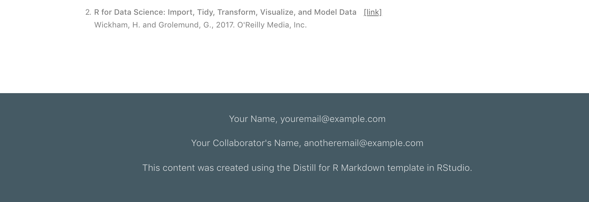
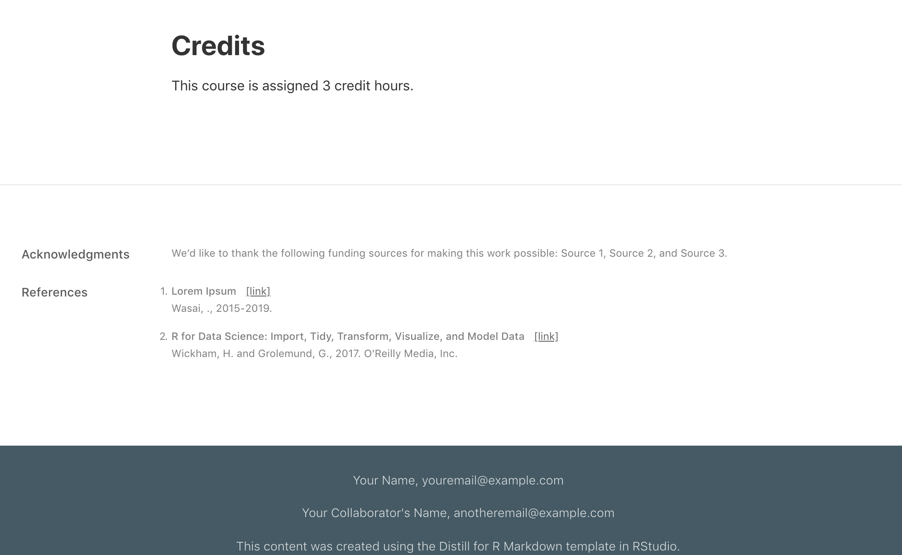
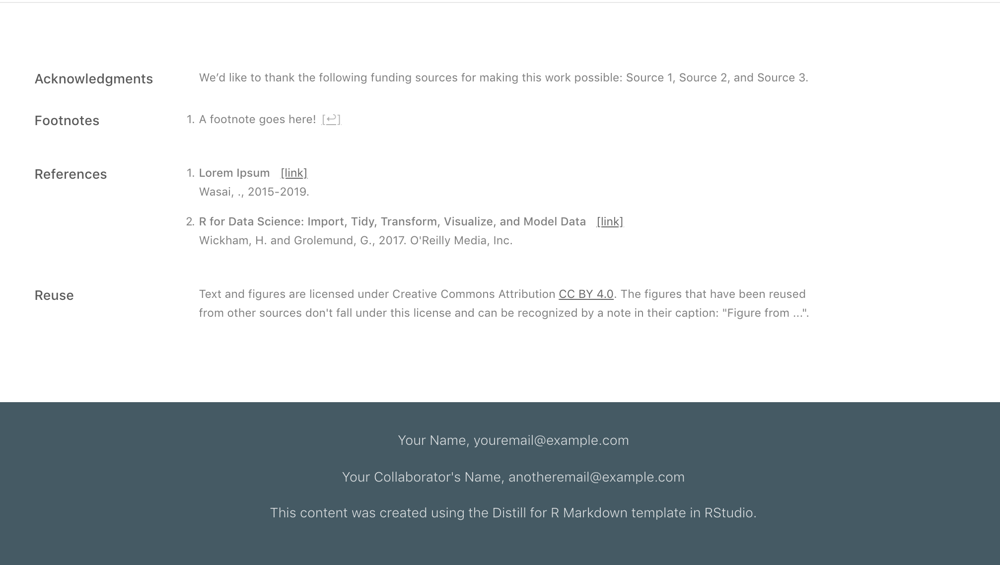
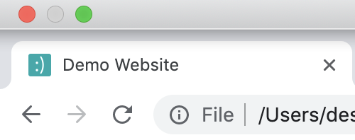

# Dress it up! {#distill-dress}


Many of the customizations you can add to a regular `.Rmd` site, you can also use in a Distill site in the same way--by specifying them in the `_site.yml` file (unless otherwise noted) as an option underneath `output:` We don't cover these options again here, but you can see which ones apply in the list below and learn more about them by clicking on the links.

**Layout features common to Rmd sites and Distill**

<div class= "col2">

* [A (non-floating) Table of contents (TOC)](#rmd-TOC)
* [Dropdown menus](#rmd-dropdown)
* [Navbar icons](#rmd-icons)
* [White space](#rmd-white)*
\

</div>
\

\* While you can of course always add more white space between sections in Distill, we think its default spacing is actually pretty good already.

:::tip
**You can't always get what you want**: Note that Distill does *not* give you the option to use a floating TOC, change color themes, use `code_download` nor `code_folding` as you can in a regular `.Rmd` site. Another weird thing worth pointing out is that the only way to get a TOC on the `index.Rmd` page is to specify one globally within the `_site.yml`. It cannot be added individually to the index page alone (but it can be to other Distill pages). 
:::

But--it gets better! Distill never leaves the house without looking classy, and the features below make that easy.

## Site sections

### Site footer

A footer is added to your all your pages when you make a file named `_footer.html` that has the content you want. It's automatically applied to all pages when you drop this file into your main project directory. 

1. In the RStudio IDE, **create a new text file** by going to *File* > *New File* > *Text file*.
2. **Save this as `_footer.html`** in your main project directory. Its contents will be used as a footer for each of your Distill pages.
3. **Enter some footer content** and save.

For example, contents could be something like this:

<div class = "side-by-side">
<div class = "side1">

```
Your Name, youremail@example.com

Your Collaborator's Name, anotheremail@example.com

This content was created using 
the Distill for R Markdown template in RStudio.

```
</div>
<div class= "side2">



</div>
</div>

Unfortunately, you'll be stuck with the default teal color for the footer unless you change the CSS file, which we demo in the [Make it fancy](#distill-fancy) chapter. But the nice thing about the Distill footer is that it will carry all across the page, which is not an easy feat to accomplish in some regular R Markdown sites (even if you're not afraid to mess with CSS). 

### Appendix

Turn any content in your `.Rmd` into an appendix by creating a new level 1 or 2 header followed by `{.appendix}` Distill page. Any content that follows will be automatically added to the end of your page, alongside the footnotes and the reference list. 

```
# Acknowledgments {.appendix}

We'd like to thank the following funding sources for making this work possible: 
Source 1, Source 2, and Source 3. 

```


## Sharing 

### Reuse and licencing

Licensing! It sounds dry and lawyer-y, but don't pass this up. Picking and posting your license is an important part of sharing content you create with others. By having a linked statement that explains what license and permissions you give to others, you can (hopefully) prevent the stomach-sinking feeling of seeing your hardwork being used across the internet without credit or attribution to you. 

Disill makes this easy-peasy by building in a `creative_commons:` line in your YAML, and it will automatically add a statement to the appendix of your site that lets others know how they can use your materials. In the example below, we add this to the `_site.yml` file.

Not sure what your options are for licensing? Check out the resource [here](https://rstudio.github.io/distill/metadata.html#creative-commons). 

<div class="side-by-side">
<div class="side1">

```
name: "basic-course-distill"
title: "Demo Website"
description: |
  A site for a course
output_dir: "docs"
creative_commons: CC BY
navbar:
  right:
    - text: "Home"
      href: index.html
    - text: "Lectures"
      href: about.html
output: distill::distill_article
```

</div>
<div class="side2">

</div>
</div>


### Preview images

Preview images are what you see when you share links of your site. You can choose the image that's used for this a few different ways that are described in detail [here](https://rstudio.github.io/distill/metadata.html#preview-images). 

### Logo

We can also add a logo to our site, which will appear on the left side of the navbar. 

1. **Save the logo** you want to use in your project directory. You don't have to, but we recommend keeping a subfolder called `images/` where you can place all image files for your site.  
2. **Open your `_site.yml`** file.
3. **Add a `logo:` field** underneath the navbar options in the `_site.yml` file. 
    * Enter the file path to the logo on the  `image:` line. 
    * If you want your logo to link to a website, enter the link address on the `href:` line.

<!-- TODO: use ymlthis -->

Here's an example in the `_site.yml` file:

<div class="side-by-side">
<div class="side1">


```r
navbar:
  logo:
    image: images/logo.png
    href: https://www.rstudio.com
```

</div>
<div class="side2">


</div>
</div>


### Favicon
You know the little tiny icon on the left side of most of your your browser tabs? That's a favicon, and here's how you include one: 

1. **Save the image** you want to use in your project directory (or in an `images/` folder). For best results this image should be square. Don't have an image? [Make a favicon with text or an emoji](https://favicon.io/), and then download and move the `.ico` file into your project directory.
2. **Open** your `_site.yml` file.
3. **Add** `favicon: <insert-path-to-favicon.ico>`.

<div class="side-by-side">
<div class="side1">

<!-- TODO: replace with ymlthis -->

```
name: "basic-course-distill"
title: "Demo Website"
description: |
  A site for a course
output_dir: "docs"
creative_commons: CC BY
favicon: images/favicon.ico
```
</div>
<div class="side2">

{width=60%}
</div>
</div>

:::tip
**Note**: In the example above, we can use a ICO image file (with the `.ico` extension), but other image file types are fine. ICO files do a better job of rendering efficiently across most browsers, so default to this if you can.
:::


### Google analytics

You can also add an option to your YAML for including a [google analytics tracking ID](https://rstudio.github.io/distill/website.html#google-analytics) to your site, and the instructions are detailed in the Distill documentation.


### Getting edits

If you want to solicit edits and feedback from others, then you can add You can also add the fields `base_url:`, `twitter:`, 


```r
name: "distill"
title: "Distill for R Markdown"
favicon: images/favicon.ico
base_url: https://rstudio.github.io/distill
twitter:
  site: "@rstudio"
```

