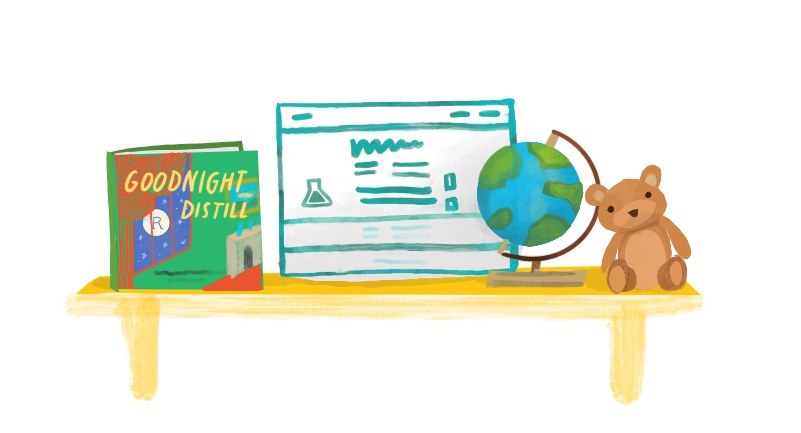

# Make it yours {#distill-yours}




## Adding new Distill articles {#add-distill}

A Distill page is called an article. To add new ones we need to add new `.Rmd` files (with a Distill-flavored YAML) to our site's project root directory. You can do this in RStudio using *File > New File > R Markdown*. When the dialogue box opens, go to *From Template* and choose "Distill Article". Now you can edit away. To add this article to your navbar and site, see the next section.

    

## Grow your navbar {#distill-grow}

To make a new Distill article discoverable and connected to the Distill site, you'll need to *also* make a change to navbar, which means opening up the `_site.yml` file and fiddling with it. To add another page link to your navbar, you need to know two things about the new page you want to add:

1. The **name you want to see** on the navbar for this page; this is the page's `text`.

1. The **name of the `.html` file** that corresponds to the `.Rmd` file you're adding; this is the page's `href`.

Let's say we create a new file called `labs.Rmd`. We want to add the link to the rendered page `labs.html` to our upper navbar next to "Home" and "Lectures", so we would add the following to our YAML:

```yaml
navbar:
  left:
  - text: Home
    href: index.html
  - text: Lectures
    href: lectures.html
  - text: Labs
    href: labs.html
```

\

Save the changes to `_site.yml`, build, and preview to see the new page appear in the upper navbar.

<div class = side-by-side>
<div class = side1>


<!-- TODO is ymlthis okay? -->


```yaml
name: Basic Course Site
output_dir: docs
title: Demo Distill
description: ' | Demo Distill'
navbar:
  right:
  - text: Home
    href: index.html
  - text: Lectures
    href: lectures.html
  - text: Labs
    href: labs.html
```

</div>

<div class= side2>
{width=40%}

</div>
</div>

You may have noticed that in the YAML options we’ve looked at so far, `right:` has been one of the first things to go under `navbar:`. You can add all (or just some) of your links aligned to the left side of the navbar instead by using `left:`. 

```yaml
navbar:
  left: []
  right: []
```

\

If we added the page for `labs.Rmd` to the left of our navbar instead:
<div class = side-by-side>
<div class = side1>

```yaml
name: Basic Course Site
output_dir: docs
title: Demo Distill
description: ' | Demo Distill'
navbar:
  left:
  - text: Labs
    href: labs.html
  right:
  - text: Home
    href: index.html
  - text: Lectures
    href: lectures.html
```

</div>

<div class= side2>

{width=40%}

</div>
</div>
