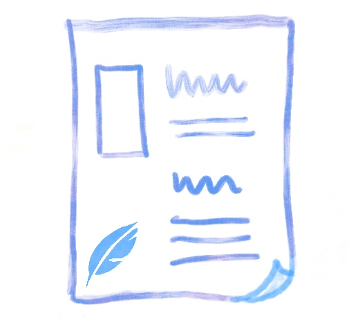
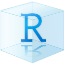
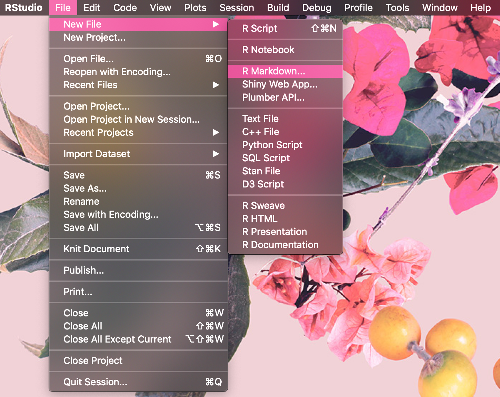
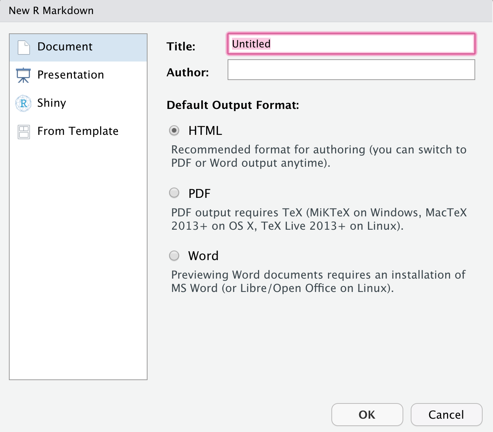
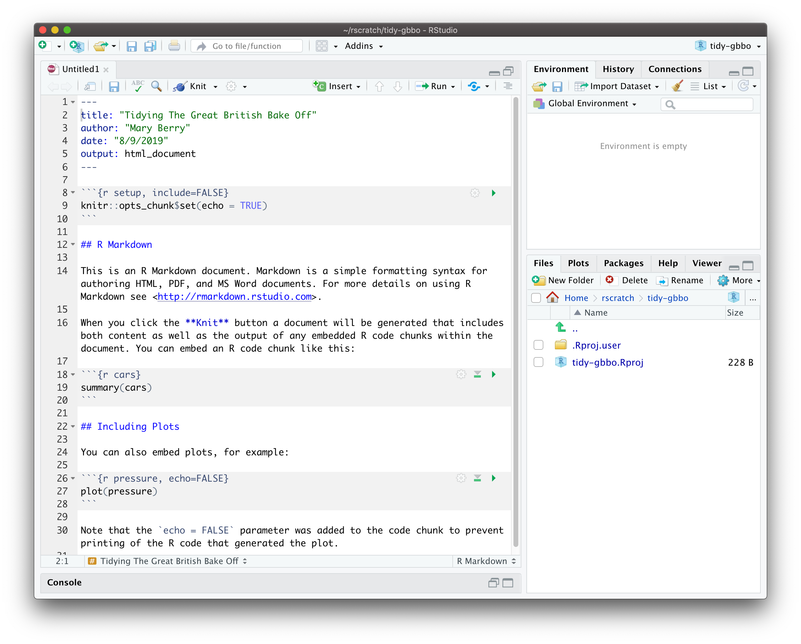
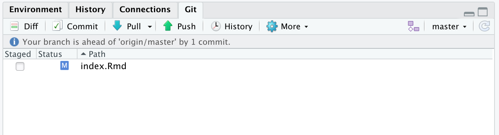
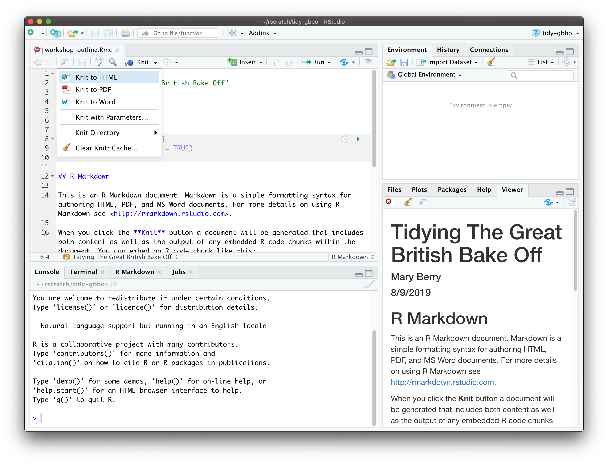
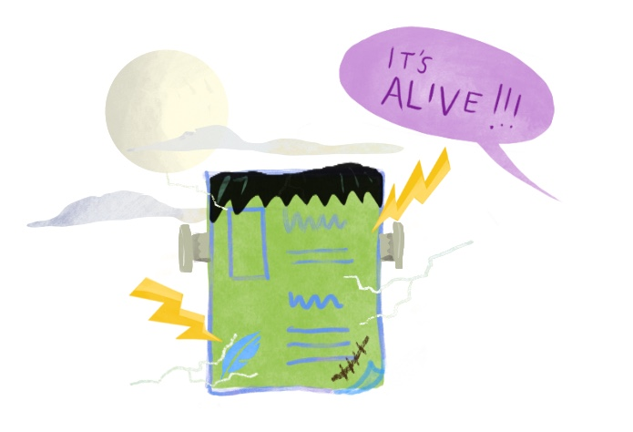

# (PART) Cookbook: R Markdown Lessons {-}

```{r, include = FALSE}
source("common.R")
library(tidyverse)
library(ymlthis)
knitr::opts_chunk$set(fig.align="center")
```


# Introduction {-#intro-doc}

R Markdown is a powerful tool that seems relatively simple when you first start using R: you focus mainly on your words (written in [Markdown](https://commonmark.org/help/tutorial/)) and your code (written in R), which seem basic enough! But...then you start trying to use R Markdown to create educational content that will be consumed by learners. 

It is easy to become overwhelmed by the number of knobs you can turn. You may even feel like you are stumbling upon hidden knobs and secret passages that you wish you had known about earlier (or at least, we did). 

Our aim in this section is to give you some of the tools and vocabulary for using R Markdown as an educator. There are a number of tips and tricks that can improve "quality of life" when working with R Markdown, both for yourself and for your learners. And we will share some of our favorite "bells and whistles" that can improve the accessibility of the lessons you make. 

In the following chapters, we distinguish **content** from **presentation**, i.e., what is delivered is distinct from how it will be delivered. We called this more general section "R Markdown Lessons", but our advice will focus on helping you use R Markdown to create different types of effective lessons, like:

+ how-tos (*a step-by-step recipe for a specific problem; light on narrative and teaching "why"*)
    + floating TOC (numbered?)
    + code download
    + download the data
+ tutorials (*a narrative that helps learners build a mental model + exercises to strengthen that mental model*)
    + add to this, code folding?
    + bootstrap q/a boxes
+ explanations (*a tutorial, but without exercises*)
+ worked examples (*like a case study; exercises may be implicit or non-existent*)
+ worksheets (*a fill-in-the-blank template with a specific structure + prompts for the learner to fill in; none to minimal narrative*)

You could deliver any of these, or a combination of these, via any of the following delivery methods:

+ workshops
+ in-class labs
+ books
+ talks/lectures
+ blog posts
+ handouts
+ vignettes

We will leave the [lesson design](http://teachtogether.tech/#s:process) and the determination of the delivery method up to you as the educator. As Greg Wilson writes in ["Teaching Tech Together"](http://teachtogether.tech/):

> "You may give your learners both written lessons and some combination of recorded video and self-paced exercises, but if you are going to teach in person you must offer something different from (and hopefully better than) either of them."
>
> --Greg Wilson

You can read more of Greg's advice for [teaching in person](http://teachtogether.tech/#s:performance) and [teaching online](http://teachtogether.tech/#s:online).

Using R Markdown document templates, you can put together a streamlined static or interactive lesson for learners to engage with. You can follow along with this cookbook, or you can download the demo repositories modify as much as you'd like. 


<div class = "side-by-side no-anchor">
<div class = "side1">

```{r echo = FALSE, fig.link = "#make-doc"}
knitr::include_graphics("images/illos/insert.jpg")
```

</div>
<div class = "side2">

#### [Make a document](#make-doc)

You will build a bare-bones R Markdown document from a template and publish it. We make only the most minimal changes to content and style necessary to get you a shareable link.

</div>
</div>

\

<div class = "side-by-side no-anchor">
<div class = "side1">

```{r, echo= FALSE, fig.link = "#doc-yours"}
knitr::include_graphics("images/illos/insert.jpg")
```

</div>
<div class = "side2">

#### [Make it yours](#doc-yours)

You'll personalize your document's content here by adding your words, R code, and R output like plots to your lesson.

</div>
</div>

\

<div class = "side-by-side no-anchor">
<div class = "side1">

```{r, echo= FALSE, fig.link = "#doc-care"}
knitr::include_graphics("images/illos/insert.jpg")
```

</div>
<div class = "side2">

#### [Caring for your document](#doc-care)
You'll develop a workflow for editing your document, adding bells and whistles, and improving your R Markdown quality of life.

</div>
</div>

\

<div class = "side-by-side no-anchor">
<div class = "side1">

```{r, echo= FALSE, fig.link = "#doc-dress"}
knitr::include_graphics("images/illos/insert.jpg")
```

</div>
<div class = "side2">

#### [Dress it up](#doc-dress)

Here, you'll find instructions for no-fuss document customizations that leverage built-in features that *do not* rely on knowing, learning, or using CSS.

</div>
</div>

\

<div class = "side-by-side no-anchor">
<div class = "side1">

```{r, echo= FALSE, fig.link = "#doc-fancy"}
knitr::include_graphics("images/illos/insert.jpg")
```

</div>

<div class = "side2">

#### [Make it fancier](#doc-fancy)

In the final chapter, you'll learn about document customizations that require some CSS and HTML.

</div>
</div>

## What are we making? {-}

<div class="side-by-side">
<div class="side1">

R Markdown is ...


</div>
<div class="side2">

```{r horst-rmd-rock, echo = FALSE, fig.cap = "Artwork by [Allison Horst](https://twitter.com/allison_horst?lang=en)", fig.link = "https://twitter.com/allison_horst?lang=en"}
knitr::include_graphics("images/horst_rmd_rockstar.png")
```

</div>
</div>

We're about to take a single R Markdown file, knit an `.html` version, and publish that file online to a shareable website. 

```{r knit-to-html, echo = FALSE, out.width="60%"}
knitr::include_graphics("images/illos/Knit-to-html.jpg")
```

The [R Markdown package](https://rmarkdown.rstudio.com/docs/) has a number of built-in ["output formats"](https://rmarkdown.rstudio.com/docs/reference/index.html#section-output-formats), which means that a single .Rmd document can be "knit" into a bunch of different output file types like HTML, PDF, and even Word documents.

For educators, we strongly encourage using the default HTML output format for four reasons:

1. __Shareability__- HTML output can be easily shared with links, especially if you are using GitHub.

1. __Flexibility__- .Rmd files output to HTML can be organized easily into larger educational projects using R Markdown extension packages like `bookdown` and `blogdown` (see later chapters).

1. __Styleability__- Each R Markdown output format has its own output styling options. The [options](https://rmarkdown.rstudio.com/docs/reference/html_document.html) for the HTML output format are by far the most fully featured and easily accessible, relying on no additional software installation.

1. __Customizability__- All HTML output can be further customized using CSS. The bad news is that you will need to learn a bit about CSS to get there (see our crash course), but the good news is that if you are the kind of educator that needs to, for example, use a specific branded style guide that specifies colors, fonts, etc., you *can* make your HTML output look "on brand" with a custom CSS.


We'll deploy the single document to GitHub Pages. The rest of our cookbooks focus on websites built from collections of R Markdown documents, but for this cookbook, we'll create one R Markdown document and publish it.

But first, a little inspiration. All of the below documents were made with R Markdown, knitted to the HTML output format and published by these lovely authors so you can enjoy the lovely rendered versions with your eyeballs in your favorite internet browser:


+ [<i class="fas fa-hand-holding-heart"></i>Harvard's R graphics with `ggplot2` workshop](https://tutorials.iq.harvard.edu/R/Rgraphics/Rgraphics.html)[<i class="fa fa-code"></i>`.Rmd`](https://github.com/IQSS/dss-workshops/blob/master/R/Rgraphics/Rgraphics.Rmd)

+ [<i class="fas fa-hand-holding-heart"></i>BBC Visual and Data Journalism cookbook for R graphics](https://bbc.github.io/rcookbook/)[<i class="fa fa-code"></i>`.Rmd`](https://github.com/bbc/rcookbook/blob/master/index.Rmd)

+ [<i class="fas fa-hand-holding-heart"></i>OpenCaseStudies - Health Expenditure](https://opencasestudies.github.io/casestudies/ocs-healthexpenditure.html)[<i class="fa fa-code"></i>`.Rmd`](https://github.com/opencasestudies/ocs-healthexpenditure/blob/master/ocs-healthexpenditure.Rmd)

+ [<i class="fas fa-hand-holding-heart"></i>How to explore and manipulate a dataset from the fivethirtyeight package in R](http://www.storybench.org/how-to-explore-a-dataset-from-the-fivethirtyeight-package-in-r/)[<i class="fa fa-code"></i>`.Rmd`](https://github.com/mjfrigaard/storybench-posts/blob/master/03-how-to-explore-and-manipulate-a-dataset-from-the-fivethirtyeight-package-in-r.Rmd)

+ [<i class="fas fa-hand-holding-heart"></i>Bioconductor for Everyone: Exploring, Analyzing, and Visualizing Large Data Sets with R](https://bioconductor.org/help/course-materials/2019/UB-CDSE/CDSE2019.html)[<i class="fa fa-code"></i>`.Rmd`](https://github.com/Bioconductor/BiocIntro/blob/UB-CDSE-Apr-2019/vignettes/CDSE2019.Rmd)

+ [<i class="fas fa-hand-holding-heart"></i>Trafford Data Lab Open Data Companion](https://www.trafforddatalab.io/open_data_companion/#open_data_companion)[<i class="fa fa-code"></i>`.Rmd`](https://github.com/traffordDataLab/open_data_companion/blob/master/index.Rmd)

+ [<i class="fas fa-hand-holding-heart"></i>Claus Wilke's class worksheet on k-means clustering](https://wilkelab.org/classes/SDS348/2019_spring/worksheets/class10.html)[<i class="fa fa-code"></i>`.Rmd`](https://github.com/wilkelab/wilkelab.github.io/blob/master/classes/SDS348/2019_spring/worksheets/class10.Rmd)

+ [<i class="fas fa-hand-holding-heart"></i>Introduction to multilevel modeling using **rstanarm**: A tutorial for education researchers](https://mc-stan.org/users/documentation/case-studies/tutorial_rstanarm.html)[<i class="fa fa-code"></i>`.Rmd`](https://github.com/stan-dev/example-models/blob/master/education/tutorial_rstanarm/tutorial_rstanarm.Rmd)


```{r}
doc_inspo <- tibble::tribble(
    ~html_url, ~html_label, ~rmd_url, ~site_url,
    # rstan tutorial
    "https://mc-stan.org/users/documentation/case-studies/tutorial_rstanarm.html", 
    "Introduction to multilevel modeling using **rstanarm**: A tutorial for education researcher",
    "https://github.com/stan-dev/example-models/blob/master/education/tutorial_rstanarm/tutorial_rstanarm.Rmd",
    "https://mc-stan.org/users/documentation/case-studies.html"
)
```

```{r echo = FALSE}
library(glue)
library(kableExtra)
doc_inspo %>% 
    mutate(see_doc = cell_spec(html_label, "html", link = html_url),
           show_doc = cell_spec(emo::ji("computer"), "html", link = rmd_url),
           all_doc = cell_spec(emo::ji("house"), "html", link = site_url)
           ) %>% 
    select(contains("doc")) %>% 
    kable("html", escape = FALSE) %>%
    kable_styling(bootstrap_options = c("hover", "condensed")) 
```


# Make a document {#make-doc}

```{r, out.width = "40%", echo= FALSE}

```


The simplest way to start with R Markdown is to use the boilerplate template that ships with RStudio. But first, we need to talk about hygiene briefly.

Make sure you set up a folder for this new document you are making. For now, let's just consider that this folder will house a single R Markdown document.

## Getting set up {#doc-setup}

```{r, out.width = "20%", echo= FALSE}
knitr::include_graphics("images/illos/Gears.jpg")
```

### Update packages 

The only package you need for this cookbook is `rmarkdown` but if you are using RStudio, you are all set!


:::rstudio-tip
The `rmarkdown` package does not need to be explicitly installed or loaded here, as RStudio automatically does both when needed. 
:::

However, if you haven't updated your package recently (or ever), you can re-install it to make sure you are using the most up-to-date version from CRAN:

```{r eval = FALSE}
# check package version installed
packageVersion("rmarkdown")
# install if update is needed
install.packages("rmarkdown")
```

At the time of publishing, we are running `rmarkdown` version `r packageVersion("rmarkdown")`.

### Make a project {#doc-proj-first}

<div class="side-by-side">
<div class="side1">

<center>
\
\


</center>

</div>

<div class="side2">

We encourage you to start a new R project every time you start a "new" educational project. 

Read up on creating projects in RStudio in the [*R for Data Science* book](https://r4ds.had.co.nz/workflow-projects.html).

For your first R Markdown document, we recommend starting by created a GitHub repository online first, then making a project in RStudio. 

</div>
</div>

:::hat
h/t to [Matt Crump](https://twitter.com/MattCrump_/status/1159540934733967363?s=20):
\
"If you're not in a project, get in one, you'll be happy you did later."
:::

<!--TODO: add link to other workflow that we recommend later-->

```{r child = 'modules/github-first-project.Rmd'}

```

If you have zero interest in publishing a single R Markdown document, you can skip the GitHub step and jump to the [next](#doc-template).

:::rstudio-tip
If you would like to make a project from an existing folder, you have two options. Go to *File > New Project > Existing Directory* in RStudio, or from your R console run: 
```{r eval = FALSE}
install.package(usethis) # once per work station
usethis::create_project() # once per project
```
:::

### Get to know Markdown {#markdown}

<div class="side-by-side">
<div class="side1">

If this will be your first foray into R Markdown territory, we strongly encourage you to take 10 minutes to do an interactive [Markdown tutorial](https://commonmark.org/help/tutorial/). Doing this will save you so many headaches in the future! It will answer all kinds of burning questions, like how to insert pretty images like Figure \@ref(fig:horst-rmd).

</div>
<div class="side2">

```{r horst-rmd, echo = FALSE, fig.cap = "Artwork by [Allison Horst](https://twitter.com/allison_horst?lang=en)", fig.link = "https://twitter.com/allison_horst?lang=en"}
knitr::include_graphics("images/horst_rmd_wizards.png")
```

</div>
</div>


## Make a document {#doc-template}

<div class='side-by-side'>
<div class='side1'>

In your RStudio IDE from in your new project, do this: 

\

*File > New File > R Markdown*

</div>
<div class='side2'>

```{r echo = FALSE, fig.cap="Using the R Markdown template in RStudio", out.width = "80%"}

```

</div>
</div>

\

<div class='side-by-side'>
<div class='side1'>

\

In the window that pops up (see Figure \@ref(fig:first-rmd)), do the following:

1. Go ahead and give your document an informative **title**. This will not be the filename of your new `.Rmd` though- go ahead and use spaces, colons, any punctuation you want.

1. You can enter your name as the **author**, but you can also enter it later too, and leave it blank for now.

1. Keep the **default output format** as HTML.

1. Click **OK**.

</div>
<div class='side2'>

\

```{r first-rmd, echo = FALSE, fig.cap = "*File > New File > R Markdown*"}

```

</div>
</div>

\ 

<div class='side-by-side'>
<div class='side1'>

\

You should now be looking at a freshly-baked R Markdown document template like Figure \@ref(fig:doc-fresh).

But before you can enjoy it, you need to save it. And to save it, you need to *name* it because it is currently named `Untitled1.Rmd`. 

Go ahead and name the file, leaving out any spaces, special characters, and punctuation (I named mine `workshop-outline.Rmd`), then **save**. 

</div>
<div class='side2'>

```{r doc-fresh, echo = FALSE, fig.cap = "R Markdown, straight out of the project oven"}

```

</div>
</div>

:::tip
Naming things is hard! 

\
Here is a [whole slide deck](https://speakerdeck.com/jennybc/how-to-name-files) about it from Jenny Bryan.
:::

## A mini-orientation {#doc-orient}

If this is your first R Markdown file, we strongly suggest that you read the [R Markdown chapter](https://r4ds.had.co.nz/r-markdown.html) in the [*R for Data Science* book](https://r4ds.had.co.nz).


## Push to GitHub {#doc-push}

Let's get this document pushed up to our remote repository on GitHub. Do the following from RStudio:

1. **Click *Git* ** in the same RStudio pane that also contains the *Environment* tab.

2. **Check the box(es)** under the "Staged" column and click *Commit*.

3. **Add a commit message** like "initial commit" and then click *Push*.

<center>{width=400px}<center>


## Knit to HTML {#doc-knit}

```{r ref.label='knit-to-html', echo = FALSE, out.width="60%"}
```

\

<div class='side-by-side'>
<div class='side1'>

\

We are ready to knit for the first time now. Get excited.

\

Click on the `r emo::ji("yarn")` **Knit** button in RStudio.

\

You should see a preview of your HTML document in the right pane.

</div>
<div class='side2'>

```{r doc-knit, echo = FALSE, fig.cap = "Knit to HTML"}

```

</div>
</div>

:::rstudio
In your RStudio viewer pane, find the *"Show in New Window"* button and click on it to open your previewed document in a real browser window. The RStudio viewer can sometimes be misleading, as well as being TEENY.
:::


## Push to GitHub (again) {#doc-push2}

Let's get this *new* document (and its knitted sibling) pushed up to our remote repository on GitHub. If you want your page to have the most recent updates you've made, then you always will need to knit *before* pushing to GitHub. 

Go ahead and stage all your changed files, commit, and push to GitHub.

Now let's publish the page.

## Make a living, breathing document! {#doc-alive}

```{r echo = FALSE, out.width="65%"}

```

The last step is to go online to the GitHub website and tell it where to find our website-ready doc (i.e., the knitted `.html` file):


```{r, child= "modules/github-pages.Rmd"}

```

:::tip
If you'll only have this one document as the main page, consider renaming it `index.Rmd`- then your url will be shorter and easier to remember (or at least, as easy as your repo name is to remember!).
:::


## Uplevel your workflow

We followed a "GitHub first" workflow above, but if you'll be using GitHub regularly, we recommend evolving this workflow. 

```{r, child= "modules/gh-pat.Rmd"}

```

Now, here is your advanced workflow for creating a new R Markdown document inside a project:


1. **Click** *File* > *New Project* > *New Directory* > *New Project* 
    (yes, you read that right: we said *New Project* twice, this is not a typo)

1. Create a new R Markdown document from [template](#doc-template), **save** and `r emo::ji("yarn")` **knit**.

1. Then use your R console to **run** this code: 

    ```{r, eval=FALSE}
    use_git()
    use_github() # you have to have a PAT setup
    ```


