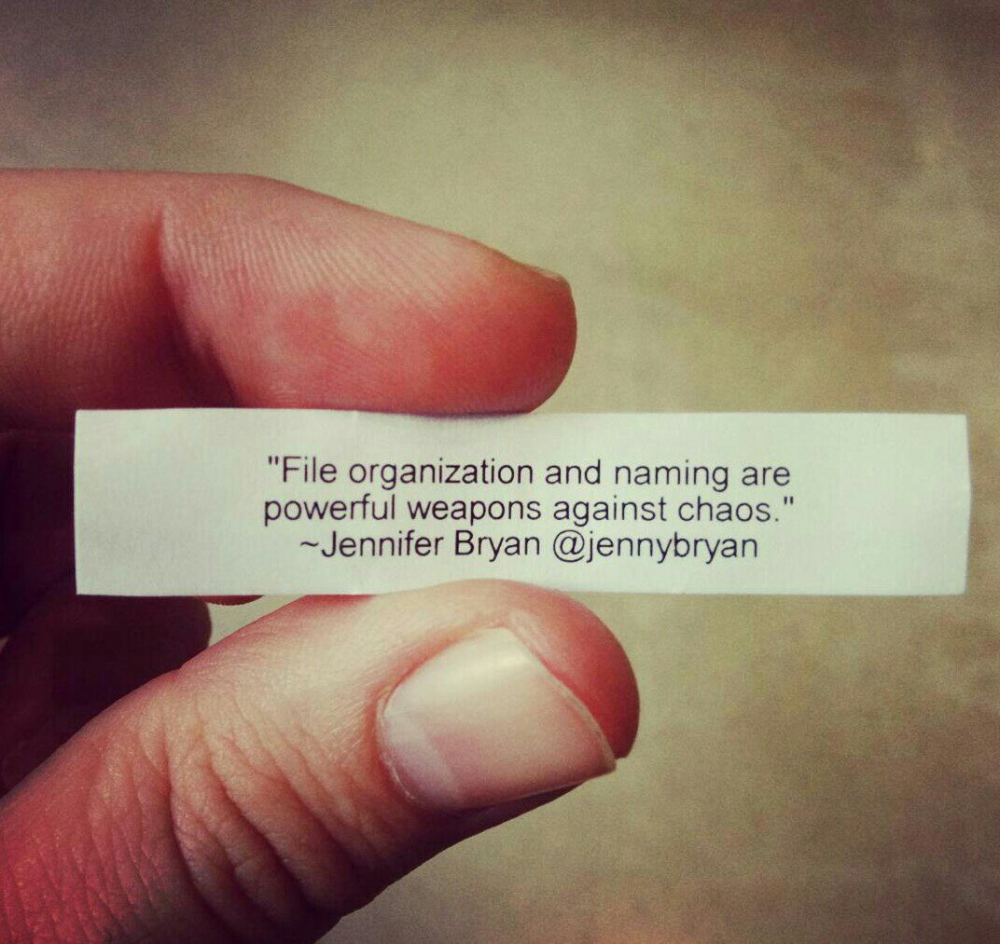
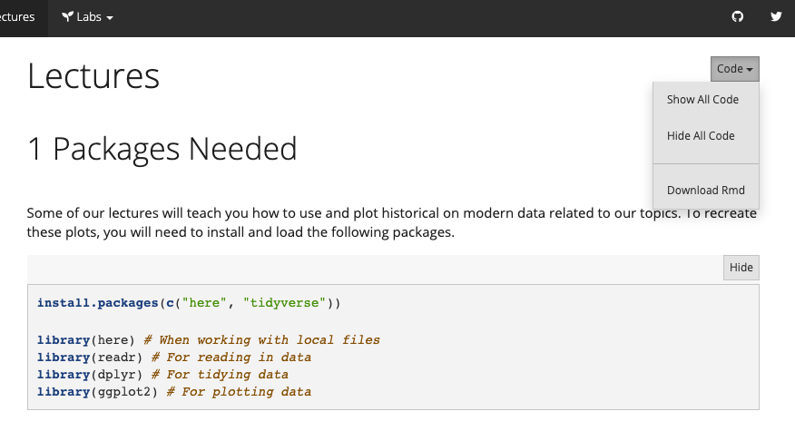
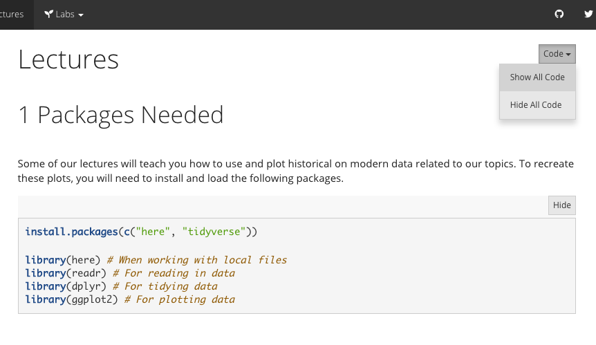

# Caring for your document {#doc-care}

```{r, include = FALSE}
source("common.R")
knitr::opts_chunk$set(fig.align="center")
```


```{r, echo= FALSE}
knitr::include_graphics("images/illos/insert.jpg")
```

Once you have your published doc in place, it's likely that you will want to change it sooner or later. The key to updating is that you must `r emo::ji("yarn")` *Knit* each time before you push to GitHub--otherwise your changes won't be published. This sounds easy enough, but trust us, it is also easy enough to forget!

Here's what the change-my-doc workflow looks like for me:

1. **Open** the existing RStudio project
1. `r emo::ji("yarn")` *Knit* right away to see where things left off, or turn on `xaringan::inf_mr()` to see a live preview of your changes.
1. Make edits, preview changes, **rinse and repeat...**
1. **Commit and push** all changes to GitHub.

## Live editing

<div class="side-by-side">
<div class="side1">
Whenever you are editing a single R Markdown file, and outputting to HTML format, you can turn on "live reload" while you work. This means that, after turning it on, every time you *Save* your updated output re-renders in your RStudio viewer pane, and also in a browser window if you open it up.
</div>

<div class="side2">
```{r echo = FALSE, fig.cap="Demo of R Markdown live reload from [Yihui Xie](https://yihui.name/en/2019/02/ultimate-inf-mr/)", fig.link="https://yihui.name/en/2019/02/ultimate-inf-mr/"}
knitr::include_graphics("https://user-images.githubusercontent.com/163582/53144527-35f7a500-3562-11e9-862e-892d3fd7036d.gif")
```
</div>
</div>

To turn on "live reload", you'll first need to install the [`xaringan` package](https://github.com/yihui/xaringan)^[`xaringan` is an R package for making presentation slides with R Markdown]:

```{r eval = FALSE}
install.packages("xaringan")
```

Then close RStudio.

When you reopen RStudio, in your "Addins" dropdown, scroll down to the bottom where the `xaringan` addins are. You should see ["Infinite Moon Reader"](https://cran.r-project.org/web/packages/xaringan/xaringan.pdf). 

The same thing can be accomplished from your R console by running this code:

```{r eval = FALSE}
xaringan::inf_mr()
```

Now, make a small change to your document, save, and watch the preview reload!

:::gotcha
You'll need to save this file first, before using the "Infinite Moon Reader".
:::

## Care for your code {#care-code}

### Use keyboard shortcuts

To insert R code chunks, you can use the {width=5%} button, or you could use keyboard shortcuts

    the keyboard shortcut Ctrl + Alt + I (OS X: Cmd + Option + I)

### Add a setup code chunk {#knitr-setup}

Get into the habit of always having your first `knitr` code chunk be a *setup* chunk using `knitr::opts_chunk$set()`. A good one looks like this:

````
```{r setup, include = FALSE}`r ''`
knitr::opts_chunk$set(
  comment = "#>",
  fig.path = "figs" # use only for single Rmd files
  collapse = TRUE,
)
```
````

Inside the parentheses, list the chunk option on the left `=` a new default value on the right. Each chunk option is separated by a comma. The chunk option for the setup chunk itself is typically `include=FALSE` so that no one sees it but you.

A few notes on what the above chunk options do:

+ `comment = "#>"` sets the character on the far left of all printed output such that a reader could copy/paste a block of code into their console and run it (they won't be bombarded by errors produced if they accidentally include your printed output in their code)

+ `fig.path = "something-here-in-quotes"` ensures that all figures that you create with R code all get stored in the folder you name here; this helps if you need to pull up a figure file quickly without needing to explicitly export each individual figure. Read more [here](https://yihui.name/knitr/options/#plots).

+ `collapse = TRUE` fuses your code and output together for all code chunks throughout your document. 

    Below is a side-by-side changing this chunk option for an *individual* chunk. 

<div class="split">

<div class="split1">

<h3>Default chunk style</h3>


```{r}
library(tidyverse)
starwars %>% 
  count(homeworld, sort = TRUE)
```

</div>
<div class="split2">

<h3>Custom chunk style</h3>

```{r, collapse=TRUE, comment = "#>"}
library(tidyverse)
starwars %>% 
  count(homeworld, sort = TRUE)
```

</div>
</div>

Our `setup` code chunk above affects *all* code chunks. It is called a global chunk option for that reason. You can (and should) use individual chunk options too, but setting up some nice ones that apply to all code chunks can save you time and can lessen your cognitive load as you create your content.

### Name your code chunks  {#knitr-name}

Remember how we [advised you set your `fig.path`?](#knitr-setup) One of the best things you can do for yourself is to *name your code chunks*. 

:::hat
h/t to [Maëlle Salmon](https://masalmon.eu/)

Maëlle wrote a [fun blog post](https://masalmon.eu/2017/08/08/chunkpets/) that (hopefully) will convince you that your chunks are pets rather than livestock (so they deserve a name!).
:::

In short, here are a few very good reasons to name your pets:

1. Easier to find them (use the chunk outline thingie in IDE)
1. Easier to debug when you `r emo::ji("yarn")` *Knit*
1. your figures get named!!


:::tip
We [recommend](https://yihui.name/en/2018/03/space-pain/) using dashes (`-`) in chunk labels instead of spaces or underscores (or really, any punctuation)...

<div class= "split">

<div class= "split1">
`r emo::ji("heavy_check_mark")` Good
````
```{r my-dog-skip}`r ''`

```
````
</div>

<div class= "split2">
`r emo::ji("x")` Bad

````
```{r my_dog_skip}`r ''`

```
````
</div>
</div>


:::


### Print pretty packages

If you load packages, we recommend setting that code chunk to be message = FALSE, warning = FALSE

````
```{r, message = FALSE, warning = FALSE}`r ''`
library(tidyverse)
library(janitor)
```
````


## Care for your self {#self-care}

### Use portable file paths {#doc-here}

<div class="side-by-side">
<div class="side1">

When you are in an `.Rproj`, you'll probably want to create some directories like `data/`, `images/`, `figures/`, etc. We strongly encourage you to use the [here package](https://here.r-lib.org/) to build up safe file paths. Read more from Jenny Bryan's [*What They Forgot to Teach You About R* workshop](https://whattheyforgot.org/safe-paths.html).

If you are *still* skeptical, read Malcolm Barret's blog post [*Why should I use the here package when I'm already using projects?*](https://malco.io/2018/11/05/why-should-i-use-the-here-package/)

</div>
<div class="side2">

```{r horst-here, echo = FALSE, fig.cap = "Artwork by [Allison Horst](https://twitter.com/allison_horst?lang=en)", fig.link = "https://twitter.com/allison_horst?lang=en"}
knitr::include_graphics("images/horst_here.png")
```

</div>
</div>


:::hat
> "The chance of the `setwd()` command having the desired effect – making the file paths work – for anyone besides its author is 0%."
>
> &mdash; [Jenny Bryan](https://www.tidyverse.org/articles/2017/12/workflow-vs-script/)
:::

### Name your files nicely



### Add notes to self

also include how to leave invisible notes to yourself `<!--- your comment --->`


# Design a how-to 

We define a "how-to" as a step-by-step recipe for a specific problem; light on narrative and teaching "why". R Markdown is a great tool for this kind of lesson, and we recommend (surprise!) HTML output with the following options.


## Share the source code {#rmd-code-download}

You can also make it easy for others to download the raw R Markdown file that produced the page on the your site that they're viewing. 

* **Add `code_download: true`** underneath `html_document:`. This particular YAML option is one that you might consider only applying to `.Rmd` files where it's relevant (in which case, you would include in the `.Rmd`'s YAML and not the `_site.yml`.)

<div class= side-by-side>
<div class = side1>

```{r echo = FALSE}
yml_empty() %>% 
  yml_site_opts(
    name = "YUM-101"
    ) %>% 
  yml_output(html_document(
    toc = TRUE,
    toc_float = TRUE,
    code_download = TRUE)) %>% 
  asis_yaml_output()
```

</div>
<div class = side2>



</div>
</div>

## Show the data {#rmd-show-data}

DT

```{r}
library(DT)
datatable(iris)
```

## Share the data {#rmd-share-data}

For a how-to that involves some local data file that you need to share, it is nice to create an easy way for learners to download that data to a place on their computer.

1. `xfun::embed_file()` [link](https://yihui.name/en/2018/07/embed-file/)

1. DT buttons [link](https://rstudio.github.io/DT/003-tabletools-buttons.html)

```{r}
library(DT)
datatable(iris, 
  extensions = 'Buttons', options = list(
    dom = 'Bfrtip',
    buttons = 
      list('copy', 'print', list(
        extend = 'collection',
        buttons = c('csv', 'excel', 'pdf'),
        text = 'Download'
      ))
  )
)
```

## Code Folding {#rmd-code-folding}

If you have a lot of code chunks, and you want to option for them to expand or fold with a click then:

* **Add `code_folding:`** as an option underneath `html_document:`. The options are either `show` or `hide`, depending on whether or not you want code chunks to be expanded by default.

<div class= side-by-side>

<div class = side1>

```{r, eval=FALSE}
output_dir: "docs"
output: 
  html_document:
    code_folding: show
```

</div>
<div class = side2>



</div>
</div>


## Show code, hide results

The default global chunk option is `echo=TRUE`, which means that by default all code in code chunks is printed in the output. But sometimes you may want to suppress the output for pedagogical reasons on individual code chunks. You *could* set `eval = FALSE` as a global chunk option, but this would mean that all the code chunks will not get evaluated at all. Thus, you could have errors in your code that learners could stumble upon. Instead, we suggest setting `results='hide'` as a global chunk option to ensure that when you knit, you'll run into the same errors your learners will *before* they do.


````
```{r, results='hide'}`r ''`
library(tidyverse)
glimpse(starwars)
```
````

## Show code, hide plots

If your code produces plots, though, `results='hide'` will not suppress the plot. To suppress printing a plot, you'll need to use `fig.show='hide'`.

````
```{r, results='hide', fig.show='hide'}`r ''`
library(tidyverse)
glimpse(starwars)
ggplot(starwars, aes(x = height)) +
  geom_histogram(colour = "white", fill = "#3fb5bd") +
  theme_minimal()
```
````

## Show results, hide code

Sometimes you may want to shield your learners from all the code and just focus their attention on the output, whether it is printed or it produced a plot. This requires a single switch to `echo=FALSE` to "mute" the code from being output.

````
```{r, echo=FALSE}`r ''`
library(tidyverse)
glimpse(starwars)
```
````

This is all the learner sees:

```{r, echo=FALSE}
library(tidyverse)
glimpse(starwars)
```

## Interactively hide/show code

whole document

## Hide everything

Useful for you as you develop a lesson sometimes to save your code but hide the code and all output from learners. You can achieve the same thing with the combination of `echo=FALSE, results='hide', fig.show='hide'`. But the easier way is to use the `include` chunk option, which is by default set to TRUE.

````
```{r, include=FALSE}`r ''`
library(tidyverse)
glimpse(starwars)
```
````


## Reuse your code

Once you embrace code chunk options, you may often find yourself copying and pasting code chunks so that you can use different options on the same code chunk. Like maybe you want the code to appear once, but you 

Special use case: plot first, code second

    Chunk 1: {r plot-first, echo = FALSE}
    Chunk 2: {r ref.label = 'plot-first', eval = FALSE}


## Two plots side-by-side

```{r dodge-st, fig.show = 'hold', out.width = '50%'}
ggplot(mtcars, aes(factor(cyl), fill = factor(vs))) +
  geom_bar(position = position_dodge(preserve = "total"))

ggplot(mtcars, aes(factor(cyl), fill = factor(vs))) +
  geom_bar(position = position_dodge2(preserve = "total"))
```


## Include verbatim code chunks

You may have noticed that the code chunk output, even when `echo=TRUE`, does not show the actual code chunk options that you see in your .Rmd file. In order to print the full code chunk, you'll need to 

+ [verbatim code chunks](https://yihui.name/en/2017/11/knitr-verbatim-code-chunk/)

+ `knitr` [ref.label](https://yihui.name/knitr/demo/reference/) to reuse code chunks
+ the `fig.path` thing: https://yihui.name/knitr/options/#plots (see also: name your code chunks!)
+ making sure that your package warnings/messages don't print!
+ how to control numbers of digits that print 
+ control significance stars

```{r}
options(
  show.signif.stars = FALSE,     
  digits = 2
  )
```
