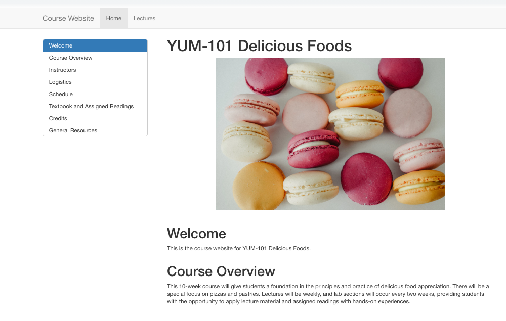

# Dress it up! {#doc-dress}

```{r, include = FALSE}
source("common.R")
knitr::opts_chunk$set(fig.align="center")
```


```{r, out.width = "65%", echo= FALSE}
knitr::include_graphics("images/illos/insert.jpg")
```

Once you have the website in place, it's likely that you will want to update it periodically or add new pages. The key to updating is that you must build your site or use `rmarkdown::render_site()` each time before you push to GitHub--otherwise your changes wouldn't make it into your `docs/` folder. And if it's not in the `docs/` then GitHub pages will not be able to find it. 

## Use a bootswatch theme {#doc-theme}

For a single R Markdown document, knitted to the HTML output format, adding a theme is so dead simple that you have no good excuses for not using one.  You have `r length(rmarkdown:::themes())` theme options: 

+ `r knitr::combine_words(rmarkdown:::themes(), before='\x60')` (use `null` for no theme) 

You can preview them all [here](#rmd-themes).

```{r echo = FALSE}
yml_empty() %>% 
  yml_site_opts(
    name = "YUM-101"
    ) %>% 
  yml_output(html_document(theme = "flatly")) %>% 
  asis_yaml_output()
```

## Add a floating table of contents  {#doc-toc}

In the `_site.yml` file, you can add a [table of contents](https://bookdown.org/yihui/rmarkdown/html-document.html#table-of-contents) either as a static list of links at the top of the page, or a floating sidebar. We recommend adding a floating TOC, which means adding two lines to your document's YAML.
  
<div class = "side-by-side">
<div class = "side1">

```{r echo = FALSE}
yml_empty() %>% 
  yml_site_opts(
    name = "YUM-101"
    ) %>% 
  yml_output(html_document(
    toc = TRUE,
    toc_float = TRUE)) %>% 
  asis_yaml_output()
```

</div>

<div class = "side2">

</div>
</div>

By default, the following "nice things" happen when you use a floating TOC.

+ First, the TOC "explodes" the subsections when you click on the top-level (H2) headers (i.e., `## My big header`). 
+ The TOC also animates, so that when you click on a top-level header, your document appears to "scroll" to the right section. 
+ All `#`, `##`, and `###` headers will be included because the default `toc_depth: 3`. 

We encourage you to leave these default settings, but know that you can [change them](https://bookdown.org/yihui/rmarkdown/html-document.html#table-of-contents).

You *can* also [number your sections](https://bookdown.org/yihui/rmarkdown/html-document.html#section-numbering), but we find it easier to stick to good top-level headers as the TOC organizing principle.

## Customize code highlighter  {#doc-highlight}

```{r echo = FALSE}
yml_empty() %>% 
  yml_output(html_document(
    highlight = "tango")) %>% 
  asis_yaml_output()
```


## Add images  {#doc-images}

### Markdown images
{width=50%} {width=50%}

### Use `knitr::include_graphics()`

include_graphics gives you figure captions

can also play with out.width

labeling chunks

fig.link too

##

That would be great re: narrative/code. I realized they are two diff lenses, because your exposition is for the educator who is sitting down and assessing their learners, their time, their task etc- so their question is, what should I make? Then, next in the process is where I am sitting! I want to write up something for educators who have decided what to make and help them navigate the dizzying array of YAML/knitr options. But for that I want a clear typology of who needs what and when from the educators’ standpoint (not from the learners’ necessarily). Does that make sense?

## Upgrade your output format

So we know we told you to use HTML document as our preferred output format. That hasn't changed- but there are ways to significantly upgrade your HTML output from R Markdown with additional packages, and you can keep all your content as is. The only changes are to install these packages and change the output format in your YAML. We'll show you four options.

### `bookdown::html_document2`

What you get: 

+ cross references to other documents
+ numbered figures (plus cross-references)

### `distill::distill_article`

### `tufte::tufte_html`

### `learnr::tutorial`

::gotcha
Warning! This output format means more surgery is needed to your content. But if you want to make your code interactive and hands-on, it may be worth it to you (and your learners!)
:::


