# Make it fancier {#doc-fancy}


## Extra packages

demoR

countdown

klippy

## Use bootswatch CSS

divs

- [breadcrumbs](https://bootswatch.com/flatly/)

## include or not?

- [ ] [tabsets](https://bookdown.org/yihui/rmarkdown/html-document.html#tabbed-sections)
         - think about good use cases
- [ ] [dropdown in tabsets](https://github.com/rstudio/rmarkdown/pull/1405)
- [ ] [code folding](https://rmarkdown-docs.netlify.com/reference/html_document.html)  


Now it's time to customize our single lesson even further. We can do a little bit of HTML and CSS work to add-on some fancy features.


## Before you begin

If you're starting here, I assume that by this point you have already:

* Updated your single lesson with your own content in the [Make it yours](#doc-yours) section. (For my demo that follows, I'll keep going with the boilerplate content since at this point everyone will have different content anyhow). 

* At a minimum, added a few elements from the [Dress it up section](#doc-dress), specifically: 
    * A theme (I've chosen `flatly`)
    * A floating table of contents
    * Code highlighting (I chose `tango`)

So that you know where *I'm* starting, here's what my YAML frontmatter looks like right now:

<div class="side-by-side">

<div class="side1">

```yaml
---
title: A demo single lesson
author: Desirée De Leon
date: '`r format(Sys.Date())`'
output:
  html_document:
    theme: flatly
    highlight: tango
    toc: true
    toc_float: true
---
```
</div>

<div class="side2">

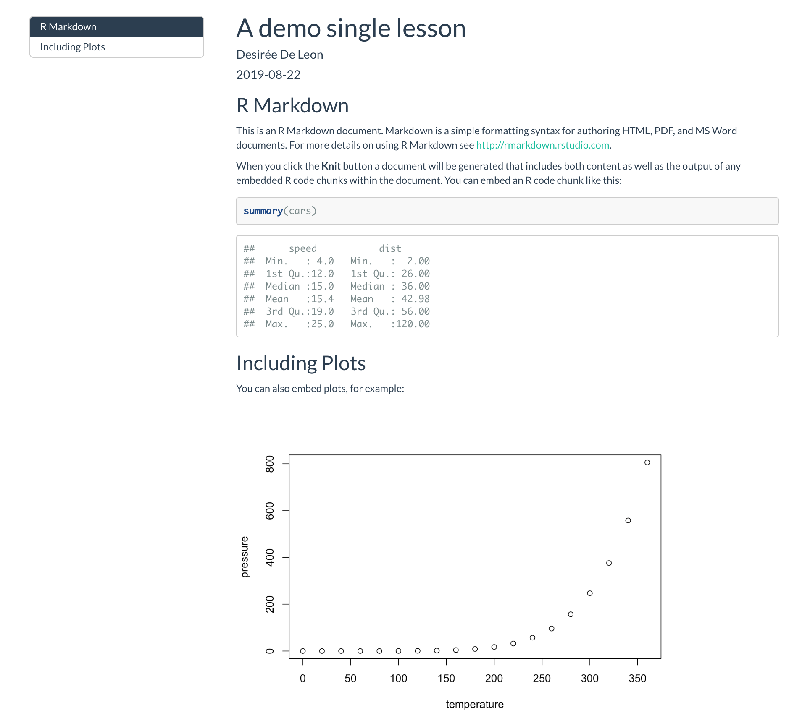

</div>

</div> 

If this is your first time having a go at CSS, then you might want to check out the [CSS crash course](#css-crash) so that you have a sense for how/why we're doing what we're doing---otherwise, buckle in for the ride!

## Include a css file

If you want to add *any* custom styling to your doc, the first thing you'll need to do is to create a CSS file in your project directory and then tell R Markdown that it exists. 

1. Go to *File* > *New File* > *Text File*
1. **Save** this file as `style.css` in your project directory. May as well keep this file open because we're about to add a bunch of stuff to it!
1. **Open** the `.Rmd` file you're working on.
1. In the YAML, reference the new CSS file by adding the `css:` option followed by its filepath.

    ```yaml
    output:
      html_document:
        css: style.css
    ```
    
1. **Save** your changes.

Now you're all set to start CSS-ing!

## Branding and aesthetics

We'll start by making changes related to the look and feel of your doc. 

  * [Add a Google font](#doc-font)
  * [Change link color](#doc-links)
  * [Add a logo](#doc-logo)
  * [Add a white space](#doc-white-space)

### Google Fonts {#doc-font}

To change the appearance of your text with a new font, you need to:

  * Pick a Google font
  * Add it to your CSS file
  * Style specific text using CSS selectors
  * Make sure your CSS file is linked in your YAML (and if you've been following along with us, it already is).
  
#### Select and import your Google font's script

1. Go to [https://fonts.google.com/](https://fonts.google.com/) and pick a font for your **lesson's main body text**. We'll choose `Muli`, but `Lato` and `Source Sans Pro` are other nice options.

:::design
We recommend going with sans-serif fonts (i.e. no little feet on the letters) for the main text because they're easier to read at smaller sizes on screens compared to serif fonts. Don't pick anything too narrow, too wide, or ornate.)
:::
    
    
\


<div class="col2">
2. Select the font you want by clicking on the upper red `+` sign, and navigate to the small pop up window. 

    <div class="figure" style="text-align: center">
    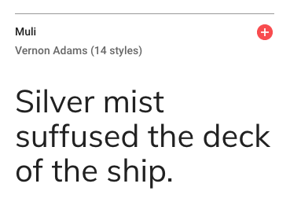
    <p class="caption">(\#fig:doc-select-font)Selecting a Google font</p>
    </div>

</div>

\


<div class="col2">

3. Click on the `CUSTOMIZE` tab, and select the extra font weights and styles you want. Don't check any that you don't think you'll use (because it slows down your lesson's loading time ever-so-slightly when you add more). In addition to regular, we're choosing one italic and one bold. 

    <div class="figure" style="text-align: center">
    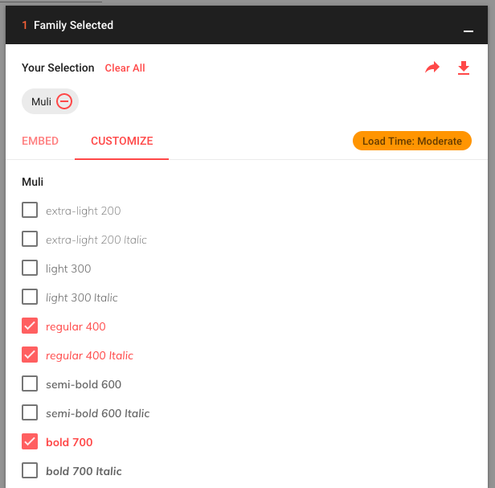
    <p class="caption">(\#fig:doc-font-customize)Choosing additional font weights and styles</p>
    </div>

</div>

\


<div class="col2">

4. Now click on `EMBED` and look under the `@IMPORT` tab. **Copy the code within the `<style>` tags** (you don't need the style tags themselves). We will also need the second code chunk in a couple steps that says `Specify in CSS`, so keep this page open to come back to that.

    <div class="figure" style="text-align: center">
    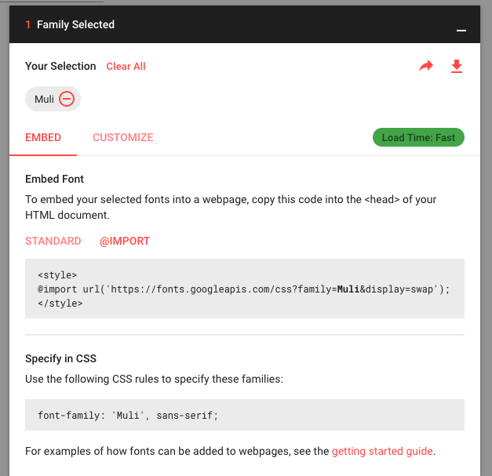
    <p class="caption">(\#fig:doc-googleimport)Getting the script to import your Google Font</p>
    </div>

</div>


#### Import the font to your lesson

1. Back in the RStudio IDE, **open** up your `style.css` file.
1. On the very first line, **paste in the Google Font import code** for the `Muli` font. This makes the font available--but doesn't actually *use* it yet.

    ```style.css
    @import url('https://fonts.googleapis.com/css?family=Muli:400,400i,700&display=swap');
    ```

:::tip
You might see others import Google fonts by embedding the script (with `<script>` tags) in an HTML file instead. This is perfectly legitimate. But if you're just starting out, it's easier to keep all the font stuff together in a CSS file, which is why we're doing it this way.
:::

#### Apply the font to your text

We have our font imported, but now we have to be explicit with R Markdown about where to apply it. Let's create our first CSS style rule below. We will apply the `Muli` font to our body's text by using the `font-family:` property. 

1. **Copy and paste** the following style rule to `style.css` beneath the other line of CSS we've already added. 
1. Let's also **specify the font size** to be `19px` by adding the `font-size:` property. 

    ```style.css
     /*------------- Whole Document---------------- */

    body {
    	font-family: 'Muli';
    	font-size: 19px;
    }
     
    ```
1. **Make sure** that each line within `{}` ends with a `;`.

:::tip
  **Keep tidy!** Organize your CSS using comments like `/* --insert-comment-- */` to create make-shift section dividers for your CSS, as we've done above. We'll be adding many style rules, and we'll want some way to keep track of everything as our CSS file grows.
:::
     
\

<div class="side-by-side">

<div class="side1">

4. Time to admire your handiwork and decide whether or not you like it. You can repeat the steps above to apply different fonts to different parts of your lesson. For example, you could create another style rule using `.title` instead of `body` to apply a different font to the Title of your lesson. 

Remember that in order for any of your CSS to take effect, your `style.css` file has to first be referenced in your YAML.
</div>

<div class="side2">
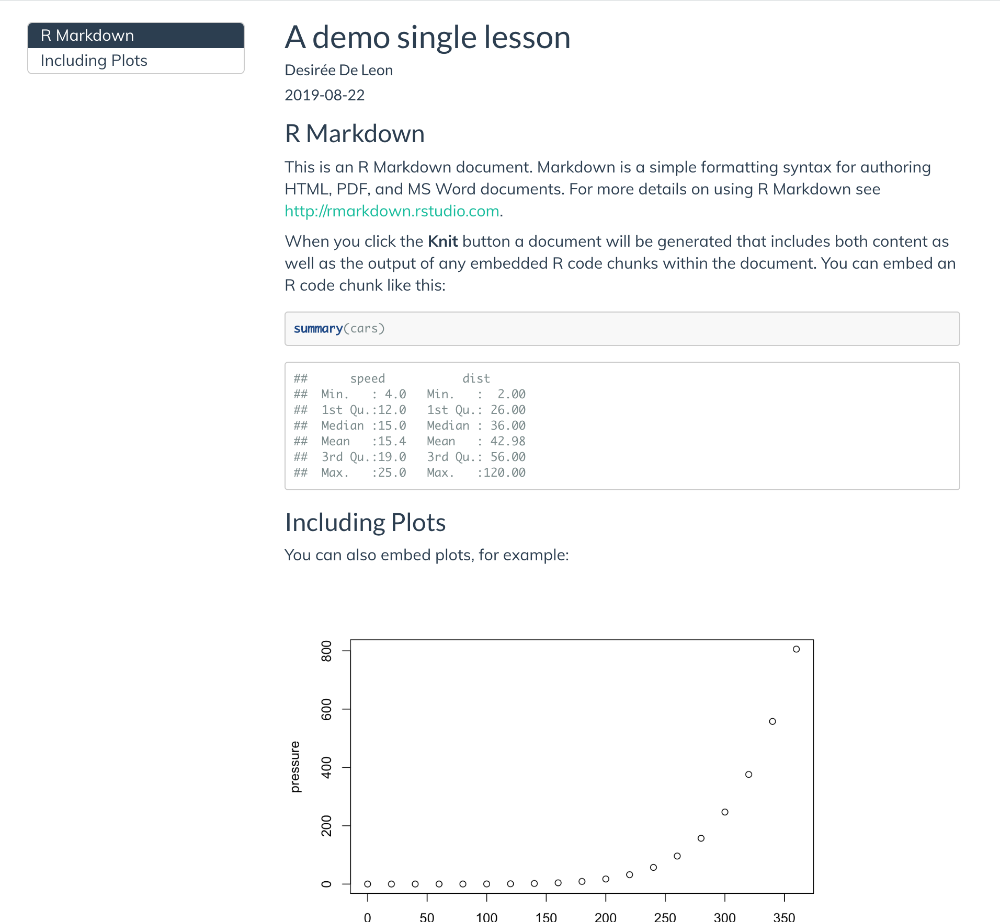
</div>
</div>

### Links

Next we'll change the color and hover behavior of our links.

1. **Open** your `style.css` file. 
1. Use the **`a` selector** to select all links in your lesson.
1. Use the **`color:` property**, followed by a color code, called a hexcode. You can use a [color picker](https://htmlcolorcodes.com/color-picker/) to find a hexcode color that you like.

    ```style.css
    /*----------------- links ---------------------*/
    
    a { 
      color: #4e89bf;
    }
    ```

    * This has changed the color of a regular link, but if we want to change the color of the link when we hover over it, we use `a:hover` as our new selector.

1. **Specify what happens when a link is hovered** by adding the style rule below. We make our hovered links a darker color:

    ```style.css
      a:hover {
        color: #396892; /* darker color when hovering */
      }
    ```

<center>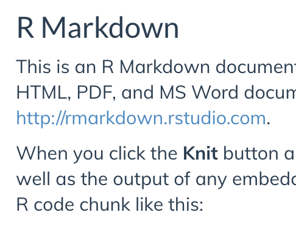{width=50%}</center>


### Add a logo {#doc-logo}

We'll add a logo above our table of contents. The main way we're going to do this is by inserting a blank box above our TOC, and then giving the blank container a background image (our logo). We can control how big our logo will be by controlling the size of the box. Here's what it will look like (if you're bothered by the outline around it all, don't worry--we'll get rid of that in the TOC section):

<center>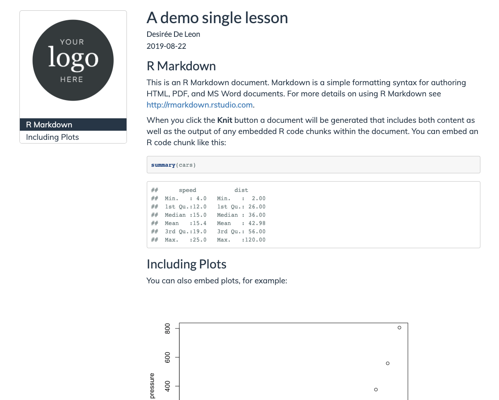{width="50%"}</center>


1. **Add** your logo image to your project directory.
1. **Paste** the CSS style rule below. We'll break it down in a second.

    ```style.css
    /*----------LOGO above TOC---------*/

    #TOC::before {
      content: "";
      display: block;
      height: 200px;
      margin: 20px 20px 40px 20px;
      background-image: url("logo-black.png");
      background-size: contain;
      background-position: center center;
      background-repeat: no-repeat;
    }

    ```
    
    * This uses the selector `#TOC` to identify our table of contents. 
    * We use the CSS trick of tacking on a `::before` to say, "hey, we want you to insert whatever is in this style rule right before our `#TOC`." This trick is called using a "pseudo-element" in CSS. 
    * In this case, our pseudo-element is a blank box--that's why it says `content: "";`. There's nothing in there. But--we *do* give our blank box some dimension with the `height:` property.
    * The blank box is no longer blank when we use our logo as its background image.
    
1. **Change** the image url to use your own image.
1. **Knit** and check out the results. If you need to adjust the size of your logo, you can fiddle with the `height:` property in the CSS above.

#### A second logo option

If you chose not to use a floating table of contents, then adding a logo the way we have above won't work since there won't be a `#TOC` that a logo can go ahead of. So, you can instead place your logo in upper righthand corner, in line with the Title and Author. 


<center>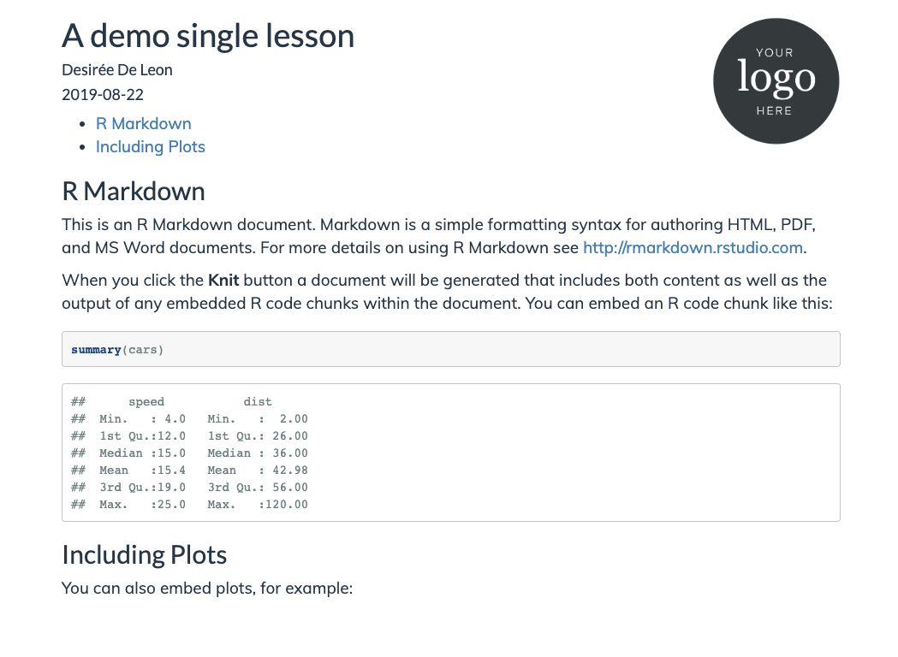{width="50%"}</center>


1. **Add** your logo image to your project directory.
1. **Open** `style.css`.
1. **Paste** this CSS rule into your CSS file:

   ```style.css
     #header.fluid-row::before {
      content: "";
      height: 150px;
      width: 150px;
      float: right;
      background-image: url("logo-black.png");
      background-size: contain;
      background-position: center center;
      background-repeat: no-repeat;
    }
    
    ```
  
1. **Edit** the image url to be your own image file path. 
1. **Save** your changes and **knit** your `.Rmd` lesson to see your logo. You can fiddle with the `height:` property to adjust the logo size. 


#### A third logo option

But wait--there's more! Here is a *third* option for adding a logo if you want it in the upper righthand corner, above the Title and Author fields. We personally like this one the least (asethetically, but also because it's more involved to implement), but sometimes you might need to do this if your Title and content keep running into the logo with option 2. 

<center>{width="50%"}</center>


To do this, you will need three things:

1. A different CSS style rule 
1. An HTML file with one line of code
1. To edit your YAML so you can reference the HTML file

##### Create an HTML container

We need something that we can put our logo into-- like an empty container. This is where the HTML file comes in. This file creates an empty tag inside of it, but we'll give the empty tag a name, "upper-right-logo", so that we can fill it up with our logo later using CSS. Let's make the HTML file: 

1. From the IDE, you'll **create a new HTML file** by going to File > New File > Text File. 
1. **Paste** the line of code below into the HTML file.

    ```
    <div class="upper-right-logo"> </div>
      
    ```
1. **Save** this file as `logo-option.html`. You can choose a different name if you want.


##### Link the HTML file to your YAML

Now we have a containter (via our HTML file), but R Markdown needs to know where to put it with respect to our page. That's where the YAML comes in. We can tell our YAML that we want whatever it finds in this HTML file to be included as the first thing on of our page. We do this by using the `includes: before_body` option:

1. **Open** your `.Rmd` file.
1. **Add** the `includes:` and `before_body:` lines. 

    ```yaml
    ---
    title: A demo single lesson
    author: Desirée De Leon
    date: '`r format(Sys.Date())`'
    output:
      html_document:
        includes:
          before_body: logo-option.html
        theme: flatly
        highlight: tango
        toc: true
        toc_float: false
    ---
    ```

1. **Edit** the filename to be your HTML file if you chose a different file name.
1. **Save** your changes.

##### Fill the container with your logo

Finally, the CSS is where we'll say "take the empty container we created in the HTML file, and make sure it's yay tall and that it has this logo image as its background, etc." 

Here's how that goes down:

1. **Add** your logo image to your project directory.
1. **Open** `style.css`.
1. **Paste** this CSS rule into your CSS file:

    ```style.css
    .upper-right-logo {
      margin-top: 20px;
      background-image: url("logo-black.png");
      height: 150px;
      background-size: contain;
      background-position: right;
      background-repeat: no-repeat;
    }
    ```
1. **Edit** the image url to be your own image file path. 
1. **Save** your changes and knit your `.Rmd` lesson to see your logo. You can fiddle with the `height:` property to adjust the logo size. 

I won't use this logo option in the demo lesson as we move on to the next steps, but now you know how to do it if you need it.


### White Space {#doc-white-space}

If you added white space manually in the \@ref(doc-breathe) section, you can remove that now, and we'll add some in programatically with our CSS.

1. First up is adding space above and below the title with the the `margin-top:` and `margin-bottom:` properties. 
    * The unit `em` here is equal to whatever you have your font-size set to. This is nice because it means your white space will scale even if you change your font size. 
    

    ```style.css
    /*----------------ADDING WHITE SPACE-------------*/
    
    .title {
      margin-top: 2.75em !important;
      margin-bottom: 0.75em;
    }
    
    ```
    
    <center>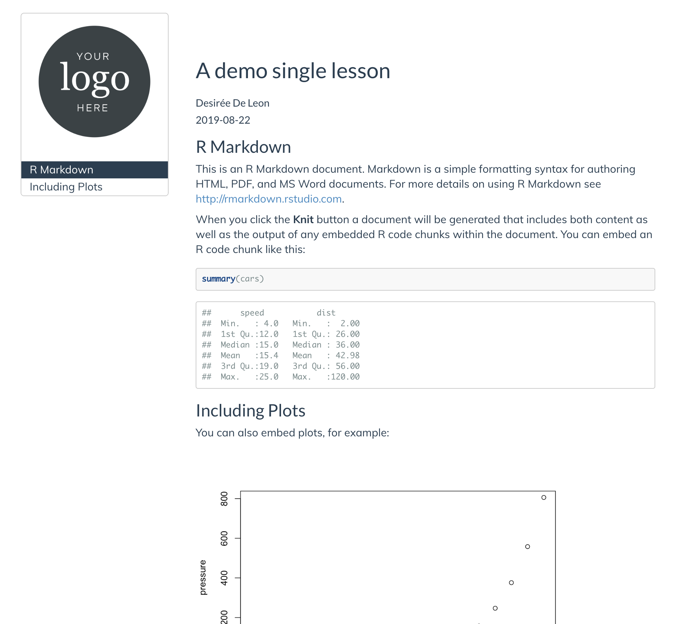{width=50%}</center>
    
1. But this leaves our logo squished up at the top of our page--so let's adjust our earlier style rule that we used for our logo, by increase the logo's top `margin` to `2.75em` also. When a margin has four numbers, the first value applies to the top.


    ```style.css
      /*----------LOGO above TOC---------*/

    #TOC::before {
      content: "";
      display: block;
      height: 200px;
      margin: 2.75em 20px 40px 20px;
      background-image: url("logo-black.png");
      background-size: contain;
      background-position: center center;
      background-repeat: no-repeat;
    }

    ```

    <center>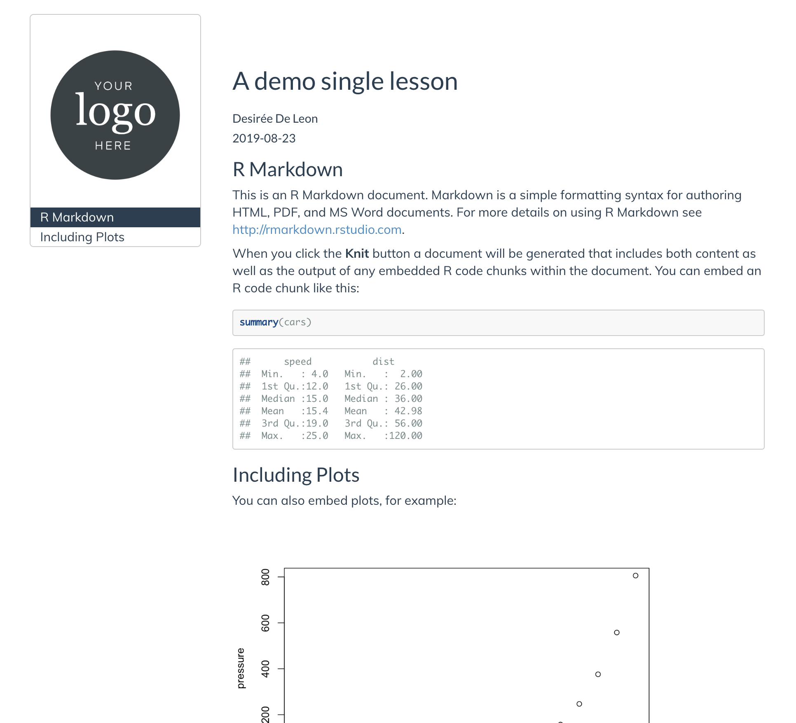{width=50%}</center>
    

3. Let's add white space in between our other headers. We want there to be a little more white space above our highest level headers (h1) than above our headers lower in the hierarchy (so that sections are more clearly delineated), so we'll style the h1 headers separately from the other headers.  
    

    ```style.css
    .section h1 {
      margin-top: 2.5em !important;
      margin-bottom: 0.75em;
    }
    
    .section h2, 
    .section h3, 
    .section h4, 
    .section h5 { 
      padding-top: 1.5em !important;
      margin-bottom: 0.75em;
    }
    
    ```
    
    * The selector `.section h1`, `.section h2`, etc. selects only headers within a section (in other words, this excludes the title and subtitle, which are also technically h1 and h2 headers--but which don't exist inside the "section" content of the page.)
    
    <center>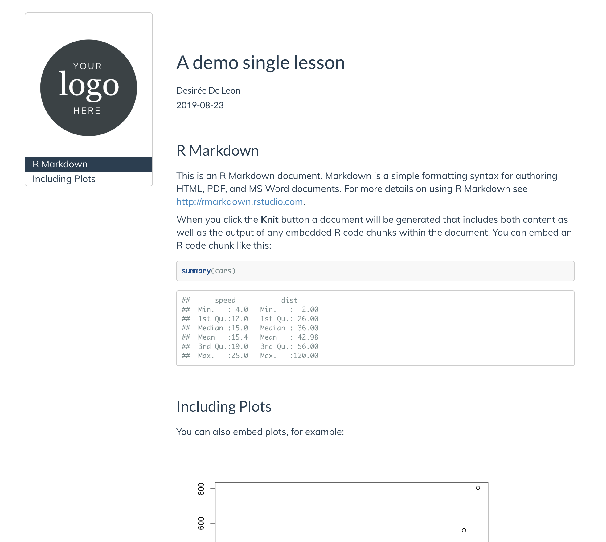{width=50%}</center>

    
4. We added white space in between our headers, but we can also add space in between the TOC and the body content, which right now is so squished together. Let's increase the space--but only when the screen is wide enough to allow it. For this, we'll have to use our first media-query. 

     * A media query is like an additional outer rule that says, "hey, only apply the CSS rule inside if [insert condition about screen width here] is met". Media queries are useful for styling something different on a big screen than you would on mobile, etc.

      * In the case below, we only increase the space between the TOC and the body content if your user's browser screen is *at least* `992px` wide:

<div class="split">
  <div class="split1">
  
```style.css
  /* Space Between TOC and 
  Righthand side content on large screens */

 @media (min-width: 992px) {
    .col-md-9 {
      width: 75%;
      padding-left: 5em !important;
    }
 }
```
    
  </div>
  
  <div class="split2">
  
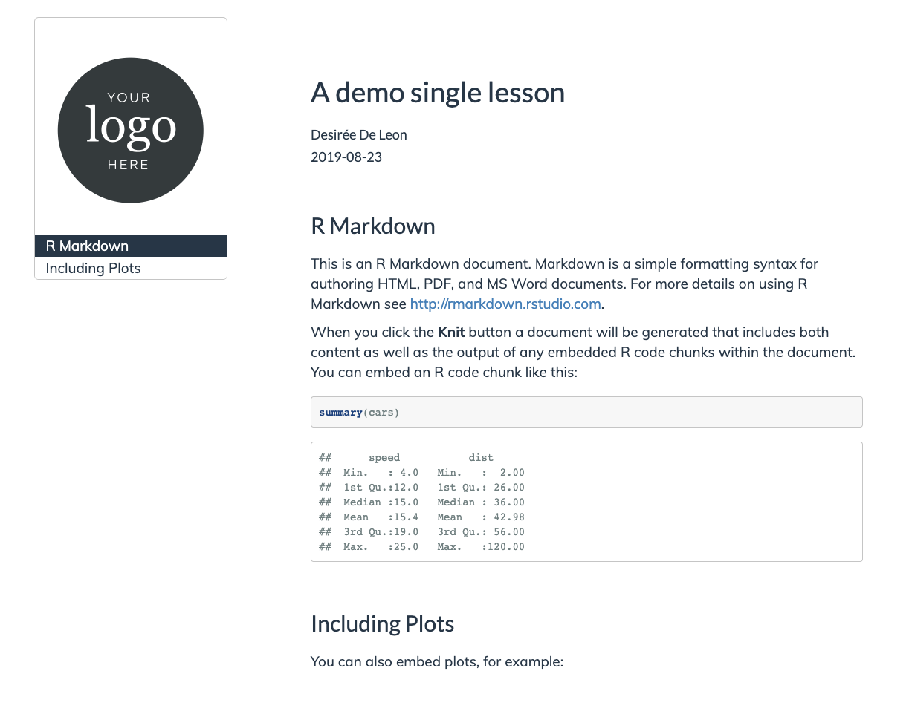

  </div>
</div>

5. Lastly, you may have noticed that there's a lot of excess empty white space at the end of the lesson, which can lead to a lot of unnecessary scrolling. Let's get rid of ost of that space with this addition to our CSS:

    ```style.css
  
    /* Remove excessive white space at the end of page */

    .tocify-extend-page {
      height: 100px !important; 
    }
    ```
    
## Table of contents (TOC) {#doc-custom-toc}

Now it's time to style the table of contents. Right now my demo `.Rmd` only has two section headers, so I'll add two more headers so that it's easier to demonstrate the changes I'm making to the TOC. Here's where I'm starting:

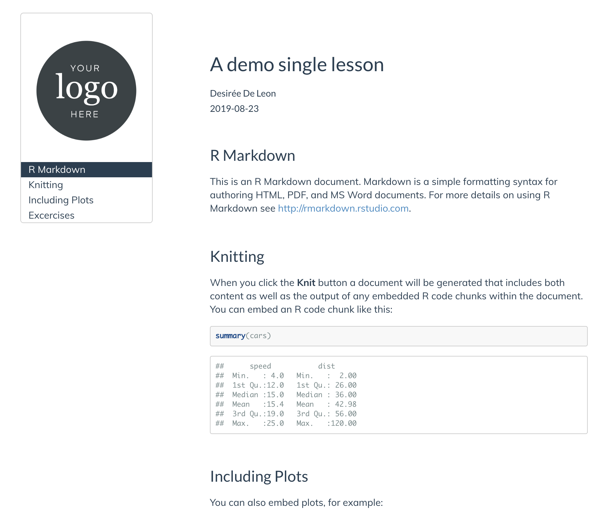

   
1. First we will get rid of the TOC border and make the font size a little smaller:

    ```style.css
    /*------------Table of Contents (TOC)----------- */
    

    .tocify {
      border: none;   /*Removes border */
      border-radius: 0px; /* Gets rid of rounded corners on TOC */
      font-size: 16px;
    }
    
    ```
    
    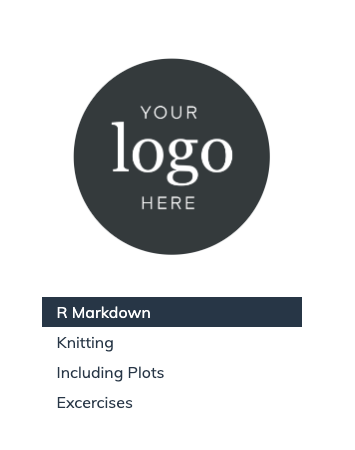

1. Next, we increase the space between each of the TOC items with the `line-height:` property, for some gratuitous breathing room. 
1. We also add a solid grey line as a border, as a subtle divider between the TOC and the rest of the page.

    ```style.css
    .tocify ul, .tocify li { /* Increases spacing between TOC headers*/
        line-height: 25px !important;
    }
    
    .tocify ul {
      border-right: solid 1px #eee; /* Thin right border on TOC list */
    }
    
    ```
    
    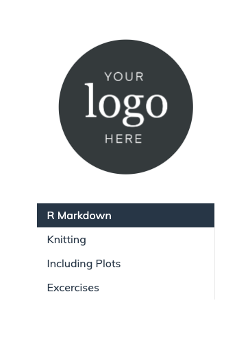

    
1. Now we remove the dark-blue background for the TOC links that you see when a link is active or when you hover over it. We do this using the `background-color:` property and setting it to white with `#ffffff`.
1. We also change the color of the active and hovered links to be a little lighter (`#787878`) than the base color. 

    ```style.css
    /* Active TOC links*/
    
    .list-group-item.active, 
    .list-group-item.active:hover{
      color: #787878;
      background-color: #ffffff;
      border-color: #ccc;
    }
    
    /* Hovered TOC links*/
    
    .list-group-item:hover { 
      color: #787878;
      background-color: #ffffff;
      border: none;
    }
    ```

    
    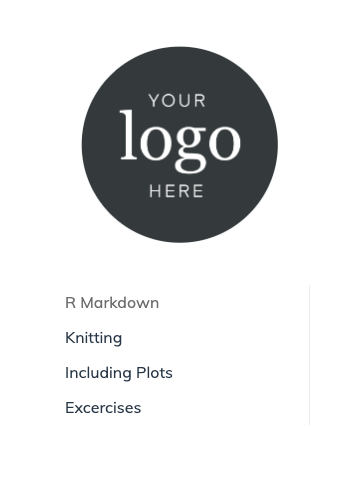


## Questions counter {#doc-q}

Finally, if you plan on using questions for learners in your doc (for example, for homework problems), you might want to make it easier to see these questions by styling them. Like this:


<div class="split">
<div class="split1>

**Before**
    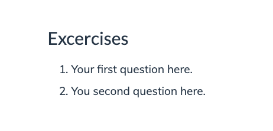

</div>

<div class="split2>

**After**
    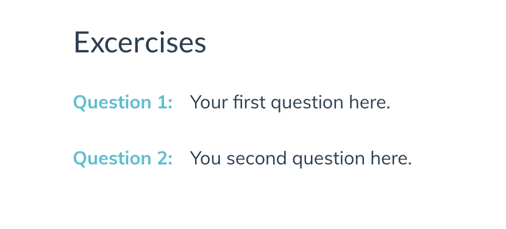

</div>
</div>


:::hat

This idea and CSS was inspired by Maria Tackett's STA210 course: https://github.com/STA210-Sp19/website

:::


The CSS you need is this--it's a lot, but for most use-cases the only style rule you really need to worry about editing is the second-to-last one, with the `content:` and `color:` properties:


```style.css
  /* -----------Question counter ---------*/

  body {
    counter-reset: li;
  }

  .question ol {
    /* Remove the default left padding */
    padding-left: 0;
  }

  .question ol>li {
  	/* Create a positioning context */
    position: relative;
    /* Disable the normal item numbering */
    list-style: none;
    width: 90%;
    padding-top: 10px;
    padding-bottom: 10px;
    padding-right: 0;
    padding-left: 120px;
  }

  .question ol>li:before,
  .question ol>p>li:before{
  	/* Use the counter as content */
    content: "Question " counter(li) ": ";
    /* Increment the counter by 1 */
    counter-increment: li;
    position: absolute;
    color: #5ebccf;
    left: -0.5px;
    font-weight: bold;
  }

  .question ol ol {
    counter-reset: subitem;
  }

```
    
* If you want to change the styling to say something other than "Question", then you modify `content: "Question "`. 
* You can change the color of the called out question, too, with the `color: #5ebccf;` 
    
**How to use the question counter:**

In your .Rmd, you have to enclose your numbered list items that you want to be styled questions with special div tags:

```.Rmd
<div class="question">` 

1. My first question 
1. My second question

</div>`
```


