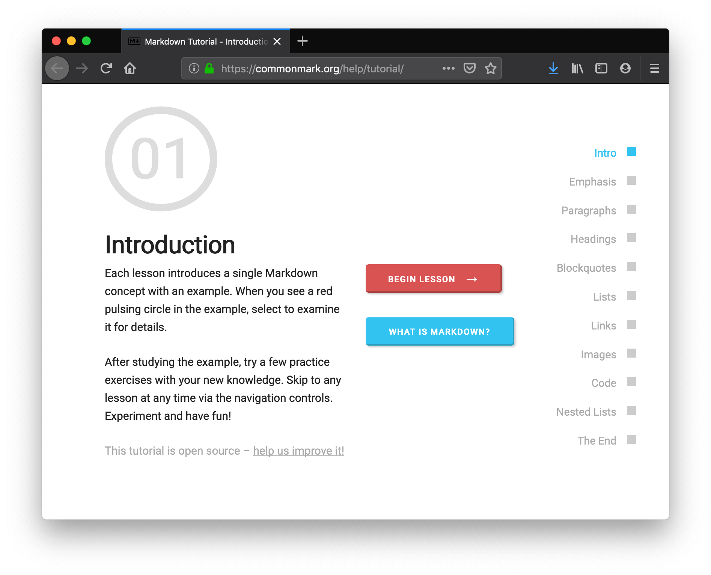
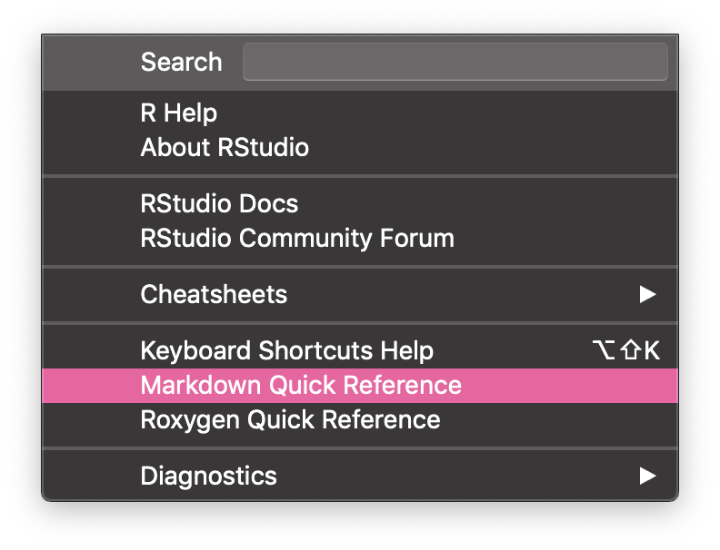
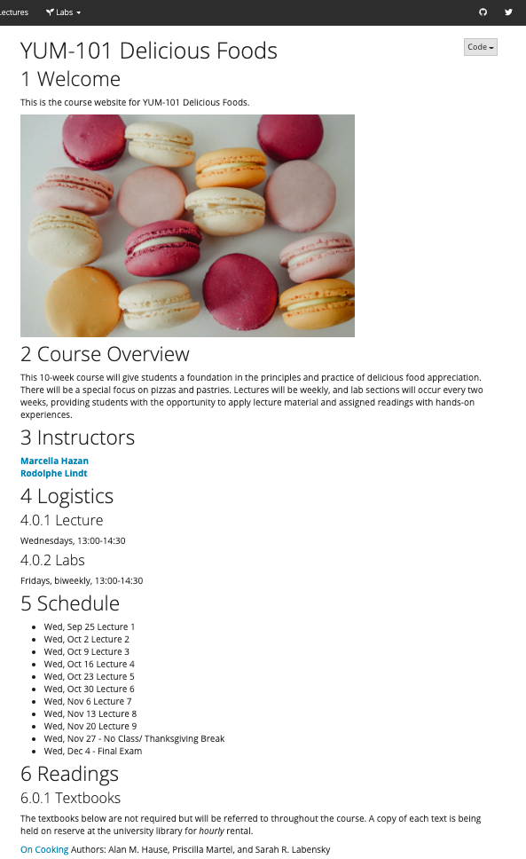
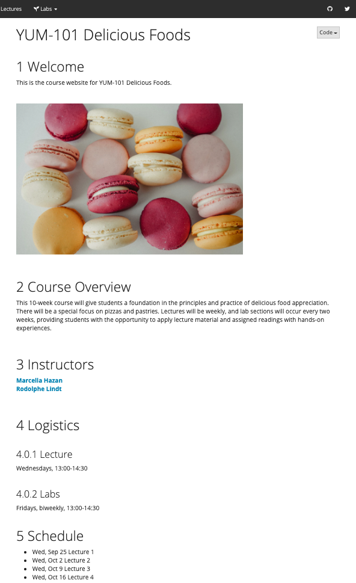

# Make it yours {#doc-yours}


Now it is time to personalize your R Markdown document to make it a lesson that works for you and your learners.

## Add code {#doc-code}

<div class = "side-by-side">
<div class = "side1">

\

````
```{r}
# a code comment
sample(c("fun", "fancy"), 1)
```
````

</div>

<div class = "side2">

You can insert new code chunks into your document in the RStudio IDE by putting your cursor in your doc where you want to plant your new chunk, then clicking on the {width=5%} button.

This adds the chunk delimiters `` ```{r} `` and `` ``` `` for you, and you place your code inside. Use `#` to add comments to your code.

</div>
</div>

## Embrace Markdown {#doc-md}


<div class = "side-by-side">
<div class = "side1">

<a href="https://commonmark.org/help/tutorial/" target="_blank"></a>

</div>

<div class = "side2">

\

One of the not-very-secret weapons of the most skilled R Markdown users is knowing Markdown inside and out. If you haven't done so already, take 10 minutes to do an [interactive Markdown tutorial](https://commonmark.org/help/tutorial/). 

\

\

\

\

From within the RStudio IDE, you can also access a *"Markdown Quick Reference"* from the **Help** menu. This renders a cheatsheet-style document in your **Help** viewer pane, so you can try to jog your memory without leaving your project.

</div>
</div>

## Add structure with headers {#doc-headers}


Headers are useful for organizing your document into sections, and with Markdown formatting you can have up to 6 types/sizes of headers. Use a `#` symbol before the label to create a new header.


<div class = "split">
<div class = "split1">

```markdown
# HEADER 1

## HEADER 2

### HEADER 3

#### HEADER 4

##### HEADER 5

###### HEADER 6
```

</div>
<div class = "no-anchor">

<h1 style="margin-top: 0em;">Header 1</h1>
<h2 style="margin-top: 0em;">Header 2</h2>
<h3 style="margin-top: 0em;">Header 3</h3>
<h4 style="margin-top: 0em;">Header 4</h4>
<h5 style="margin-top: 0em;">Header 5</h5>
<h6 style="margin-top: 0em;">Header 6</h6>

</div>
</div>

\

The RStudio IDE has several built-in features made to improve quality of life for R Markdown users.

\

<div class = "side-by-side">
<div class = "side1">

<div class="figure" style="text-align: center">
<a href="https://r4ds.had.co.nz/" target="_blank"></a>
<p class="caption">(\#fig:md-nav)RStudio code navigator</p>
</div>

</div>
<div class = "side2">

One feature is the drop-down code navigator in the bottom-left of your file editor as shown in Figure \@ref(fig:md-nav) (from the [R for Data Science book](https://r4ds.had.co.nz/)).

As you can see, this uses your Markdown headers to allow you to navigate around your `.Rmd` file. 

</div>
</div>

\

You can also use the RStudio outline pane, as shown in Figure \@ref(fig:md-outline) (from the [RStudio blog](https://rviews.rstudio.com/2016/11/11/easy-tricks-you-mightve-missed/)).

<div class="figure" style="text-align: center">
<a href="https://rviews.rstudio.com/2016/11/11/easy-tricks-you-mightve-missed/" target="_blank"></a>
<p class="caption">(\#fig:md-outline)RStudio outline pane</p>
</div>

## Add narrative {#doc-narrative}

Start writing! You can add words anywhere in your document below the YAML, just be sure you aren't adding non-R-code inside any code chunks.

Let's take a lightly-edited snippet from a [Wikipedia about "The Great British Bake Off"](https://en.wikipedia.org/wiki/The_Great_British_Bake_Off). On the left, you can see the raw Markdown and on the right, the rendered version.

<div class = "split">
<div class = "split1">

```markdown
# The Great British Bake Off

The Great British Bake Off (also called 
*Bake Off* or *GBBO*) is a British 
television baking competition.

In the first series, the location of 
the cast and crew moves from town to town 
each week, with a different baking 
**theme** each week:

1. Cakes
1. Biscuits
1. Bread
1. Puddings
1. Pastry
1. Tea Party

In each episode, the amateur bakers 
are given three challenges based on 
that week's theme:

- A signature bake,
- a technical challenge,
- and a show-stopper. 


[Photo:](https://en.wikipedia.org/wiki/Macaron)

Vanilla Macaron, Michelle Naherny 

```

</div>

<div class = "no-anchor">

<h4 style="margin-top: 0em;">The Great British Bake Off</h4>

The Great British Bake Off (also called *Bake Off* or *GBBO*) is a British television baking competition.

In the first series, the location of the cast and crew moves from town to town each week, with a different baking **theme** each week:

1. Cakes
1. Biscuits
1. Bread
1. Puddings
1. Pastry
1. Tea Party (Final)

In each episode, the amateur bakers are given three challenges based on that week's theme:

- A signature bake,
- a technical challenge,
- and a show-stopper. 


[Photo:](https://en.wikipedia.org/wiki/Macaron)

Vanilla Macaron, Michelle Naherny 

</div>
</div>

## Add space {#doc-breathe}

Let your words and code chunks breathe! This is unfortunately a bit manual. But--if you don't plan on doing any CSS, then we highly recommend doing the below:

* **Add white space** in the body of your .Rmd file by including either a `<br>` or a `\` on its own line with a blank line above and below it. At a minimum, we recommend doing before top-level section headers.  

:::hat
> "Code needs a lot of whitespace. That's how it breathes."
>
> &mdash; [Roger Peng](https://twitter.com/Dale_Masch/status/1017651666999394304?s=20)
:::

<div class = col2>



<br>



</div>

