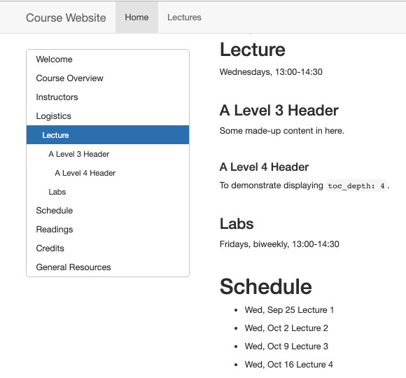
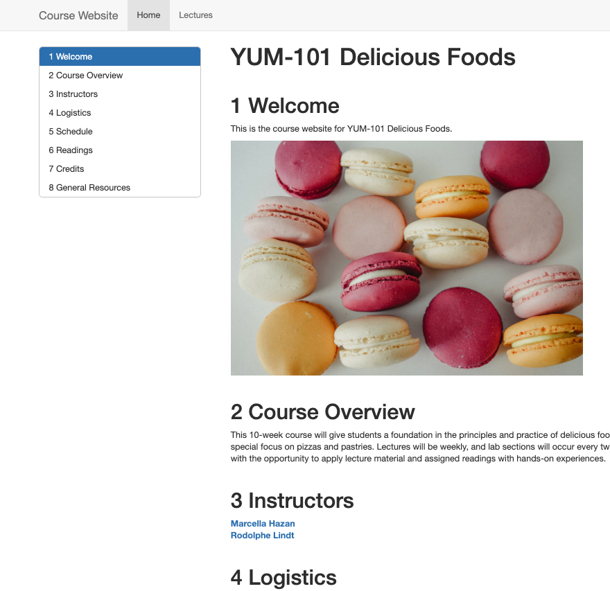

# (PART) Cookbook: Rmd + knitr {-}

```{r, include = FALSE}
source("common.R")
```

# Introduction {-#intro-knitr}

Overview- this is a section filled with recipes for making common types of educational content...

## Table of Contents (TOC) {#rmd-TOC}

In the `_site.yml` file, you can add a [table of contents](https://bookdown.org/yihui/rmarkdown/html-document.html#table-of-contents) either as a floating sidebar or as a static set of links at the top of the page. 


### Static TOC

* **Add `toc: true`** on its own line underneath `html_document` and indented.

<div class = side-by-side>
<div class = side1>
```{r, eval = FALSE}
name: "YUM-101"
navbar:
  type: default
  title: "Course Website"
  left:
    - text: "Home"
      href: index.html
    - text: "Lectures"
      href: lectures.html
output_dir: "docs"
output: 
  html_document:
    toc: true
```
</div>

<div class = side2>

</div>
</div>


### Floating TOC

* **Add `toc_float: true`** on another indented line beneath `toc: true`.
  
<div class = side-by-side>
<div class = side1>

```{r, eval=FALSE}
name: "YUM-101"
navbar:
  type: default
  title: "Course Website"
  left:
    - text: "Home"
      href: index.html
    - text: "Lectures"
      href: lectures.html
output_dir: "docs"
output: 
  html_document:
    toc: true
    toc_float: true
```
</div>

<div class = side2>

</div>
</div>

#### Even more

There are a few more `toc_float` related options you can change, though we recommend skipping them. Note that if you use them, you need to leave `toc_float:` blank. 

```{r, eval=FALSE}
output: 
  html_document:
    toc: true
    toc_float: 
      smooth_scroll: false
      collapsed: false
```

* **Try `smooth_scroll: false`** as an indented option underneath `toc_float:` so that when someone clicks on a header in the TOC, that section just "appears" automatically. We find doing this a bit jarring for the person navigating your site, so it's better to leave this as `true` (which is the same thing as not using the `smooth_scroll:` option at all).  


* **Try `collapsed: false`** to keep your floating TOC fully expanded to show all sub-level headers at all times instead of dynamically expanding and collapsing. 


### TOC Depth

You can control whether or not subheaders will be shown in your TOC, with the line below. The lower the `toc_depth`, the fewer subheaders it will show (e.g. a 1 will only show level 1 headers). The default is 3.

* **Add `toc_depth: <depth-value>`**.

<div class = side-by-side>
<div class = side1>
```{r, eval=FALSE}
name: "YUM-101"
navbar:
  type: default
  title: "Course Website"
  left:
    - text: "Home"
      href: index.html
    - text: "Lectures"
      href: lectures.html
output_dir: "docs"
output: 
  html_document:
    toc: true
    toc_float: true
    toc_depth: 4
```
</div>

<div class= side2>

</div>
</div>

## Numbered sections {#rmd-numbered}

* **Number your page sections and TOC** with the addition of `number_sections: true`. 

<div class = side-by-side>
<div class = side1>
```{r, eval=FALSE}
name: "YUM-101"
navbar:
  type: default
  title: "Course Website"
  left:
    - text: "Home"
      href: index.html
    - text: "Lectures"
      href: lectures.html
output_dir: "docs"
output: 
  html_document:
    toc: true
    toc_float: true
    toc_depth: 3
    number_sections: true

```
</div>

<div class= side2>

</div>
</div>

## Code Folding {#rmd-code-folding}

If you have a lot of code chunks, and you want to option for them to expand or fold with a click then:

* **Add `code_folding:`** as an option underneath `html_document:`. The options are either `show` or `hide`, depending on whether or not you want code chunks to be expanded by default.

<div class= side-by-side>

<div class = side1>

```{r, eval=FALSE}
output_dir: "docs"
output: 
  html_document:
    code_folding: show
```

</div>
<div class = side2>


</div>
</div>

## Code Download {#rmd-code-download}

You can also make it easy for others to download the raw R Markdown file that produced the page on the your site that they're viewing. 

* **Add `code_download: true`** underneath `html_document:`. This particular YAML option is one that you might consider only applying to `.Rmd` files where it's relevant (in which case, you would include in the `.Rmd`'s YAML and not the `_site.yml`.)

<div class= side-by-side>
<div class = side1>

```{r, eval=FALSE}
output_dir: "docs"
output: 
  html_document:
    code_folding: show
    code_download: true
```

</div>
<div class = side2>


</div>
</div>


## White Space {#rmd-white}

Last but not least, you should add some additional white space to your site to give the page more "breathing room" and improve readability. This is not accomplished with a built-in YAML option, and unfortunately, accomplishing this (without using CSS) is a bit manual. But--if you don't plan on doing any CSS, then we highly recommend doing the below:

* **Add white space** in the body of your .Rmd file by including either a `<br>` or a `\` on its own line with a blank line above and below it. At a minimum, we recommend doing before top-level section headers.  

By default, the R Markdown page spacing looks pretty squished, and you can see for yourself what our demo site looks like before and after a liberal helping of backslashes `\`.

\

<div class = col2>


<br>


</div>

After dressing up your site, don't forget to push to GitHub!


## Show code, hide results

The default global chunk option is `echo=TRUE`, which means that by default all code in code chunks is printed in the output. But sometimes you may want to suppress the output for pedagogical reasons on individual code chunks. You *could* set `eval = FALSE` as a global chunk option, but this would mean that all the code chunks will not get evaluated at all. Thus, you could have errors in your code that learners could stumble upon. Instead, we suggest setting `results='hide'` as a global chunk option to ensure that when you knit, you'll run into the same errors your learners will *before* they do.


````
```{r, results='hide'}`r ''`
library(tidyverse)
glimpse(starwars)
```
````

## Show code, hide plots

If your code produces plots, though, `results='hide'` will not suppress the plot. To suppress printing a plot, you'll need to use `fig.show='hide'`.

````
```{r, results='hide', fig.show='hide'}`r ''`
library(tidyverse)
glimpse(starwars)
ggplot(starwars, aes(x = height)) +
  geom_histogram(colour = "white", fill = "#3fb5bd") +
  theme_minimal()
```
````

## Show results, hide code

Sometimes you may want to shield your learners from all the code and just focus their attention on the output, whether it is printed or it produced a plot. This requires a single switch to `echo=FALSE` to "mute" the code from being output.

````
```{r, echo=FALSE}`r ''`
library(tidyverse)
glimpse(starwars)
```
````

This is all the learner sees:

```{r, echo=FALSE}
library(tidyverse)
glimpse(starwars)
```

## Interactively hide/show code

whole document

## Hide everything

Useful for you as you develop a lesson sometimes to save your code but hide the code and all output from learners. You can achieve the same thing with the combination of `echo=FALSE, results='hide', fig.show='hide'`. But the easier way is to use the `include` chunk option, which is by default set to TRUE.

````
```{r, include=FALSE}`r ''`
library(tidyverse)
glimpse(starwars)
```
````

## Fuse code and output together

In a typical R Markdown document, the results or plot produced by the code is printed following the code itself, so you see:

```{r}
library(tidyverse)
glimpse(starwars)
```

You may wish to fuse those two blocks together using the code chunk option `collapse=TRUE`:

````
```{r, collapse=TRUE}`r ''`
library(tidyverse)
glimpse(starwars)
```
````

```{r, collapse=TRUE}
library(tidyverse)
glimpse(starwars)
```


## Reuse your code

Once you embrace code chunk options, you may often find yourself copying and pasting code chunks so that you can use different options on the same code chunk. Like maybe you want the code to appear once, but you 

Special use case: plot first, code second

    Chunk 1: {r plot-first, echo = FALSE}
    Chunk 2: {r ref.label = 'plot-first', eval = FALSE}


## Two plots side-by-side

```{r dodge-st, fig.show = "hold", out.width = "50%"}
ggplot(mtcars, aes(factor(cyl), fill = factor(vs))) +
  geom_bar(position = position_dodge(preserve = "total"))

ggplot(mtcars, aes(factor(cyl), fill = factor(vs))) +
  geom_bar(position = position_dodge2(preserve = "total"))
```


## Include verbatim code chunks

You may have noticed that the code chunk output, even when `echo=TRUE`, does not show the actual code chunk options that you see in your .Rmd file. In order to print the full code chunk, you'll need to 

+ [verbatim code chunks](https://yihui.name/en/2017/11/knitr-verbatim-code-chunk/)

+ `knitr` [ref.label](https://yihui.name/knitr/demo/reference/) to reuse code chunks
+ the `fig.path` thing: https://yihui.name/knitr/options/#plots (see also: name your code chunks!)
+ making sure that your package warnings/messages don't print!
+ how to control numbers of digits that print 
+ control significance stars

```{r}
options(
  show.signif.stars = FALSE,     
  digits = 2
  )
```
