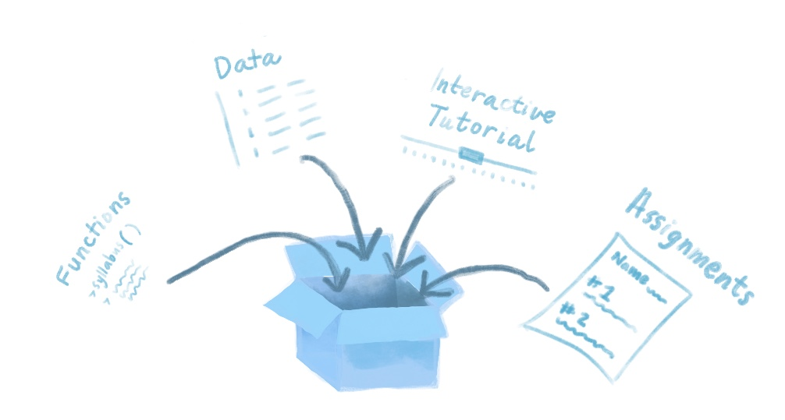

# (PART) Cookbook: Packages etc. {-}

# Introduction {-#intro-dry}

Overview- this is a section about how not to repeat yourself as an educator. define the DRY principle from software standpoint, then talk about ways to reduce repeating yourself as an educator. Namely, we see templates and data packages as a nice way to do this.  

\
**Why make a package?**

{width=600px}

\

As an educator you can use a package to easily deliver the contents of your lesson, teaching material, or data to an audience. Your package doesn't have to be on CRAN, and it doesn't have to contain functions (but it can if you want!). Packages can be used creatively so that you can give your students custom data sets to work with, R Markdown "worksheets" that they can fill in or use as templates for completing exercises. You can also have students run LearnR tutorials with a package. These are interactive R Markdown docs that use Shiny.
