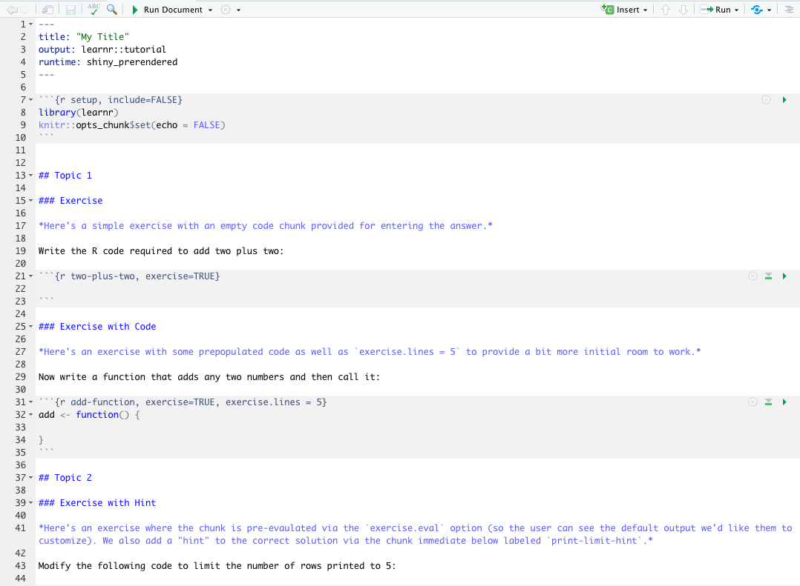
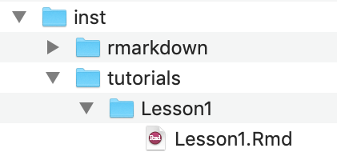

# Add interactive tutorials {#learnr}


## PART 1: Including a [LearnR](https://blog.rstudio.com/2017/07/11/introducing-learnr/) tutorial

### Why do this?

LearnR tutorials are interactive R Markdown documents that allow you to incorporate code exercises as well as elements like videos and quizzes. There are many possibilities, and we point you to other [resources](https://rstudio.github.io/learnr/index.html) to see various examples of these tutorials in action. The nice thing about this tool is that students can play around with code and preview various concepts outside of the RStudio IDE. One possible use case would be when you would like to introduce broader concepts in an interactive way before students begin focusing on the programming and coding aspects of the concepts within a regular `.Rmd` document. 

<br>


### Step 1: Create files and directories

As before, I assume you have at a minimum created the basic package structure from [Part 1](#data-pkg). 

* Install the `learnr` package
* Run `use_tutorial("<name-of-tutorial-file>", "<title-you'd-like-the-user-to-see>", open = interactive())` 


```r
remotes::install_github("rstudio/learnr")

use_tutorial("Lesson1", "My Title", open = interactive())
```

<br>

This adds a `tutorial` folder to the `inst` directory.

<br>


### Step 2: Customize your tutorial

* The `.Rmd` file inside the `tutorial` folder is automatically opened. Edit it to customize your tutorial content. 

<center></center>

* Click *Run Document* next to the little green arrow in the toolbar of the `.Rmd` file.
  + This will generate a `.html` file in the same directory as the tutorial `.Rmd` file and also run your tutorial locally.

<br> 

### Step 3: Add additional subdirectory

At the time of writing, there is one additional folder that needs to be added, which `use_tutorial` did not create for us. 

* Within the subdirectory `tutorials/`, add a new folder with the same name as your `.Rmd` tutorial file.
* Move your tutorial `.Rmd` file and the `.html` for your tutorial into this new folder.
* *Build* > *Install and Restart*

<center>{width=300px}</center>

<br>

### Step 4: Run your tutorial
* Run your tutorial with `run_tutorial("<tutorial-name>", "<package-name>")`. 


```r
learnr::run_tutorial("Lesson1", "testpackage")
```


The above line of code is also how your users will be able to run your tutorial once they have installed your package.

If you get errors, double check that your structure for the tutorial folders and files matches that of those in the `testpackage` [repository](https://github.com/rstudio4edu/testpackage).  Make sure you Build, Install, and Restart before trying again. 


<br>

<br>

## PART 5: FINAL STEPS

### (Optionally) Document the package as a whole

We created documentation for the data set, but not for the package overall. To do so: 

* Run `usethis::use_package_doc()`
* Edit the associated .R script that is generated in `R/` with roxygen-style comments
  + See [section 6.6 here](https://r-pkgs.org/man.html) and [here](https://stat545.com/packages05_foofactors-package-02.html#document-the-package-as-whole) for examples of what to include.
* Don't forget to run `document()` to update the documentation


```r
#install.packages(c("devtools", "roxygen2"))
library(roxygen2)
library(devtools)

document()
```

* Re-Build and install your package
* Check that package documentation works by typing `? <package-name>` substituting your own package name.

<br>

### Create a README.Rmd file

You can include additional information in a `README.Rmd` file for your package. At a minimum, you should include a line about how to install, using the guidelines from **Part 1: Deliver**.

* Run `use_readme_rmd()`


```r
> use_readme_rmd()
✔ Writing 'README.Rmd'
✔ Adding '^README\\.Rmd$' to '.Rbuildignore'
● Modify 'README.Rmd'
✔ Writing '.git/hooks/pre-commit'
```

* Edit to meet your needs.
* Click `Knit`, so that it updates the corresponding README.md file
* Commit and push.

<br>

## Troubleshooting
If you run into rough patches, here are some common pitfalls that might be resulting in errors:

* Do you have most up-to-date version of your packages? Try installing the development version of the package from github. Here's an example of what that looks like for the `usethis` package.


```r
# install.packages("devtools")
devtools::install_github("r-lib/usethis")
```

* Are you running the most current version of R and/or RStudio?
* Did you install R via homebrew? --> Uninstall and install from CRAN!

<br>

## Miscellaneous / Nice to Know

* If you didn't start with a repo, then you should use `usethis::use_github()`
* Licensing educational materials [ASK GREG]

<br>

## Other community resources on package-making:

You can find a diversity of additional helpful resources and tutorials on making R packages. We list a few below:

* [Hilary Parker on basic package functions](https://hilaryparker.com/2014/04/29/writing-an-r-package-from-scratch/): bare-bones function making
* [Writing an R package from scratch](https://r-mageddon.netlify.com/post/writing-an-r-package-from-scratch/) : Follows up on Hilary's but incorporates usethis()
* [Taking your data to Go](https://www.davekleinschmidt.com/r-packages/): Straightforward, concise tutorial on data packages
* [R Package Primer](https://kbroman.org/pkg_primer/)


