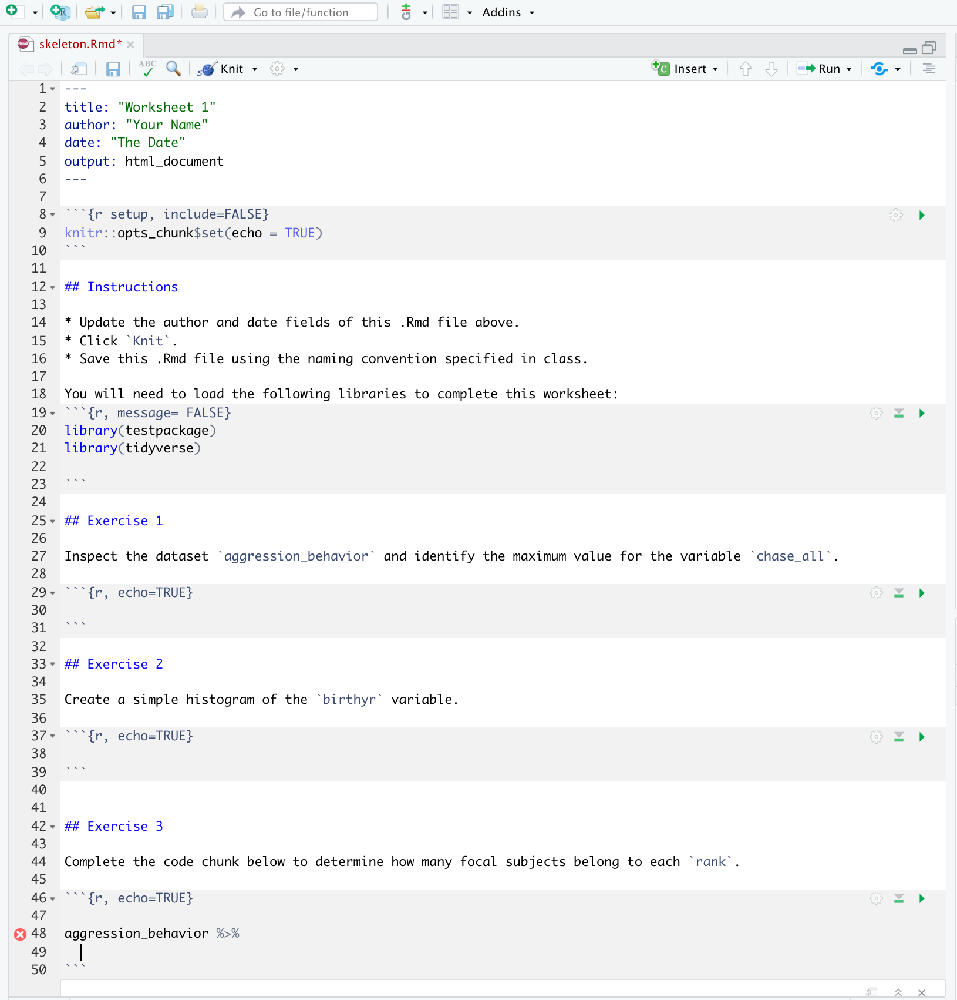

# Create R Markdown templates {#rmd-templates}


Including "worksheets" or report templates with R Markdown 

## Why do this?

An .Rmd template is essentially the replacement for a worksheet. It is a partially-filled out R Markdown file that you can create. You can create a template for every homework assignment or exercise that you want your students to work through. And they can access all of these templates easily when they go to `File` > `New File` > `R Markdown`. And then select `From Template` from the dialogue box menu. Your custom R Markdown template will appear there. 


You can make a couple templates for general use cases (e.g. "Homework", "Reports", "Final Project") or you can make as many very specific templates populated with questions or tailored excercies  (e.g. "Lesson 1 Excerices", "Problem Set 2").


As a rough outline, to make your first template you will:

1) Use a usethis function `use_rmarkdown_template()` to create the necessary directory and file structure within your package.
2) Modify the template.
3) Save, Build, Install, and Restart.

:::tip
If you're unfamiliar with the basics of RMarkdown and need to learn the syntax, then first you will want to check-out the resources and tutorials we've compiled [here](#intro-content).
:::
<br>

## Step 1: Create files and folders

I assume you have already created the basic package infrastructure from [Part 1](#data-pkg).

* Run `use_rmarkdown_template(template_name = "<your-template-name")`


```r
use_rmarkdown_template(template_name = "Worksheet1")

✔ Setting active project to '/Users/desiree/Documents/New R Projects/testpackage'
✔ Creating 'inst/rmarkdown/templates/worksheet1/skeleton/'
✔ Writing 'inst/rmarkdown/templates/worksheet1/template.yaml'
✔ Writing 'inst/rmarkdown/templates/worksheet1/skeleton/skeleton.Rmd'
> 
```

This creates a new folder in the root package directory `inst/` with several subdirectories. 

[](images/pkg/skeletonss.png){width=500px}

<br>


## Step 2: Create your template

* Edit `skeleton.Rmd` inside `inst/rmarkdown/templates/<your-template-name>/skeleton/`. This is what you're users will see.
  consider what you'd like the [output format to be](https://bookdown.org/yihui/rmarkdown/output-formats.html).
  + To see some examples of how  [here](https://github.com/dr-harper/example-rmd-templates).
  
* You can also include a description of your template in the `template.yaml` file in the parent directory `skeleton/`. But this is not critical to getting the template into the package.
* Save, *Build* > *Install and Restart*

<center>{width=500px}</center>

<br>

You can get ideas for how minimal `.Rmd` templates can be customized by checkout out a few example templates [here](https://github.com/dr-harper/example-rmd-templates).

<br>


## Step 3: Confirm that your template is accessible

* Once your R session has been restarted, navigate to `File` > `New File` > `R Markdown`. Select `From Template` from the dialogue box menu. Your custom R Markdown template will appear there. Voilà!

<center> {width=500px} </center>

<br>

:::tip
**Tip**: You can continue to add new .Rmd templates to your package throughout your course. When you do, ask students to update the package, and they will access to the new templates. 

[INSERT DAVID MEZA QUOTE]
:::

<br>


We next show you how you can introduce a special type of .Rmd document in your package: a LearnR tutorial.

<br>

