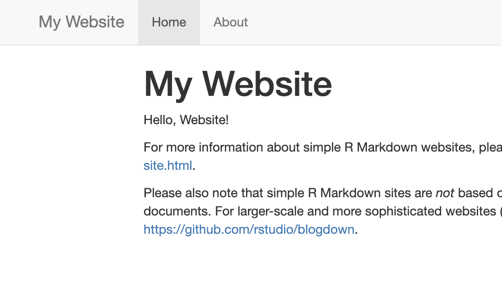

# (PART) Cookbook: R Markdown sites {-}

```{r, include = FALSE}
source("common.R")
```

```{r setup_moma, include = FALSE, cache = FALSE}
knitr::opts_chunk$set(fig.align="center")
```

# Introduction {-#intro-rmd}

<center>{width=30%}</center>

This is a tutorial intended for folks who would like to put together a site to help them organize and deliver their teaching materials to their participants. The R Markdown site is arguably the most basic [FUNDAMENTAL? CLASSIC?] means of compiling collections of R Markdown documents compared to other options available to you (i.e. blogdown, bookdown, etc.).

Using R Markdown, you can put together a bare-bones site in no time at all. Here, we will show you an example of how to do this by making a demo site. You can follow along with this tutorial, or you can download the demo repositories modify as much as you'd like. 


* In the "Dress it Up" section, you find instructions for customizations that are built-in features. These are no-fuss ways to customize. 

* In the Make it fancier section, you'll find customizations that require some CSS and HTML.

* In the workshop / course sections, we give specific ideas on how you might use particular R Markdown site features that would be especially useful for workshop and course sites. 

# Make a site {#make-rmd}

<center>{width=50%}</center>


Let's build an R Markdown site made from one or more R Markdown pages. You can jump to the different parts of this cookbook by using the links below. 

```{r echo = FALSE, results = 'asis'}
build_toc("cookbook-rmd.Rmd")
```


## Is this tutorial for you?

```{r child ="modules/is-this-tutorial-for-you.Rmd"}

```

* How to compile multiple R Markdown pages into an R Markdown site
* How to add basic customization through themes using built-in options
* How to publish your R Markdown pages for free via GitHub Pages


<br>


## Mental framework

What are we going to make here?

We're about to take R Markdown documents and create `.html` versions of them to make them web pages. This is not so different from what happens when you work with individual `.Rmd`s. But, there are a few key pieces of magic that separate a regular collection of R Markdown documents from a living, breathing website: 

<center></center>

* A `_site.yml` text file that will stitch your `.Rmd` documents together and place an official-looking navigation bar at the top of them.
* An R Markdown file with the name `index.Rmd` file, which will become your site's homepage.
* A `docs/` folder, which will be the folder that acts as the "boarding area" for our rendered site files.
* Turning on GitHub Pages for your repository with the click of a button to make our work go live!


Let's get started!

## Part 1: Getting set up

### Packages

We'll use the `usethis` package:

```{r, eval=FALSE}
#install.packages("usethis")
library(usethis)

```

### Two getting-started workflows:

```{r child = 'modules/github-first-project.Rmd'}

```

```{r eval = FALSE}
rmarkdown:::site_skeleton(getwd())
```

(note that we use `:::` here, with three colons!) to generate important infrasctructure files we need. 

:::tip
Warning! If you're the type of person who "arrows up" to run previously executed commands in your console, make sure you don't accidentally re-run this one once you've started populated your files with your content. It will irreversibly wipe the slate clean for some of your files each time it's executed.

:::

\

Though we recommend a "GitHub first" workflow, it is possible to start with RStudio project wizard to create a new R Markdown site and then move to GitHub:

1. Click *File* > *New Project* > *New Directory*
2. Scroll down and select *Simple R Markdown Website*
3. Then, optionally: 

```{r, eval=FALSE}
usethis::use_git()
usethis::use_github() # you have to have a PAT setup
```

Regardless of which workflow you choose, you will end up with the following files in your working directory. The most critical files are the `index.Rmd` and the `_site.yml`.

<center>{width=300px}<center>

## Part 2: Create your content

### Make some changes and push to GitHub

Our R Markdown skeleton created with out-of-the-box pages meant for site content that we can start to edit. Let's throw in some new content and preview it locally.


1. Open `index.Rmd` and add some content. Any content on this page will be on the landing page of your site. This file *must* be named "index.Rmd". Save and Close.


2. Open `about.Rmd`. Add some new content. This will be a second, distinct page of your site. This file can have any name, but we will stick to "about" for now.


3. Click *Knit* on either of the `.Rmd`s to preview what that specific page will look like on the website. Alternatively, run the code below to knit and preview the "index" and "about" pages in one fell swoop.

```{r, eval = FALSE}
rmarkdown::render_site()
```

What does this do? It creates a new folder, `_site`, that now houses `.html` (i.e. website-formatted) versions of your `.Rmd` files. AND each of these `.html` files has a navigation bar at the top that links one page to the other. 


4. Locate the RStudio pane that has a tab labelled *Git* and click on it.


5. Check the box(es) under the "Staged" column and click *Commit*.


6. Add a commit message and then click *Push*.


<center>{width=400px}<center>


### Stitch it together
Now for a closer look at the `_site.yml`. This file is really the lifeblood of our site, and it contains YAML info (which in the programming world is just a type of language that is easy-ish to read and usually deals with configuation settings). This file not only creates a navigation bar (a.k.a "navbar") for us, which links together all our site pages, but it will also be mission-control center for our site's layout and aesthetics, as we'll see soon. 

[replace with annotated screenshot of the side-by-side below]

<div class = side-by-side>
<div class = side1>
```{r, eval=FALSE}
name: "my-website"
navbar:
  title: "My Website"
  left:
    - text: "Home"
      href: index.html
    - text: "About"
      href: about.html
output_dir: "docs"
output: 
  html_document:
```

</div>
<div class = side2>

</div>
</div>

Normally, a new R Markdown document will have its own YAML, but when making an R Markdown site, we instead compile the YAML info common to all the `.Rmd`s in our site and write it once in the `_site.yml` file. One YAML to rule them all!

```{r, out.width = "30%", fig.align='center', echo= FALSE}
knitr::include_graphics("images/insert.jpg")
```


Let's edit our `_site.yml` to prep our files for GitHub pages:


1. Open `_site.yml`.

2. Add `output_dir: "docs"` on its own line.

3. Add `output:` to another line. On another line beneath that, indent and add `html_docucument:` like so:


```{r, eval=FALSE}
name: "my-website"
navbar:
  title: "My Website"
  left:
    - text: "Home"
      href: index.html
    - text: "About"
      href: about.html
output_dir: "docs"
output: 
  html_document:
```


These additions say "please make all of my output HTML documents when I knit, and also please place all of my `.html` files in the `docs/` folder." (If your file doesn't end up in the `docs/` folder, GitHub pages doesn't care about it.)

\

:::tip
FYI: Within any YAML, pay careful attention to the indentations and spaces. YAMLs are fussy about this, and this is often the source of many errors!
:::

\

4. Aaaand ACTION! In the Rstudio console, run: 
```{r, eval = FALSE}
rmarkdown::render_site()
```

Besides rendering a local version of your site (it's not live yet!), this creates a `docs/` folder with the website-ready HTML files inside. This line of code is one that you will need to run after each time you've made changes to your content. Each time you run `rmarkdown::render_site()`, the `docs/` folder will be overwritten with updated HTML versions of your `.Rmd`s. Which means, by the way, DON'T EVER EDIT FILES IN THE `docs/` FOLDER! Nothing catastrophic will happen if you do, but you will overwrite and lose all your changes the next time you knit or `render_site()`.

\

:::tip
If the rendered site does not open up in a new automatically in a new window, you can go to the `docs/` folder in your project, click on the `index.html` file, and `View it in Web Browser`.)
:::

\

5. Delete the `_site` folder. You don't need it anymore.  

6. Push all your changes to GitHub before going to the next step. 


## Part 3: Make it a living, breathing, shareable site!

```{r, out.width = "30%", fig.align='center', echo= FALSE}
knitr::include_graphics("images/insert.jpg")
```

We've created content, linked all our pages together with `_site.yml`, and pushed to GitHub. Now we'll go back to the GitHub website and tell it where to find our website-ready files:


1. Back on GitHub, click the *Settings* tab of your repository.


2. Scroll down until you get to "GitHub Pages" and select "master branch/docs folder".

<center>{width=600px}</center>


3. Congratulations! A url is generated--this is your website address. You can share it, tweet it, send it to your mom--it's now live!


4. We recommend adding this url to the repo description so that it's easy for you to find. 

[SCREENSHOT]

Now that the bare bones of the site are up, you can go back and add more content to your R Markdown documents anytime. Your changes will "go live" as soon as knit or `render_site()` and push to GitHub. 

## Part 4: Dress it up!

```{r, out.width = "30%", fig.align='center', echo= FALSE}
knitr::include_graphics("images/rmd_custom/Dressup.jpg")
```

Let's go back and change the way your site looks and feels by editing the YAML section. The sections below go through a nearly exhaustive list of built-in ways you can give your site a face lift, but don't feel overwhelmed. Most of these options are à la carte -- so go ahead and scroll on down and see if there are any you like!

[placeholder below, need to make annotated screenshot for basic course site]
<center>{width=800px}</center>


Let's try out some different options and then knit your document or `render_site()` to see what they look like. 

\

### Starting Point

```{r, out.width = "30%", fig.align='center', echo= FALSE}
knitr::include_graphics("images/insert.jpg")
```

After adding some content, here's the site we're starting with and the YAML that goes with it. We use our [basic course demo Rmd site](https://rstudio4edu.github.io/basic-course-website/) as an example. we re-named the "about" files to "lectures", but the YAML structure is the same as where we left off above.

<div class = side-by-side>
<div class = side1>

```{r, eval = FALSE}
name: "YUM-101"
navbar:
  type: default
  title: "Course Website"
  left:
    - text: "Home"
      href: index.html
    - text: "Lectures"
      href: lectures.html
output_dir: "docs"
output: 
  html_document:
```

</div>
<div class = side2>

</div>
</div>
Open your `_site.yml` file, and let's begin our site makeover.

### Table of Contents (TOC)

In the `_site.yml` file, you can add a [table of contents](https://bookdown.org/yihui/rmarkdown/html-document.html#table-of-contents) either as a floating sidebar or as a static set of links at the top of the page. 


#### Static TOC

* Add `toc: true` on its own line underneath `html_document` and indented.

<div class = side-by-side>
<div class = side1>
```{r, eval = FALSE}
name: "YUM-101"
navbar:
  type: default
  title: "Course Website"
  left:
    - text: "Home"
      href: index.html
    - text: "Lectures"
      href: lectures.html
output_dir: "docs"
output: 
  html_document:
    toc: true
```
</div>

<div class = side2>

</div>
</div>


#### Floating TOC

* Add `toc_float: true` on another indented line beneath `toc: true`.
  
<div class = side-by-side>
<div class = side1>

```{r, eval=FALSE}
name: "YUM-101"
navbar:
  type: default
  title: "Course Website"
  left:
    - text: "Home"
      href: index.html
    - text: "Lectures"
      href: lectures.html
output_dir: "docs"
output: 
  html_document:
    toc: true
    toc_float: true
```
</div>

<div class = side2>

</div>
</div>

##### Even more

There are a few more `toc_float` related options you can change, though we recommend skipping them. Note that if you use them, you need to leave `toc_float:` blank. 

```{r, eval=FALSE}
output: 
  html_document:
    toc: true
    toc_float: 
      smooth_scroll: false
      collapsed: false
```

* Try `smooth_scroll: false` as an indented option underneath `toc_float:` so that when someone clicks on a header in the TOC, that section just "appears" automatically. We find doing this a bit jarring for the person navigating your site, so it's better to leave this as `true` (which is the same thing as not using the `smooth_scroll:` option at all).  


* Try `collapsed: false` to keep your floating TOC fully expanded to show all sub-level headers at all times instead of dynamically expanding and collapsing. 


#### TOC Depth

You can control whether or not subheaders will be shown in your TOC, with the line below. The lower the `toc_depth`, the fewer subheaders it will show (e.g. a 1 will only show level 1 headers). The default is 3.

* Add `toc_depth: <depth-value>`.

<div class = side-by-side>
<div class = side1>
```{r, eval=FALSE}
name: "YUM-101"
navbar:
  type: default
  title: "Course Website"
  left:
    - text: "Home"
      href: index.html
    - text: "Lectures"
      href: lectures.html
output_dir: "docs"
output: 
  html_document:
    toc: true
    toc_float: true
    toc_depth: 4
```
</div>

<div class= side2>

</div>
</div>

### Numbered Sections

* Number your page sections and TOC with the addition of `number_sections: true`. 

<div class = side-by-side>
<div class = side1>
```{r, eval=FALSE}
name: "YUM-101"
navbar:
  type: default
  title: "Course Website"
  left:
    - text: "Home"
      href: index.html
    - text: "Lectures"
      href: lectures.html
output_dir: "docs"
output: 
  html_document:
    toc: true
    toc_float: true
    toc_depth: 3
    number_sections: true

```
</div>

<div class= side2>

</div>
</div>


### Themes

Themes are blanket ways of dressing up your site's aesthetics. 

\

* Add a theme with `theme: <insert-theme-name>` indented on its own line underneath `html_document:` 
    + Theme options: `default`, `cerulean`, `journal`, `flatly`, `darkly`, `readable`, `spacelab`, `united`, `cosmo`, `lumen`, `paper`, `sandstone`, `simplex`, and `yeti`.  
    
    
* See examples of the 14 available themes you can choose from [here](#rmd-themes)


    
<div class = side-by-side>
<div class = side1>

```{r, eval=FALSE}
name: "YUM-101"
navbar:
  type: default
  title: "Course Website"
  left:
    - text: "Home"
      href: index.html
    - text: "Lectures"
      href: lectures.html
output_dir: "docs"
output: 
  html_document:
    toc: true
    toc_float: true
    toc_depth: 3
    number_sections: true
    theme: yeti

```
</div>

<div class= side2>


</div>
</div>

### Highlight style

Want to change the way your code chunks and output appears? You can:

 
* Change the highlight style:** `highlight: <insert-style-name>`
    + Highlight styles: `default`, `tango`, `pygments`, `kate`, `monochrome`, `espresso`, `zenburn`, `haddock`, and `textmate`.  
    
    
* Check out what these look like [here](https://www.garrickadenbuie.com/blog/pandoc-syntax-highlighting-examples/). 

<div class = side-by-side>
<div class = side1>

```{r, eval=FALSE}
name: "YUM-101"
navbar:
  type: default
  title: "Course Website"
  left:
    - text: "Home"
      href: index.html
    - text: "Lectures"
      href: lectures.html
output_dir: "docs"
output: 
  html_document:
    toc: true
    toc_float: true
    toc_depth: 3
    number_sections: true
    theme: yeti
    highlight: tango

```
</div>

<div class= side2>


</div>
</div>

### Navbar

We can do a few different things to our navbar including:

* **Organizing the site**:
    * Add more R Markdown documents to the site
    * Create a dropdown menu
    
\

* **Changing navbar aesthetics**:
    * Change the navbar color
    * Align navbar content to right

#### Link to more pages 

To add another R Markdown page to the site:

1.  Create a pair of new `- text:` and `href:` lines


2.  Enter the name you want to see on the navbar for this page in quotes after `- text:`


3.  Enter the name of the `.html` file that corresponds to the R Markdown page you're adding after `href:`

<div class = side-by-side>
<div class = side1>

```{r, eval=FALSE}
name: "YUM-101"
navbar:
  type: default
  title: "Course Website"
  left:
    - text: "Home"
      href: index.html
    - text: "Lectures"
      href: lectures.html
    - text: "Labs"
      href: labs.html
output_dir: "docs"
output: 
  html_document:
    toc: true
    toc_float: true
    toc_depth: 3
    number_sections: true
    theme: yeti
    highlight: tango

```
</div>

<div class= side2>


</div>
</div>

#### Dropdown menu

You can also create a dropdown menu to add *many* more pages to the site. Let's say we instead decided to create a separate R Markdown document for each lab in this course. We could create a dropdown menu called "Labs" and link to each of the pages underneath that. 

See how we do this in the YAML below:

1. Add a new `- text:` line with the heading name of your dropdown menu. 

2. Add `menu:` on its own line underneath this, aligned with the `href:` of the other indepedent pages in the navbar.  

3. Add a `- text:` line beneath this with the name of page you want to link to.  

4. Add an `href:` line with the `.html` of the page you want to link to.  

5. Repeat 3. and 4. until you've added all the pages for this dropdown.


<div class = side-by-side>
<div class = side1>
```{r, eval=FALSE}
name: "YUM-101"
navbar:
  type: default
  title: "Course Website"
  left:
    - text: "Home"
      href: index.html
    - text: "Lectures"
      href: lectures.html
    - text: "Labs"
      menu:
      - text: "Lab 1"
        href: lab1.html
      - text: "Lab 2"
        href: lab2.html
      - text: "Lab 3"
        href: lab1.html
      - text: "Lab 4"
        href: lab1.html
output_dir: "docs"
output: 
  html_document:
```
</div>

<div class= side2>


</div>
</div>

##### Even more

There's a little more accessorizing we can do with the dropdown menu.

* Add **divider lines** to create sections in the dropdown with `- text: "---"`. 

* Add **internal headers** with a `- text:` line without an `href` line immediately underneath it. 


<div class = side-by-side>
<div class = side1>
```{r, eval=FALSE}
name: "YUM-101"
navbar:
  type: default
  title: "Course Website"
  left:
    - text: "Home"
      href: index.html
    - text: "Lectures"
      href: lectures.html
    - text: "Labs"
      menu:
      - text: "Introductory"
      - text: "Lab 1"
        href: lab1.html
      - text: "Lab 2"
        href: lab2.html
      - text: "---"
      - text: "Advanced"
      - text: "Lab 3"
        href: lab1.html
      - text: "Lab 4"
        href: lab1.html
output_dir: "docs"
output: 
  html_document:
```
</div>

<div class= side2>


</div>
</div>


#### Change the navbar color

* Swap out your theme's default navbar with `type: inverse`.

<div class = side-by-side>
<div class = side1>
```{r, eval=FALSE}
name: "YUM-101"
navbar:
  title: "Course Website"
  type: inverse
```

</div>

<div class= side2>


</div>
</div>

#### Align navbar content to the right

In all the YAML options we've looked at so far, `left:` has been one of the first things to go under `navbar:`. You have all (or just some) of your links aligned to the right side of the navbar instead by changing this to `right:`. We demo this below when we add aligned-right icons to the navbar. 

### Icons

Sprinkle some icons into your navbar and have them link to outside sources (e.g. twitter, GitHub, etc.) or to pages within your own site. You can use any icons from [Font Awesome](https://fontawesome.com/icons), by entering the prefix `fa-` followed by the icon's name.

Here's how you add them:

* Type `icon: <icon-prefix-and-name>` on the line immediately above the link that you want to icon to point to.

Below we add GitHub and Twitter icons that will link to our accounts, and just for fun, we some more icons to the pages that were already in our navbar.


<div class = side-by-side>
<div class = side1>
```{r, eval=FALSE}
name: "YUM-101"
navbar:
  type: default
  title: "Course Website"
  left:
    - text: "Home"
      icon: fa-home
      href: index.html
    - text: "Lectures"
      icon: fa-book-open
      href: lectures.html
    - text: "Labs"
      icon: fa-seedling
      menu:
      - text: "Introductory"
      - text: "Lab 1"
        href: lab1.html
      - text: "Lab 2"
        href: lab2.html
      - text: "---"
      - text: "Advanced"
      - text: "Lab 3"
        href: lab1.html
      - text: "Lab 4"
        href: lab1.html
  right: 
    - icon: fa-github
      href: https://github.com/rstudio4edu/basic-course-website
    - icon: fa-twitter
      href: https://twitter.com/rstudio?lang=en
output_dir: "docs"
output: 
  html_document:
```
</div>

<div class= side2>

{width=100%}

<br>

{width=100%}
</div>
</div>

:::tip
If the icon won't be accompanied by text, you'll have to enter `- icon:`.
:::

### Code Folding

If you have a lot of code chunks, and you want to option for them to expand or fold with a click then:

* Add `code_folding:` as an option underneath `html_document:`. The options are either `show` or `hide`, depending on whether or not you want code chunks to be expanded by default.

<div class= side-by-side>

<div class = side1>

```{r, eval=FALSE}
output_dir: "docs"
output: 
  html_document:
    code_folding: show
```

</div>
<div class = side2>


</div>
</div>

### Code Download

You can also make it easy for others to download the raw R Markdown file that produced the page on the your site that they're viewing. 

* Add `code_download: true` underneath `html_document:`.

<div class= side-by-side>
<div class = side1>

```{r, eval=FALSE}
output_dir: "docs"
output: 
  html_document:
    code_folding: show
    code_download: true
```

</div>
<div class = side2>


</div>
</div>


### White Space

Last but not least, you should add some additional white space to your site to give the page more "breathing room" and improve readability. This is not accomplished with a built-in YAML option, and unfortunately, accomplishing this (without using CSS) is a bit manual. But--if you don't plan on doing any CSS, then we highly recommend doing the below:

* **Add white space** in the body of your .Rmd file by including either a `<br>` or a `\` on its own line with a blank line above and below it. At a minimum, we recommend doing before top-level section headers.  

By default, the R Markdown page spacing looks pretty squished, and you can see for yourself what our demo site looks like before and after a liberal helping of backslashes `\`.

\

<div class = col2>


<br>


</div>

After dressing up your site, don't forget to push to GitHub!

## Caring for your site

### Adding new pages
Once you have the website in place, it's likely that you will want to update it periodically or add new pages. The key to updating is that you must knit the individual page you update or `render_site()` each time before you push to GitHub--otherwise your changes wouldn't make it into your `docs/` folder. And if it's not in the `docs/` then GitHub pages doesn't care about it. 

Here's what the add-new-pages workflow looks like for me:

1. Open the existing site RStudio project
2. Run `rmarkdown::render_site()` right away to see where things left off.
3. Create a new `.Rmd` document and delete its default YAML except for the title. 
4. Update your `_site.yml` by adding the new page's `.html` file to the navbar section. **Note: It's very easy to forget this step!!**
6. Run `rmarkdown::render_site()` to stitch everything together.
7. Rinse and repeat if needed!
8. Commit and push all changes to GitHub.

### Hiding pages
Have an R Markdown file that you're not ready to share with the world? If you leave it off of your navbar and don't link to it elsewhere, then it's unlikely anyone will ever find it, but it will still be rendered with build your site. If you don't want the `.Rmd` to be rendered at all, then save it with a filename that begins with an underscore `_`. All files with underscores get passed over when it's time to render the site (but they'll still be in your repository).


## Pros and cons of using Rmd sites

**Pros:**

* **Minimal additions** (really, just 2 files) are needed to go from a collection of regular R Markdown documents to a site.  

* **A simple structure** allows you to grow your content and add pages quickly, without having to invest time in learning complicated folder structures to figure out where to put new files.  

* **Ideal for small sites** that do not need complex organization or many pages (i.e. for workshops).  

* **Easy to customize** without any knowledge of web design or CSS if you're okay sticking to the templates.  

\

**Cons:**

* **Many files lead to chaos** because there is not a way to organize files so that they fall under the umbrella of an overarching page. All R Markdown docs and pages will be on the same "level" of website organization, so as the number of pages increases, your project directory becomes increasingly crowded. 

* **CSS and HTML necessary** for moving beyond the limited built-in customization options. Depending on what you enjoy about coding--this might not actually be a con. 


## Community resources

### For existing tutorials

* [Chapter 5, Webpages](https://debruine.github.io/tutorials/webpages.html): Includes some overview of adding images, changing global style settings, etc.  

* [Creating Website in R](https://www.emilyzabor.com/tutorials/rmarkdown_websites_tutorial.html#r_markdown_website_basics): Includes description of how to add a personal domain name.


* [Making free websites with RStudio'd R Markdown](https://jules32.github.io/rmarkdown-website-tutorial/index.html): A how to that also includes descriptions of the RStudio GUI layout and an overview of Markdown syntax.  

* [Personal Website tutorial](http://nickstrayer.me/RMarkdown_Sites_tutorial/)  

### On general setup

* [GitHub and Rstudio](https://resources.github.com/whitepapers/github-and-rstudio/): Step-by-step guide on publishing `.Rmd` docs to GitHub, includes working with local branches and using the terminal tab within R. 

* [R Markdown: The Definitive Guide](https://bookdown.org/yihui/rmarkdown/): The official and very thorough, but often technical, resource for R Markdown. Treat this as a reference text.

\

### On formatting

* [R Markdown cheatsheet](https://www.rstudio.com/wp-content/uploads/2015/02/rmarkdown-cheatsheet.pdf)
* [Pimp my RMD](https://holtzy.github.io/Pimp-my-rmd/#equations): smattering of examples of different ways to format R Markdown documents. Includes adding equations, figure captions, etc.


## tldr;

**Here's how you make an R Markdown site:**

1. In a GitHub-connected RStudio project, run `rmarkdown:::site_skeleton(getwd())`.
2. Add `output_dir: "docs"` to `_site.yml` on its own line.
2. Edit `index.Rmd` content to be with whatever you want to put on your homepage.
3. Edit the `about.Rmd` or create new `.Rmd` files if you want more site pages.
4. Delete all YAML info from new `.Rmd` docs except the `Title:` and the dashed lines.
5. Link new pages to the site by referencing them in the navbar section of `_site.yml`.
6. Modify `_site.yml` with built-in options to dress up your site.
7. Run `rmarkdown::render_site()` each time you make changes to any doc to create `.html` files of your `.Rmd` pages.
8. Commit and push all changes to GitHub.
9. Go to your GitHub repo > Settings > scroll down to GitHub pages > select "master branch/ docs folder" from the dropdown menu. And share your new site URL!


**Here's what the YAML looks like if you max-out the built-in customization options:**

```{r, eval = FALSE}
name: "YUM-101"
navbar:
  type: default
  title: "Course Website"
  left:
    - text: "Home"
      icon: fa-home
      href: index.html
    - text: "Lectures"
      icon: fa-book-open
      href: lectures.html
    - text: "Labs"
      icon: fa-seedling
      menu:
      - text: "Introductory"
      - text: "Lab 1"
        href: lab1.html
      - text: "Lab 2"
        href: lab2.html
      - text: "---"
      - text: "Advanced"
      - text: "Lab 3"
        href: lab1.html
      - text: "Lab 4"
        href: lab1.html
  right: 
    - icon: fa-github
      href: https://github.com/rstudio4edu/basic-course-website
    - icon: fa-twitter
      href: https://twitter.com/rstudio?lang=en
output_dir: "docs"
output: 
  html_document:
    toc: true
    toc_float: true
    toc_depth: 3
    number_sections: true
    theme: yeti
    highlight: tango
    code_folding: show
    code_download: true

```


And here's what each option does:

[INSERT SCREENSHOT]

