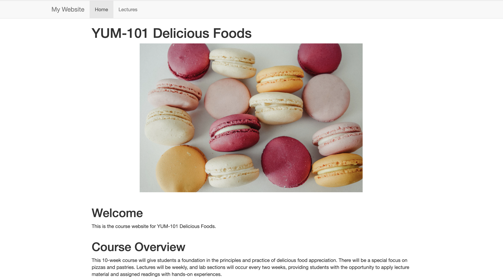
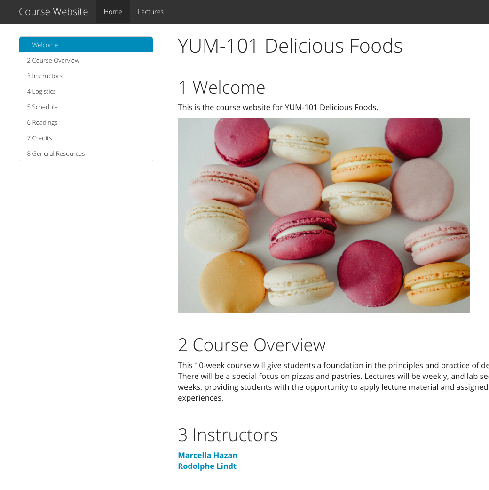
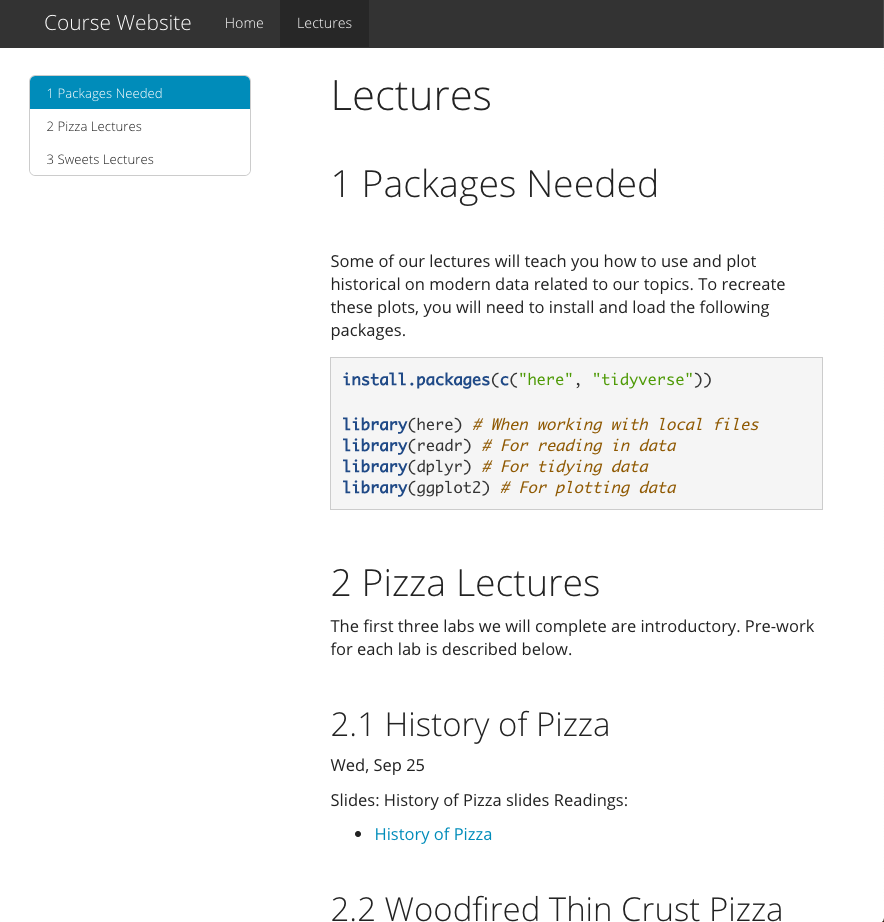
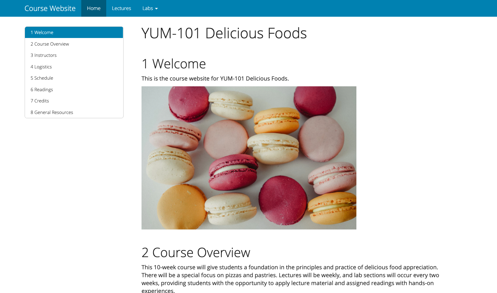
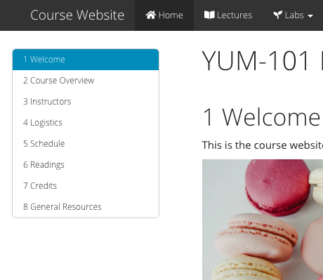
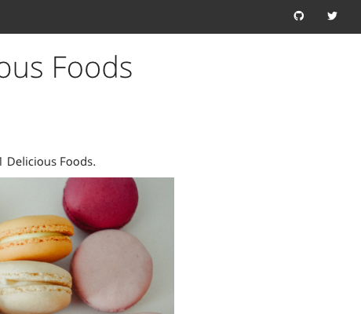
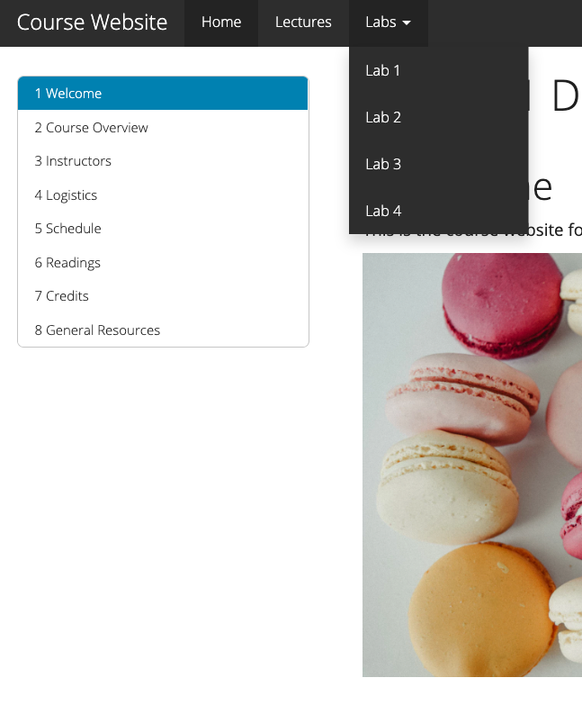
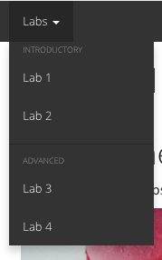
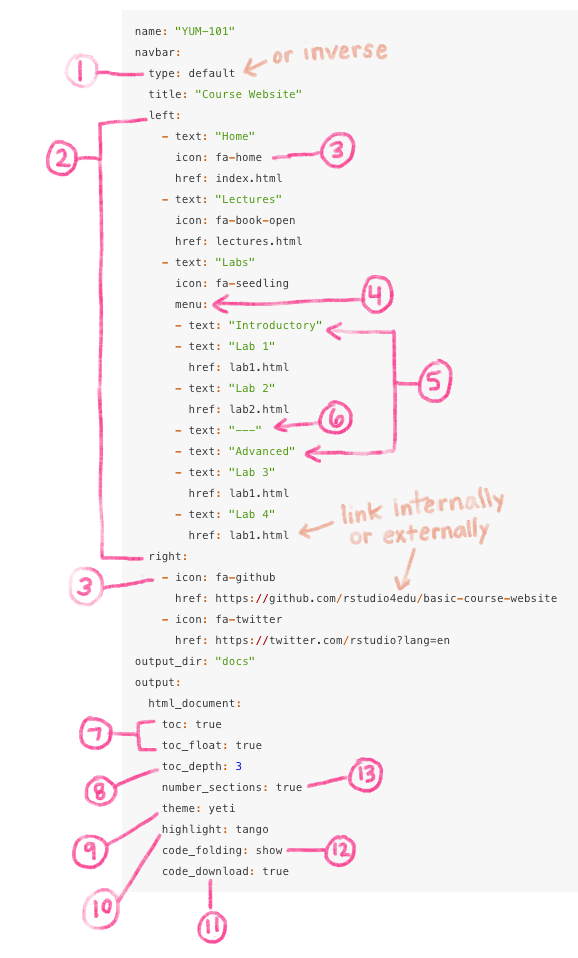
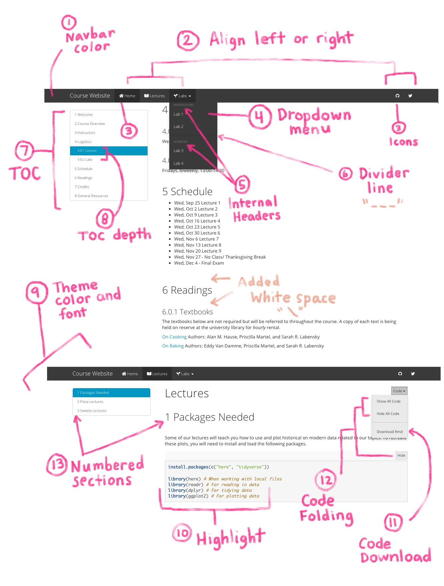

# Dress it up! {#rmd-dress}

```{r, include = FALSE}
source("common.R")
knitr::opts_chunk$set(fig.align="center")
```

```{r, out.width = "30%", fig.align='center', echo= FALSE}
knitr::include_graphics("images/rmd_custom/Dressup.jpg")
```

The focus of this section is to show you "built in" ways for you to change the way your site looks and feels *without needing any custom style*. What does this mean? This means you don't need to know or use [CSS, otherwise known as Cascading Style Sheets](https://en.wikipedia.org/wiki/Cascading_Style_Sheets) to make any of the changes we demo below. 

Let's return to our site, right where we left off. The sections below go through a nearly exhaustive list of built-in ways you can give your site a face lift by editing the YAML, but don't feel overwhelmed. Most of these options are à la carte -- so go ahead and scroll on down and see if there are any you like!


Let's try out some different options. Build your site or use `rmarkdown::render_site()` after trying each one out to see how the change affects your site.

If these customizations leave you wanting more, then be sure to check out the ["Make it fancier"](#rmd-fancy) chapter.

```{r include = FALSE}
yum_yml <- yml(date = FALSE, author = FALSE) %>% 
  yml_site_opts(
    name = "YUM-101",
    output_dir =  "docs"
    ) %>% 
  yml_navbar(
    title = "Course Website",
    type = "default",
    left = list(
      navbar_page("Home", href = "index.html"),
      navbar_page("Lectures", href = "lectures.html")
    )) 
```

## Bare bones 

```{r, out.width = "30%", fig.align='center', echo= FALSE}
knitr::include_graphics("images/insert.jpg")
```

After adding some content, here's the site we're starting with and the YAML that goes with it. We use our [basic course demo Rmd site](https://rstudio4edu.github.io/basic-course-website/) as an example. We renamed the "about" files to "lectures", but the YAML structure is the same as where we left off above.

<div class = side-by-side>
<div class = side1>

```{r echo = FALSE}
yum_yml %>% 
  asis_yaml_output()
```

</div>
<div class = side2>

</div>
</div>
\

## One YAML to rule them all {#rmd-one-yaml}

```{r, out.width = "30%", fig.align='center', echo= FALSE}
knitr::include_graphics("images/insert.jpg")
```

Now for a closer look at `_site.yml`. This file is like the orchestra conductor (?<!--TODO: Desiree / lifeblood was throwing me but not attached to this analogy-->) of our site.

The `_site.yml` file directs the R Markdown site generator how to build our *whole site* from the different sections <!--(think: cello, violins, bass)-->. The file is written in YAML (which in the programming world is just a language that is easy-ish to read and usually deals with configuation settings). `_site.yml` is not only what creates the navigation bar (a.k.a "navbar") for us, but it's also mission-control for layout and aesthetics options, as we'll see soon. 

<center>{width=90%}</center>

<!--Desiree TODO: redo annotated image to leave off the output: html_document stuff at bottom-->

Normally a single R Markdown document will have its own YAML. When we make an R Markdown site, we have a new tool, the `_site.yml`, which is a global YAML file. This YAML acts as a default YAML setting for all the `.Rmd`s that will go into our website. This is useful if, for example, we want the table of contents to appear on every site page, but don't want to have to write it at the top every individual `.Rmd`. Just throw it in once to `_site.yml` and have all your YAML options apply globally.

**What happens if one of your R Markdown documents in your site still has its own YAML at the top?** Then the YAML options at the top of that R Markdown document will apply to that document only. An individual `.Rmd` file's YAML will override the global `_site.yml`. This can actually be useful when some options are only applicable to a single page on your site. For example, the `code_download` option, which we demo in the next section, might not be relevant for all your site pages, so you can reserve this for individual page YAMLs only. If an individual page's YAML and the `_site.yml` conflict, then the more specific option will always win (i.e. the individual YAML).

## Add a site theme {#rmd-site-theme}

Open your `_site.yml` file, and let's begin our site makeover. We'll start with setting up our `_site.yml` to apply a theme to our site. Themes are blanket ways of dressing up your site's aesthetics quickly. We highly recommend picking a theme for your site! You have `r length(rmarkdown:::themes())` theme options: 

+ `r knitr::combine_words(rmarkdown:::themes(), before='\x60')` (use `null` for no theme) 

You can preview them all [here](#rmd-themes).

Here is how you give your website a theme:

1. **Open `_site.yml`**.

2. **Add these 3 lines** to the bottom of your `_site.yml` file; let's give every page the same `theme = "yeti"` *(Remember! Indentation and new lines matter very much here)*:

```{r echo = FALSE}
just_output <- yml(author = FALSE, date = FALSE) %>% 
  yml_output(html_document(theme = "yeti"))
just_output %>% 
  asis_yaml_output()
```

\

Save your `_site.yml` file then re-build your site. Your YAML should like this, and your site should now be themed.

<div class = side-by-side>
<div class = side1>

```{r echo = FALSE}
yum_yml %>% 
  yml_output(
    html_document(
      theme = "yeti"
    )
  ) %>% 
  asis_yaml_output()
```
</div>

<div class= side2>

```{r yeti-closeup, echo = FALSE, fig.cap = "Add a site theme"}

```


</div>
</div>

\

:::tip

FYI: Within any YAML, pay careful attention to the indentations and spaces. YAMLs are fussy about this, and this is often the source of many errors!
:::


\


## Customize code highlighting {#rmd-highlight}

Now that we have a theme, we may also want to change how our code looks. Again, we have a few built-in options:

+ `r knitr::combine_words(rmarkdown:::highlighters(), before='\x60')`

Check out what these look like [here](https://www.garrickadenbuie.com/blog/pandoc-syntax-highlighting-examples/). 

Add a highlight style by creating one new line with the key `highlight`, nested underneath the `html_document:` line:

<div class = side-by-side>
<div class = side1>

```{r echo = FALSE}
yum_yml %>% 
  yml_output(
    html_document(
      theme = "yeti",
      highlight = "tango"
    )
  ) %>% 
  asis_yaml_output()
```
</div>

<div class= side2>


</div>
</div>


## Change the navbar color {#rmd-navbar}

Each [site "theme"](#rmd-site-theme) has a built-in color for the navigation bar, but there is also an alternate navigation bar color we can activate by swapping out the theme `type` from default to inverse. This means that each site theme can really generate two distinct "looks".

<div class = side-by-side>
<div class = side1>

```{r echo = FALSE, warning = FALSE}
yum_yml %>% 
  yml_navbar(
    title = "Course Website",
    type = "inverse"
  ) %>% 
  asis_yaml_output()
```

</div>

<div class= side2>



</div>
</div>

See Figure \@ref(fig:yeti-closeup) for a reminder of what the default navbar color looked like.

## Add navbar icons {#rmd-icons}

In [Caring for your site](#rmd-care), we saw how to [add new pages](#add-rmd) and [grow your navbar](#rmd-grow). When you add `text` and `href` fields to your navbar, you can also add sprinkle in an `icon: <icon-prefix-and-name>` either in addition to or in place of text. Using icons in place of text is often used to provide links to outside sources (e.g., Slack, GitHub, etc.) or to other pages within your own site. You can use any icons from [Font Awesome](https://fontawesome.com/icons), by entering the prefix `fa-` followed by the icon's name. 

<div class = side-by-side>
<div class = side1>

Here is a basic navbar:

```{r echo = FALSE}
yml(date = FALSE, author = FALSE) %>%
  yml_navbar(
    left = list(
      navbar_page("Home", href = "index.html"),
      navbar_page("Lectures", href = "lectures.html"),
      navbar_page("Labs", href = "labs.html")
    )) %>% 
  asis_yaml_output()
```

</div>

<div class = side2>

And here is the same with icons added:

```{r echo = FALSE}
yml(date = FALSE, author = FALSE) %>%
  yml_navbar(
    left = list(
      navbar_page("Home", href = "index.html", icon = "fa-home"),
      navbar_page("Lectures", href = "lectures.html", icon = "fa-book-open"),
      navbar_page("Labs", href = "labs.html", icon = "fa-seedling")
    ),
    right = list(
      navbar_page(href = "https://github.com/rstudio4edu", icon = "fa-github"),
      navbar_page(href = "https://twitter.com/rstudio", icon = "fa-twitter")
    )) %>% 
  asis_yaml_output()
```

</div>
</div>


\

Here is the output:

\


<div class = side-by-side>
<div class = side1>

Left navbar
{width=100%}
</div>

<div class= side2>
Right navbar

{width=100%}
</div>
</div>


## Add a dropdown menu {#rmd-menu}

At some point, you may realize that you need room to grow with your navbar and the content you have planned to create and share. When you do, you may want to use dropdown menus. You can create a dropdown menu to add *many* more pages to the site without taking up space in your navbar. Let's say we instead decided to create a separate R Markdown document for each lab in this course. We could create a dropdown menu called "Labs" and link to each of the pages underneath that. 

See how we do this in the YAML below:

1. **Add a new `- text:` line** with the heading name of your dropdown menu. 

1. **Add `menu:`** on its own line underneath this, aligned with the `href:` of the other indepedent pages in the navbar.  
1. **Add a `- text:` line** beneath this with the name of page you want to link to.  

1. **Add an `href:` line** with the `.html` of the page you want to link to.  

1. Repeat 3. and 4. until you've added all the pages for this dropdown.


<div class = side-by-side>
<div class = side1>

```{r echo = FALSE, warning = FALSE}
yum_yml %>% 
  yml_navbar(
    title = "Course Website",
    type = "inverse",
    left = list(
      navbar_page("Home", href = "index.html"),
      navbar_page("Lectures", href = "lectures.html"),
      list(menu = list(
        navbar_page("Labs"),
        navbar_page("Lab 1", href = "lab1.html"),
        navbar_page("Lab 2", href = "lab2.html"),
        navbar_page("Lab 3", href = "lab3.html"),
        navbar_page("Lab 4", href = "lab4.html")
      ))
    )
  ) %>% 
  asis_yaml_output()
```


</div>

<div class= side2>


</div>
</div>

There's a little more accessorizing we can do with the dropdown menu.

* **Add divider lines** to create sections in the dropdown with `- text: "---"`. 

* **Add internal headers** with a `- text:` line without an `href` line immediately underneath it. 


<div class = side-by-side>
<div class = side1>

```{r echo = FALSE, warning = FALSE}
yum_yml %>% 
  yml_navbar(
    title = "Course Website",
    type = "inverse",
    left = list(
      navbar_page("Home", href = "index.html"),
      navbar_page("Lectures", href = "lectures.html"),
      navbar_page("Labs", menu = list(
        navbar_page("Introductory"),
        navbar_page("Lab 1", href = "lab1.html"),
        navbar_page("Lab 2", href = "lab2.html"),
        navbar_page(navbar_separator()),
        navbar_page("Advanced"),
        navbar_page("Lab 3", href = "lab3.html"),
        navbar_page("Lab 4", href = "lab4.html")
      ))
    )
  ) %>% 
  asis_yaml_output()
```

</div>

<div class= side2>


</div>
</div>


## Recap

<!--todo: make sure this recap gets updated to just focus on what we covered in dress-->

**Here's what the YAML looks like if you max-out the built-in customization options:**




**And here's what that maps onto on a real site**:

