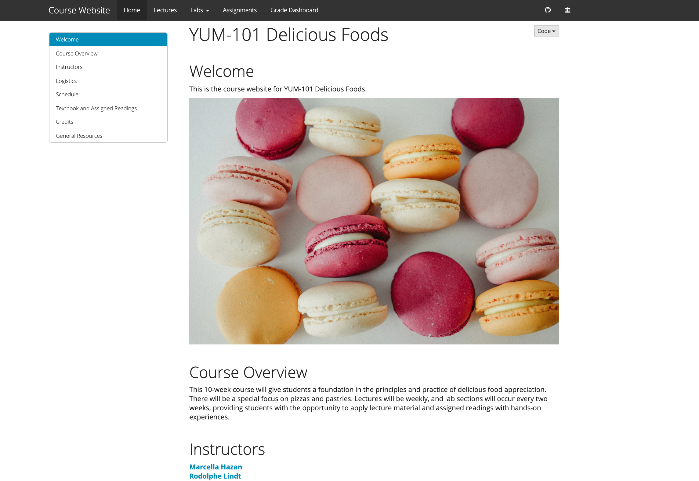
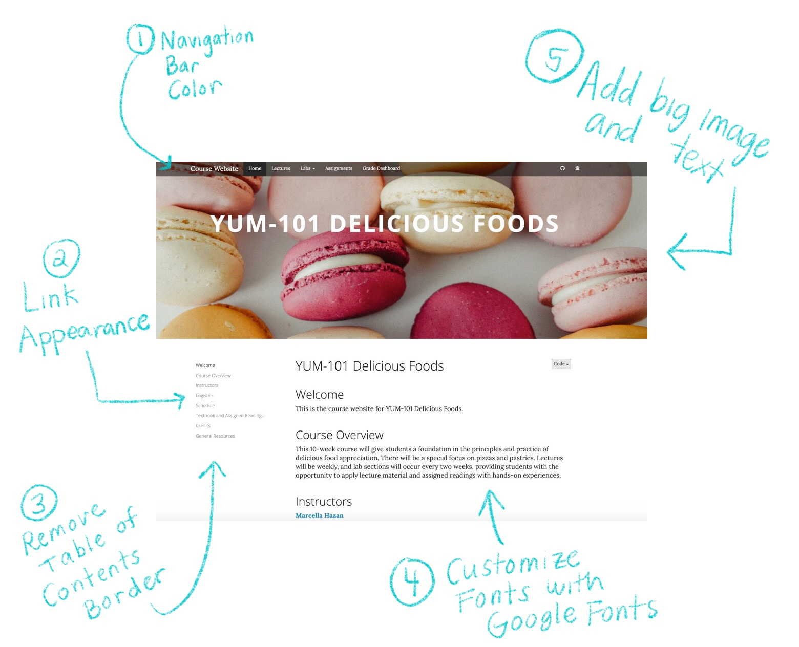
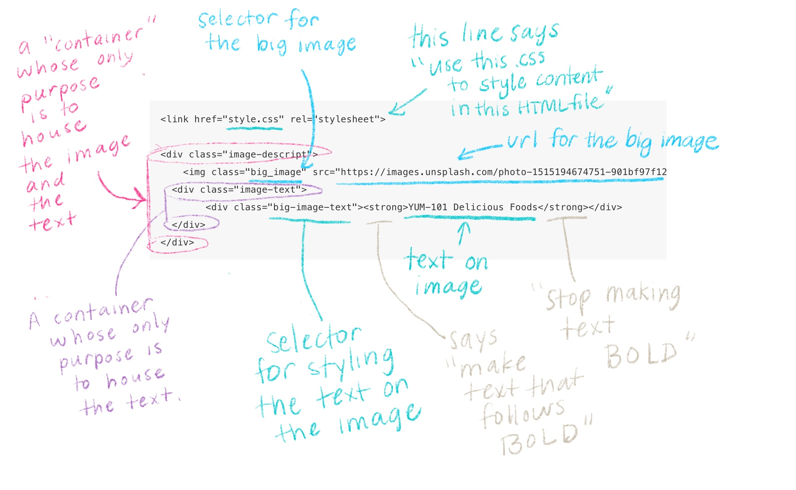

# Make it fancier {#rmd-fancy}

```{r, include = FALSE}
source("common.R")
```

Once you've built the basic structure for your R Markdown site, if you'd like to customize it even further, here are a handful of things you can add. 

The steps below involve a little bit of HTML and CSS work, but you don't have to have much experience in these methods to be able to build something cool. 

In this section, we'll walk you through the non-YAML "add ons" to our custom course demo site.

You'll get the most out of this chapter if you read through our [CSS crash course](#css-crash) before diving in. You'll want to be familiar with using the Developer Tools of your web browser and [selectors](https://developer.mozilla.org/en-US/docs/Web/CSS/Reference#Selectors).


## Anatomy of a fancy R Markdown page

Here's what we're starting with:

{width=700px}

<br>

And here's where we're going: 

{width=700px}
<br>

We'll go through how to do each of the numbered add-ons below, but first let's get a little more context for what CSS is. 

<br>


## Adding custom CSS to your site

You can make your own file with custom CSS rules and apply it to your site by adding `includes:` and `css: <file-name.css>` in the `_site.yml` file underneath `html_document`. Like so:

```{r echo = FALSE}
yml(date = FALSE, author = FALSE) %>%
  yml_output(html_document(css = "style.css")) %>% 
  asis_yaml_output()
```

We'll now make a CSS file, by going to *File* > *New File* > *Text File*. Go ahead and save this file in your project directory as `style.css`. We'll populate this with some CSS styles. We're going to want to keep a rendered version of our custom course site pulled up in a separate window. 

<br>


### Add a favicon

You know the little tiny icon that gets placed in the corner of your browser tabs? That's a favicon! We can add one by creating an HTML file and then referencing this file in our `_site.yml`:

**Here's how:**

1. Save the image you'd like to use as (use a PNG or ICO file) and place it in your project directory (for the best results, use a square image).
1. Click *File* > *New File* > *Text File*. We're going to make an HTML file.
1. Insert the following, replacing `favicon.ico` with your image filename.

    ```{r, eval=FALSE}
      <link rel="icon" type="image/png" href="favicon.ico"/>
    ```
  
1. Save this file as `header.html`. You can choose a different name. 
1. Open `_site.yml` and under the `html_document:` section, insert the `includes:` and `in_header` options like so:

    ```{r, echo = FALSE}
    yml(date = FALSE, author = FALSE) %>%
      yml_output(html_document(includes = includes2(in_header = "header.html"))) %>% 
      asis_yaml_output()
    ```

:::tip
If you already were including a file with `in_header`, then you can add the line of code above at the top of your existing file, OR you can include both files by listing them within brackets like this: `[header.html, <first-file.html>,]`.
:::

### Change the navigation bar color

Let's make the navigation bar a different color. We'll use the developer tools to try out different options in real time.

1. Pull up your site and right click to open the developer tools. 
1. When we click on the navigation bar, we see that it highlights a certain line of HTML in the left pane of the developer tools. Look for anything that says `class = `. The values that follow `class` are the CSS selectors that are currently styling our navigation bar. 

    In this case, our navbar has three classes `navbar`, `navbar-default`, and `navbar-fixed-top`. 

    

    <br>

    In the righthand pane of the developer tools. we see these classes being used in the CSS (notice that a class needs to have a `.` before it in when it's a selector--but a tag, like the link example above, does not). [SAY SOMETHING ABOUT THE ORDER EACH ARE LISTED?]

1. Let's choose the first CSS selector `.navbar` and play around with it in this pane to decide what color we'd like. Type `background-color:` followed by any [HEX code or rgb code](https://www.google.com/search?q=color+picker) and press `Enter`. You can also click on the small color square to use sliders to set the color and transparency of your navigation bar. I'm selecting 

    <center>{width=200px}</center>

<br>

### Customize your link appearance

<br>

### Remove table of contents border

<br> 

### Use Google fonts
To change any of the fonts on your site to be a Google Font, 

Once you've selected the Google Fonts you want to use, open up your `style.css` file and paste in the line of code from Google at the top of it. 

```
@import url('https://fonts.googleapis.com/css?family=Lora:400,400i,700,700i&display=swap');

```

<br>

### Add a hero image

To add the big image at the top of page (a.k.a hero image), we need to make an HTML file containing our image and text.  

**How to do it:**

1. Go to *File* > *New File* > *Text File*. 
1. Copy as paste the HTML code below into this file (see Figure \@ref(fig:hero-decode) to decode this!)

    ```css
    <link href="style.css" rel="stylesheet">
    
    <div class = "image-descript"> 
    	" >
      <div class = "image-text">
    		<div class = "big-image-text"> <strong> YUM-101 Delicious Foods </strong> </div>
      </div>
    </div>
    ```
1. Replace `<url-or-image-file>` with the path of the image that you'd like to use. If you need some good ones, check [here](https://unsplash.com/).
1. Replace "YUM-101 Delicious Foods" with whatever text you'd like to be overlaid the image. 
1. Close and Save this file in your project directory as `hero-image.html`. The name of the file does not have to be `hero-image`.
1. Open `index.Rmd`.
1. Reference the HTML file in `index.Rmd`'s YAML with the `includes:` and `in_header:` lines.

    ```{r, echo = FALSE}
    yml(date = FALSE, author = FALSE) %>% 
      yml_title("YUM-101 Delicious Foods") %>%
      yml_output(html_document(includes = includes2(in_header = "hero-image.html"))) %>% 
      asis_yaml_output()
    ```
    
    This will add the image to ONLY the `index.Rmd` page of your site, which is appropriate since the index will serve as the homepage. We could have instead added `in_header:` to our `_site.yml` to apply the image to EVERY site page (but consider whether this might be visually overwhelming for your site!). 


Here's what each of the lines in `hero-image.html` is doing:

```{r hero-decode, fig.cap = "Decoding the hero-image.html file", echo = FALSE}

```


You should note that when you add an `in_header:` option to a single pages's YAML, it will override the more "global" `in_header:` option set in `_site.yml`. So if you still want the global `in_header:` to apply (e.g. if you created a favicon), then you'll need to list both files in the single page's YAML. Like this, for example:

```{r, echo = FALSE}
yml(date = FALSE, author = FALSE) %>% 
  yml_title("YUM-101 Delicious Foods") %>%
  yml_output(html_document(includes = includes2(in_header = list(
    "<first-file.html>",
    "hero-image.html"))
  )
  )%>% 
  asis_yaml_output()
```


:::tip
Including an image like this in the header of the page is kind of a hack-- in order for this to work properly, if you have two HTML files listed, make sure the `hero-image.html` is listed last.
:::

<br>

:::tip
Design tip: Try out a completely blank `index.Rmd` with nothing but the YAML with a header image for a visually-striking homepage. 
:::

**Styling the hero image**

You could style this endlessly, but here's the CSS we're using for the fancy course demo site. Each selector corresponds to the class names we used in `header.html`:


```css
.image-descript {
    position: relative;
}

.big_image {
  margin-top: -50px;
  margin-bottom: 2em;
  width: 100%;
  height: 600px;
  object-fit: cover;
}

.image-text {
    position: absolute;
    top:30%;
    left:0;
    right:0;
    bottom:0;
  }
```


### Add a logo

<br>

### Add multiple CSS files

Note that you can have several CSS files, if for example you have one for your organization and another custom file. We add multiple items like this to the YAML like so:

```{r echo = FALSE}
yml(date = FALSE, author = FALSE) %>%
  yml_output(html_document(css = list("org.css", "custom.css"))) %>% 
  asis_yaml_output()
```
