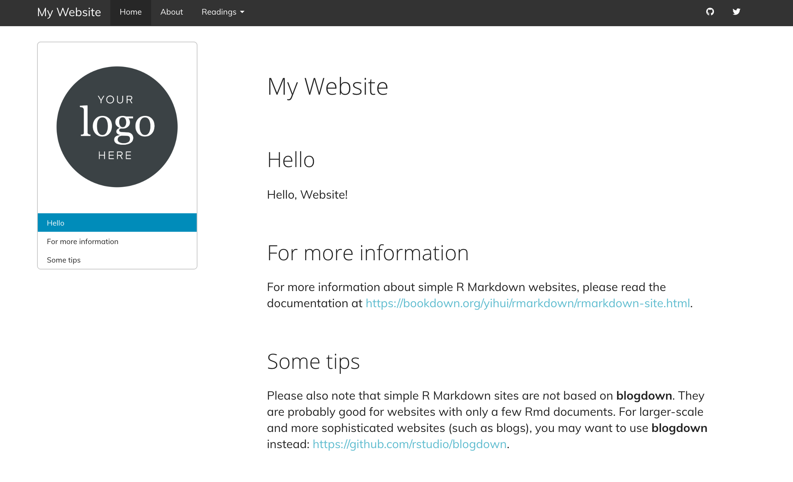
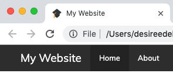
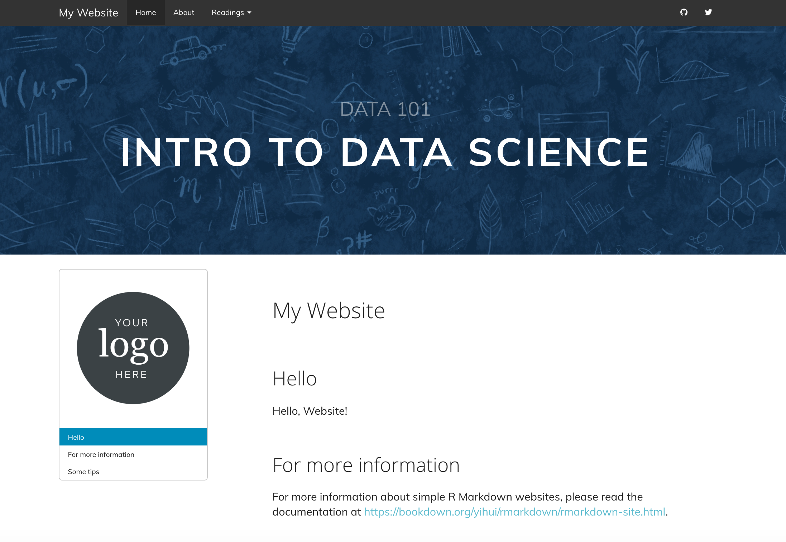
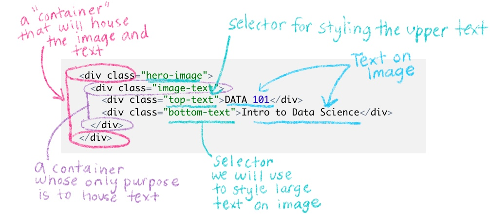

# Make it fancier {#rmd-fancy}


Once you've built the basic structure for your R Markdown site, if you'd like to customize it even further, here are a handful of things you can add. 

The steps below involve a little bit of HTML and CSS work, but you don't have to have much experience in these methods to be able to build something cool. 

In this section, I'll walk you through the non-YAML "add ons" to your R Markdown site.

You'll get the most out of this chapter if you read through the [CSS crash course](#css-crash) before diving in. You'll want to be familiar with using the Developer Tools of your web browser and [selectors](https://developer.mozilla.org/en-US/docs/Web/CSS/Reference#Selectors).

## Before you begin

I'm making a few assumptions that by this point you have already updated your R Markdown site with your own content in the [Make it yours](#rmd-yours) section and added whatever built-in options you wanted.

For the demo that follows, I'll keep using the RMD site skeleton with a few additions. I've added a few things to the site skeleton, aside from what we've walked through in the previous chapters, so that the following examples make more sense. It is okay that your content does not match up exactly with mine.

* A dropdown menu to the navbar
* Additional level 1 headers to the home page
* Turned on a floating table of contents
* Added github and twitter icons to the navbar
* We chosen yeti as our theme
    * A note about choosing a theme. To start out, choose a theme whose navbar most closely matches what you're final vision is. For example, if you want your navbar (and dropdown menus) to be dark with a light colored text, then sticking with Yeti is cool. But if you want a light colored navbar with dark text, sticking with Yeti as the base theme would mean you have *a lot* more CSS that will need adjusting, and you're better off using a theme like `default` as your baseline.


## Anatomy of a fancy R Markdown page

<!--todo: add before and after screenshop. Ping Desiree for annotating screenshot --> 


## Adding custom CSS to your site

1. Make a CSS file, by going to *File* > *New File* > *Text File*. 
1. Save this file in your project directory as `style.css`. 
1. Add this `css:` field to your `_site.yml`.

```yaml
output:
  html_document:
    css: style.css
```

[commit]

## Aesthetics and branding

Everything that makes your site, look like *your* site.

* Google fonts
* Link color and hover behavior
* Add a logo
* Favicon
* Hero image


### Google fonts {#rmd-font}

To change the appearance of your text with a new font, you need to:

  * Pick a Google font
  * Add it to your CSS file
  * Style specific text using CSS selectors
  * Make sure your CSS file is linked in your `_site.yml` (and if you've been following along, it already is).

#### Select and import your Google font's script

1. Go to [https://fonts.google.com/](https://fonts.google.com/) and pick a font for your **lesson's main body text**. I'm choosing `Muli`, but `Lato` and `Source Sans Pro` are other nice options.

:::design
I recommend going with sans-serif fonts (i.e. no little feet on the letters) for the main text because they're easier to read at smaller sizes on screens compared to serif fonts. Don't pick anything too narrow, too wide, or ornate.)
:::
    
    
\


<div class="col2">
2. Select the font you want by clicking on the upper red `+` sign, and navigate to the small pop up window. 

    <div class="figure" style="text-align: center">
    
    <p class="caption">(\#fig:rmd-select-font)Selecting a Google font</p>
    </div>

</div>

\


<div class="col2">

3. Click on the `CUSTOMIZE` tab, and select the extra font weights and styles you want. Don't check any that you don't think you'll use (because it slows down your lesson's loading time ever-so-slightly when you add more). In addition to regular, I'm choosing one italic and one bold. 

    <div class="figure" style="text-align: center">
    
    <p class="caption">(\#fig:rmd-font-customize)Choosing additional font weights and styles</p>
    </div>

</div>

\


<div class="col2">

4. Now click on `EMBED` and look under the `@IMPORT` tab. **Copy the code within the `<style>` tags** (you don't need the style tags themselves). We will also need the second code chunk in a couple steps that says `Specify in CSS`, so keep this page open to come back to that.

    <div class="figure" style="text-align: center">
    
    <p class="caption">(\#fig:rmd-googleimport)Getting the script to import your Google Font</p>
    </div>

</div>


#### Import the font to your site {#rmd-font-import}

1. Back in the RStudio IDE, **open** up your `style.css` file.
1. On the very first line, **paste in the Google Font import code** for the `Muli` font. This makes the font available within your site but doesn't *use* the font yet.

    ```style.css
    @import url('https://fonts.googleapis.com/css?family=Muli:400,400i,700&display=swap');
    ```

:::tip
You might see others import Google fonts by embedding the script (with `<script>` tags) in an HTML file instead. This is perfectly legitimate. But if you're just starting out, it's easier to keep all the font stuff together in a CSS file, which is why we're doing it this way.
:::

#### Apply the font to your text

We have our font imported, but now we have to be explicit with R Markdown about where to apply it. Let's create our first CSS style rule below. We will apply the `Muli` font to our body's text by using the `font-family:` property. 

1. **Copy and paste** the following style rule to `style.css` beneath the other line of CSS we've already added. 
1. Let's also **specify the font size** to be `19px` by adding the `font-size:` property. 

    ```style.css
     /*------------- Whole Document---------------- */

    body {
    	font-family: 'Muli';
    	font-size: 19px;
    }
     
    ```
1. **Make sure** that each line within `{}` ends with a `;`.

:::tip
  **Keep tidy!** Organize your CSS using comments like `/* --insert-comment-- */` to create make-shift section dividers for your CSS, as we've done above. We'll be adding many style rules, and we'll want some way to keep track of everything as our CSS file grows.
:::
     
\

<div class="side-by-side">

<div class="side1">

4. Time to admire your handiwork and decide whether or not you like it. You can repeat the steps above to apply different fonts to different parts of your lesson. For example, you could create another style rule using `.title` instead of `body` to apply a different font to the Title of your lesson. 

<!-- TODO: we also have to import the font Lora so that our rstudio4edu footer link will render properly later  -->

Remember that in order for any of your CSS to take effect, your `style.css` file has to first be referenced in your YAML.
</div>

<div class="side2">

</div>
</div>

[commit]

### Customize your links

Their color, but also what color they turn when you hover over them.

```
/* links */
a { 
  color: #5ebccf;
}

a:hover {
 color: #50a0b0; /* darker color when hovering */
}
```

[commit]

### White space

If you added white space manually before in an earlier section with either <br> or `\`, you can remove them because we're about to add white space in a less manual way. 

We'll take advantage of the fact that we know major sections will be divided by section headers, so we'll tack on some padding on top of each section header. 

:::tip
We're adding what seems like *a lot* of padding--but that's because our theme by default is going to undo some of this padding with a *negative* value for the `margin-top:` property. I know this seems absurd--we won't get into the details here, but the negative margin is needed so that our headers don't get hidden behind the navbar when your share links to particular sections of your site.

:::

We're going to style the title a little differently than the rest of the headers, so we'll pull it out on its own. It doesn't need as much space as the other headers do.

```style.css
/*----------------ADDING WHITE SPACE-------------*/

.title {
  margin-top: 2em !important;
  margin-bottom: 0.75em;
}

.section h1,
.section h2, 
.section h3, 
.section h4, 
.section h5 { 
  padding-top: 3em !important; /*adding so much padding because theme adds a margin-top: -65px by default */
  margin-bottom: 0.75em;
}

```

[commit]


We'll also add more white space in between the TOC and the rest of the body content, but we do this only when we have the space to--- in other words, when our user's screen is large enough. 


For this, we'll have to use our first media-query. 

  * A media query is like an additional outer rule that says, "hey, only apply the CSS rule inside if [insert condition about screen width here] is met". Media queries are useful for styling something different on a big screen than you would on mobile, etc.

  * In the case below, we only increase the space between the TOC and the body content if your user's browser screen is *at least* `992px` wide:

<div class="split">
  <div class="split1">
  
```style.css
  /* Space Between TOC and 
  Righthand side content on large screens */

 @media (min-width: 992px) {
    .col-md-9 {
      width: 75%;
      padding-left: 5em !important;
    }
 }
```
    
  </div>
  
  <div class="split2">
  
  <!-- TODO new screenshot -->
  


  </div>
</div>

[commit]


### Logo

### Add a logo {#rmd-logo}

We'll add a logo above our table of contents. The main way we're going to do this is by inserting a blank box above our TOC, and then giving the blank container a background image (our logo). We can control how big our logo will be by controlling the size of the box. Here's what it will look like (if you're bothered by the outline around it all, don't worry--we'll get rid of that in the TOC section):


<center>{width="50%"}</center>


1. **Add** your logo image to your project directory.
1. **Paste** the CSS style rule below. We'll break it down in a second.

    ```style.css
    /*----------LOGO above TOC---------*/

    #TOC::before {
      content: "";
      display: block;
      height: 200px;
      margin: 2em 20px 40px 20px;
      background-image: url("logo-black.png");
      background-size: contain;
      background-position: center center;
      background-repeat: no-repeat;
    }

    ```
    
    * This uses the selector `#TOC` to identify our table of contents. 
    * I use the CSS trick of tacking on a `::before` to say, "hey, I want you to insert whatever is in this style rule right before our `#TOC`." This trick is called using a "pseudo-element" in CSS. 
    * In this case, my pseudo-element is a blank box--that's why it says `content: "";`. There's nothing in there. But--I still give my blank box some dimension with the `height:` property.
    * The blank box is no longer blank once I use the logo as its background image.
    
1. **Change** the image url to use your own image.
1. **Build your site** and check out the results. If you need to adjust the size of your logo, you can fiddle with the `height:` property in the CSS above.

#### A second logo option

If you chose not to use a floating table of contents, then adding a logo the way we have above won't work since there won't be a `#TOC` that a logo can go ahead of. So, you can instead place your logo in upper righthand corner, in line with the Title and Author. 

  <!-- TODO new screenshot -->

<center>{width="50%"}</center>


1. **Add** your logo image to your project directory.
1. **Open** `style.css`.
1. **Paste** this CSS rule into your CSS file:

   ```style.css
     #header.fluid-row::before {
      content: "";
      height: 150px;
      width: 150px;
      float: right;
      background-image: url("logo-black.png");
      background-size: contain;
      background-position: center center;
      background-repeat: no-repeat;
    }
    
    ```
  
1. **Edit** the image url to be your own image file path. 
1. **Save** your changes and **knit** your `.Rmd` lesson to see your logo. You can fiddle with the `height:` property to adjust the logo size. 


#### A third logo option

But wait--there's more! Here is a *third* option for adding a logo if you want it in the upper righthand corner, above the Title and Author fields. I personally like this one the least (asethetically, but also because it's more involved to implement), but sometimes you might need to do this if you find that your title and content keep running into the logo with option 2. 

  <!-- TODO new screenshot -->


<center>{width="50%"}</center>


To do this, you will need three things:

1. A different CSS style rule 
1. An HTML file with one line of code
1. To edit `_site.yml` so you can reference the HTML file

##### Create an HTML container

We need something that we can put our logo into-- like an empty container. This is where the HTML file comes in. This file will hold an empty tag inside of it, but we'll still give the empty tag a name, "upper-right-logo", so that we can fill it up with our logo later using CSS. Let's make the HTML file: 

1. From the IDE, you'll **create a new HTML file** by going to File > New File > Text File. 
1. **Paste** the line of code below into the HTML file.

    ```
    <div class="upper-right-logo"> </div>
      
    ```
1. **Save** this file as `logo-option.html`. You can choose a different name if you want.


##### Link the HTML file to your YAML

Now we have a containter (via our HTML file), but R Markdown needs to know where to put it with respect to our page. That's where `_site.yml` comes in. We will add two fields to our `_site.yml`: `includes:` and `before_body: logo-option.html`. This is how we have R Markdown place the empty container in the right spot--- as the first item in the body tag of our page (the name "before" body is kind of a misnomer). 

1. **Open** your `.Rmd` file.
1. **Add** the `includes:` and `before_body:` lines. 

    ```yaml
    ---
    output:
      html_document:
        includes:
          before_body: logo-option.html
        theme: yeti
        highlight: tango
        toc: true
        toc_float: false
    ---
    ```

1. **Edit** the filename to be your HTML file if you chose a different file name.
1. **Save** your changes.


##### Fill the container with your logo

Finally, the CSS is where we'll say "take the empty container we created in the HTML file, and make sure it's yay tall and that it has this logo image as its background, etc." 

Here's how that goes down:

1. **Add** your logo image to your project directory.
1. **Open** `style.css`.
1. **Paste** this CSS rule into your CSS file:

    ```style.css
    .upper-right-logo {
      margin-top: 20px;
      background-image: url("logo-black.png");
      height: 150px;
      background-size: contain;
      background-position: right;
      background-repeat: no-repeat;
    }
    ```
1. **Edit** the image url to be your own image file path. 
1. **Save** your changes and knit your `.Rmd` lesson to see your logo. You can fiddle with the `height:` property to adjust the logo size. 

I won't use this logo option in the demo lesson as we move on to the next steps, but now you know how to do it if you need it.


### Add a favicon

You know the little tiny icon that gets placed in the corner of your browser tabs or gets placed in the bookmark's bar? That's a favicon! 

<center>{width="50%"}</center>

To add a favicon you need:

1. An HTML file with one line of code
1. An image to use as your favicon
1. To edit `_site.yml` so you can reference the HTML file.

#### Choose your favicon image

1. **Choose an image**--don't have one? You can make one with a [favicon generator](https://favicon.io/). I chose the emoji graduation cap.
1. **Save** the image you'd like to use as (use a PNG or ICO file) and place it in your project directory (for the best results, use a square or circular image).

#### Embed the favicon in an HTML file

1. Make a new HTML file by clicking *File* > *New File* > *Text File*. 
1. Insert the following, replacing `favicon.ico` with your image filename.

    
    ```r
      <link rel="icon" type="image/png" href="favicon.ico"/>
    ```
  
1. Save this file as `header.html`. You can choose a different name. 

#### Reference the HTML file in `_site.yml`

We want this HTML file to go in the `<head>` tag of our site. The head tag is like the Font Desk/ admin of our site--and its the place where the favicon will be taken care of. 

1. Open `_site.yml`.
1. Under the `html_document:` section, insert the `includes:` and `in_header` options like so:

    ```yaml
    output:
      html_document:
        includes:
          in_header: header.html
    ```

:::tip
If you already have a file that you've included with the `in_header` field, then you can open up that file, and add the favicon line of code at the top of your existing file, OR you can list both header files separately, by listing them within brackets like this: `[header.html, <other-file.html>,]`. The order you list them in is the order that the browser will use them (which is only really important to know so that if you need to troubleshoot, you can try swapping the order).
:::

[commit]

### Add a hero image

To add the big image at the top of page (a.k.a hero image), we need to make an HTML file containing our image and text.  
Let's add one to *only* our homepage. 

<center>{width="60%"}</center>


We'll need:

* An HTML file
* To edit the YAML of our index.Rmd
* A image to use as our hero image
* CSS
* To adjust the table of contents positioning
* Aspirational step: to tweak for mobile

**How to do it:**

#### Make an HTML file

1. Go to *File* > *New File* > *Text File*. 
1. Copy and paste the HTML code below into this file (see Figure \@ref(fig:hero-decode) to decode this!)

    
    ```r
    <div class="hero-image"> 
    	    <div class="image-text">
    	      <div class="top-text">DATA 101</div>
    		    <div class="bottom-text">Intro to Data Science</div>
    	    </div>
    </div>
    ```

1. Replace "DATA 101" with the text that you'd like to see on the top line.
1. Replace "DATA SCIENCE" with whatever text you'd like to see on the bottom line. 
1. Close and Save this file in your project directory as `hero-image.html`. The name of the file does not have to be `hero-image`.

Here's what each of the lines in `hero-image.html` is doing:

<div class="figure" style="text-align: center">

<p class="caption">(\#fig:hero-decode)Decoding the hero-image.html file</p>
</div>


#### Have R Markdown apply the HTML file

1. Open `index.Rmd`.
1. Reference the HTML file in `index.Rmd`'s YAML with the `includes:` and `in_header:` lines.

```yaml
title: My Website
output:
  html_document:
    includes:
      in_header: hero-image.html
```
    
This will add the image to ONLY the `index.Rmd` page of your site, which is appropriate since the index will serve as the homepage. We could have instead added `in_header:` to our `_site.yml` to apply the image to EVERY site page (but consider whether this might be visually overwhelming for your site!). 


When you add an `in_header:` option to a single page's YAML, it will override the more "global" `in_header:` option set in `_site.yml`. So if you still want the global `in_header:` to apply (e.g. the header.html file that we used for our favicon), then you'll need to list both files in the single page's YAML. Like this, for example our index.Rmd YAML now looks like this:

```yaml
---
title: My Website
output:
  html_document:
    includes:
      in_header:
      - header.html
      - hero-image.html
---
```

:::tip
Including an image like this in the header of the page is kind of a hack (the <head> tag is supposed to be reserved for admin/ meta stuff of the website only, not really content or images)-- so in order for this to work properly if you have two HTML files listed, make sure the `hero-image.html` is listed last.
:::

\

:::design
**Ooh la la**: Try out a completely blank `index.Rmd` with nothing but the YAML with a header image for a visually-striking homepage. 
:::

#### Choose your hero image

1. Find the hero image that you'd like to use. It should be something that will still look good even on a variety of different screen sizes. So, patterns usually work. Or landscapes. If you need some ideas, check [here](https://unsplash.com/). In the rstudio4edu template, I also drop in a couple hero image files you can use--including one with a transparent background (a .png, not .jpeg file) so that (in a bit) you can manipulate the background color of it in the CSS.

1. Save this image in your project directory.

#### Styling the hero image

You could style this endlessly, but here's the CSS we're using. Each selector corresponds to the class names we used in `hero-image.html`:


1. Open style.css
1. Paste the three style rules below into your css file.
1. In the hero image selector, find the `background-image:` property. Replace file within the url parentheses `url()` with the path of the image that you'd like to use.

:::tip
Find the part of the `background-image:` property that uses a linear gradient. This is a trick that will add a translucent dark overlay on your image so that your text on top will be easier to read (0 is completely transparent, 1 is completely opaque). If the hero image you chose is already dark enough, then you may not need the overlay, and you can either delete `linear-gradient( rgba(0,0,0,.2), rgba(0,0,0,.2) )` or change the last numbers to 0.

:::


```style.css

/* -----------HERO IMAGE AT TOP OF PAGE -----------*/

/* LARGE HERO IMAGE AT TOP OF PAGE*/

.hero-image {
    position: relative;
    margin-bottom: 2em;
    /* liner gradient tints the image darker for readability*/
    background-image: linear-gradient( rgba(0,0,0,.2), rgba(0,0,0,.2) ), url(hero-navy.jpg); 
    height: 400px;
    background-size: cover;
    background-color: #141c25f2;
    background-position: center center;
    display: flex; /* Change to `display: none` for no hero image */
    justify-content: center;
    align-items: center;
}

.top-text {
  position: relative;
  font-size: 34px;
  padding-bottom: 0.5em
  text-transform: uppercase;
  text-align: center;
  display: block; /* Change to `display: none` for no top text */
  color: #ffffff72;
}

.bottom-text {
  position: relative;
  letter-spacing: 0.065em;
  line-height: 1em;
  font-size: 68px;
  text-transform: uppercase;
  text-align: center;
  display: block; /* Change to `display: none` for no bottom text */
  color: #ffffff;
  margin-bottom: 2.5rem;
  font-weight: bold;
}

```

:::design

**Why use a background color?** Yes, we did specify a background color *and* a background image for our .hero-image selector on purpose. Two reasons: (1) If your site ever has trouble loading your image, the background color is a nice stand-in. (2) If you use one of our template hero-images that was created as a pattern on a transparent background (`hero-transparent.png` -- or any hero image that has a transparent background), then the background color you specify in your CSS will be the background color you see. Makes it easy to customize!

:::


1. Build your site and make sure that you like how your hero image looks. Notice that you can choose NOT to show a hero image, or either of the text lines by specifying `display: none` in the CSS. 

[commit]

:::tip

If you don't like how your hero image is positioned in the container, you can mess around with the [background-position property](https://developer.mozilla.org/en-US/docs/Web/CSS/background-position). Right now we use the keyword "center" to specify its x and y position--but other keywords you can use include:  top, bottom, right, and left. You can also set the background position to be a length or a percentage of the container width. 

:::

:::design

We haven't changed the font for the text that overlays the hero image in this example, but you could always apply a Google Font that you've already [imported](#rmd-import-font) by adding the CSS property `font-family:` to the CSS style rules for the `.top-text` and `.bottom-text` selectors.

:::

#### Adjust TOC positioning

Adding a hero image in this way makes our floating table of contents do strange things. We'll need to fix this with the following CSS:


```
/*-----------------TOC----------------*/

/* Makes TOC sticky (needed if you used a hero image) */

.row-fluid{
  display: flex; /* Necessary for sticky TOC*/

}

.tocify {
  position: -webkit-sticky;
  position: sticky; 
  top: 120px; /*Controls where TOC stops when sticky */
  width: 100% !important;
}

```

[commit]


#### Tweak for mobile

But on mobile and other small screens, we don't want the floating TOC to be there. And we'd probably like to make the overlaid text to either not be displayed (display: none) or just make the text smaller (which is what I'll demo with the CSS below). Let's try it. We'll need to use a media query again:


The style rules below will only apply for screens that are 767px or smaller:

```style.css

/* NO TOC on mobile */
@media screen and (max-width: 767px){

  .col-xs-12.col-sm-4.col-md-3 {
    display: none;
  }
  
  .top-text {
    font-size: 25px;
  }

  .bottom-text {
    font-size: 40px;
  }
  
  
}

```


## Table of contents

We've already started changing TOC styles after having added a hero image. Now we focus on the TOC aesthetics. 


First we will get rid of the TOC border

1. Find the .tocify selector that we added earlier when we were working on the hero image. 
1. Add `border: none;` as a new line in this style rule.


    ```style.css

    .tocify {
      position: -webkit-sticky;
      position: sticky; 
      top: 120px; /*Controls where TOC stops when sticky */
      width: 100% !important;
      border: none;
    }

    
    ```
    
  <!-- TODO new screenshot -->
  
    

Next we'll style the links that make up the TOC. 

1. Let's change the color of the links slightly and also increase the font size


    ```style.css
       /* TOC links */
    
    .list-group-item {
        color: #7b8a8b;
        font-size: 16px;
    }
    
    ```

1. Change the color and background color of active links, the link that show which section you are actively viewing:

    ```style.css
    .list-group-item.active {
        color: #2c3e50;
        background-color: white;
        border: none;
    }
    ```

1. Finally, change what happens when you hover over the regular and active links:

    ```style.css
    .list-group-item:hover, 
    .list-group-item.active:hover {
        color: #131b23;
        background-color: white;
    }
    ```
    
<!-- TODO new screenshots -->

    
    


[commit]

## Navigation bar styling

Finally-- we get to tweak the navbar. The navbar, like the TOC, is important because we'll see it on every page. 

It's a little annoying to have style the navbar because we have to change the color of the navbar itself, and also the dropdown menu, *and* also the link buttons for both of these when you hover over them. 

We'll change the colors to be a dark blue and grey variety with this CSS, including a bit of transparency on the navbar itself (`#141c25f2` -- is a hexcode color with two additional characters that add the transparency).

```style.css

/*----------------NAVBAR ---------------*/
.navbar-default {
    background-color: #141c25f2;
}

.navbar-default .navbar-nav>.open>a, 
.navbar-default .navbar-nav>.active>a, 
a.dropdown-toggle:hover {
  background-color: #141c25 !important;
}

/* Dropdown menu color */
.navbar-default .dropdown-menu {
  background-color: #141c25;
}

/* Dropdown menu hover color */
  .navbar-default .dropdown-menu>li>a:hover {
    background-color: #202831f2;
  }

/* Navbar Links when hovered*/
.navbar-default .dropdown-menu>.active>a
.navbar-default .navbar-nav>.active>a:hover, 
.navbar-default .navbar-nav:hover, 
.navbar-default .navbar-nav>li>a:hover, 
a.navbar-brand:hover {
  color: #ffffffab !important;
  background-color: #141c25;
}

```

[commit]


## Questions counter {#rmd-q}

Finally, if you plan on using questions for learners in your site (for example, for labs or homework sets), you might want to make it easier to call out these questions by styling them. Like this:


<div class="split">
<div class="split1>

**Before**
    

</div>

<div class="split2>

**After**
    

</div>
</div>


:::hat

This idea and CSS was inspired by Maria Tackett's STA210 course: https://github.com/STA210-Sp19/website

:::


The CSS you need is this--it's a lot, but for most use-cases the only style rule you really need to worry about editing is the second-to-last one, with the `content:` and `color:` properties:


```style.css
  /* -----------Question counter ---------*/

  body {
    counter-reset: li;
  }

  .question ol {
    /* Remove the default left padding */
    padding-left: 0;
  }

  .question ol>li {
  	/* Create a positioning context */
    position: relative;
    /* Disable the normal item numbering */
    list-style: none;
    width: 90%;
    padding-top: 10px;
    padding-bottom: 10px;
    padding-right: 0;
    padding-left: 120px;
  }

  .question ol>li:before,
  .question ol>p>li:before{
  	/* Use the counter as content */
    content: "Question " counter(li) ": ";
    /* Increment the counter by 1 */
    counter-increment: li;
    position: absolute;
    color: #3d85bb;
    left: -0.5px;
    font-weight: bold;
  }

  .question ol ol {
    counter-reset: subitem;
  }

```
    
* If you want to change the styling to say something other than "Question", then you modify `content: "Question "`. 
* You can change the color of the called out question, too, with the `color: #5ebccf;` 
    
**How to use the question counter:**

In your .Rmd, you have to enclose your numbered list items that you want to be styled questions with special div tags:

```.Rmd
<div class="question">` 

1. My first question 
1. My second question

</div>`
```

##Footer

Let's also add a footer. You need to:

1) Make a new HTML file and insert your footer content
1.5) If you're going to include images in your footer content (like logos or icons), then add those to your project directory.
2) Add it to your _site.yml with the includes: after_body:
3) Style the footer elements using CSS

Here's how we do this:

1. Create your HTML file. 
1. Save it in your project directory. Name it `footer.html`. You can choose a different name.
1. Paste something like this in the file:

```footer.html

<div class="footer"> 
  
  <hr> 
  
  <p> <!--your custom footer text can go here--> </p>

  <p class="rstudio4edu-footer">This site was created with an <a class="rstudio4edu-link" href="https://rstudio4edu.github.io/rstudio4edu-book/"> &nbsp;rstudio4edu</a> template.</p>


</div>

```

1. I suggest you use the footer to include mention of licensing [say more about this]. It's a good place to add another <p> tag with this content, for example:

```

<div class="footer"> 
  
  <hr> 
  
  <p> This content is licensed under the CC-BY license. </p>

  <p class="rstudio4edu-footer">This site was created with an <a class="rstudio4edu-link" href="https://rstudio4edu.github.io/rstudio4edu-book/"> &nbsp;rstudio4edu</a> template.</p>


</div>


```

What does this do?

* The <hr> is going to be a little section divider line. 
* the div tag with class "footer" is going to be the container that we'll use to style most of our footer contents later in the CSS. 
* Within the div tag, you can put your chunks of footer text inside <p> tags (for "paragraph"). 
* In the example above, we've added the rstudio4edu icon and made it linked, so that's what the <a> tags and  tags are for. 


Here's the CSS we'll use to style each of the part of our footer:

```style.css

/*------------FOOTER----------*/

/* Divider line above footer */
.footer hr{
  width: 100%;
}

.footer {
  font-size: 16px;
  color: #808080;
  text-align: center;
  width: 90%;
  margin: 3rem auto;
  font-weight: 300;
}

.footer.logo {
  width: 25px;
  margin: 0px !important;
}

.rstudio4edu-footer {
  font-size: 12px;
  text-transform: uppercase;
}

.tocify-extend-page {
  height: 0px !important; /* Gets rid of extra space after footer*/
}


```


## Add multiple CSS files

Note that you can have several CSS files, if for example you have one for your organization and another custom file. I'm not going to do that, but just want to let you know that this is an option.

```yaml
output:
  html_document:
    css:
    - org.css
    - custom.css
```


## Recap

So here are all the ways that we made our site fancy:

* Added Google Fonts
* Customized our links
* Added white space around headers and site sections
* Added a logo
* Added a favicon
* Added a hero image with overlaying text
* Styled the Table of Contents links
* Customized the navbar
* Created specially-styled questions
* Created a footer

