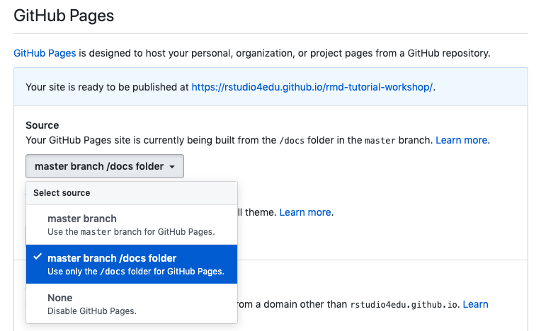

# Make a site

This is a tutorial intended for folks who would like to put together a site to help them organize and deliver their teaching materials to their participants. 

Using R Markdown, you can put together a bare-bones site in no time at all. Here, we will show you an example of how to do this by making a demo R Markdown site. You can follow along with this tutorial, or if you'd like to get up and running as quickly as possible, you you can download the repository containing the demo site and modify it as much as you'd like. 

<br>


## Is this tutorial for you? {-}

```{r child ="modules/is-this-tutorial-for-you"}

```

* How to compile multiple R Markdown websites into an R Markdown site
* How to add basic customization through themes using built in options
* How to publish your R Markdown pages for free via GitHub Pages


<br>


## Mental framework: what are we going to make here? {-}

We're about to make a website out of R Markdown documents. There are a few key pieces of magic that separate a regular collection of R Markdown documents from a living, breathing website: 

* A `_site.yml` text file that will stitch your `.Rmd` documents together and place an official-looking navigation bar at the top of them.
* An R Markdown file with the name `index.Rmd` file, which will become your site's homepage.
* After we've pushed all our files to GitHub, we turn on GitHub Pages with the click of a button to make our work go live!


Let's get started!


<br>


## Part 1: Getting Set up {-}

We'll use the `usethis` package:

```{r, eval=FALSE}
#install.packages("usethis")
library(usethis)

```
<br>


### Two getting-started workflows: {-}

```{r child = 'modules/github-first-project.Rmd'}

```

```{r eval = FALSE}
rmarkdown:::site_skeleton(getwd())
```

(note that we use `:::` here, with three colons!) to generate important infrasctructure files we need. 

<br>

Though we recommend a "GitHub first" workflow, it is possible to start with RStudio project wizard to create a new R Markdown site and then move to GitHub:

1. Click *File* > *New Project* > *New Directory*
2. Scroll down and select *Simple R Markdown Website*
3. Then, optionally: 

```{r, eval=FALSE}
usethis::use_git()
usethis::use_github() # you have to have a PAT setup
```

[NEED TO FILL IN ^ DETAILS]


Regardless of which workflow you choose, you will end up with the following files in your working directory. The only critical ones are the `index.Rmd` and the `_site.yml`.

<center>{width=300px}<center>


[DO WE SAY RENDER SITE NOW? BUT THEN WILL LATER NEED TO TELL FOLKS TO DELETE SITE FOLDER?]

## Part 2: Create your content {-}

<br>


### Make some changes and push to GitHub {-}

1. Open `_site.yml` and add the `output_dir: "docs"` on its own line, under `name:`. Save.
2. Optionally, open `index.Rmd` and add some more text to the body of the document. Click `Knit` to preview your page locally. This will become the "landing page" of your site.
4. Locate the RStudio pane that has a tab labelled `Git`, and click on it.
5. Check the box(es) under the "Staged" column, click `Commit`.
6. Add a commit message, and then click `Push`.

<center>{width=400px}<center>

<br>


### Add additional R Markdown documents {-}

Let's create at least one other R Markdown document, so that we have more content we can compile in our website. We're going a bit above and beyond here since the minimally-viable R Markdown site can me made with a just a single `.Rmd`  plus a `_site.yml` file (which we'll set up in the next section).

1. Add additional R Markdown documents (`File`> `New File` > `R Markdown`), and you can save your `.Rmd` file with whatever file name you'd like (we recommend avoiding using spaces). 

  + For this tutorial, I'm going to name my additional`.Rmd` file `materials.Rmd`.
  
2. Stage, Commit, and Push to GitHub. 
3. You can repeat this process, adding as many new `.Rmd` files as you'd like.

<br>

### Stitch it together {-}

[MODIFY TO ACCOUNT FOR ABOUT PAGE/ USE_SKELETON SEQUENCE]

Now we'll modify the YAML (i.e.`_site.yml`) file, which is what will allow all of our R Markdown page(s) to be pulled together as a site. Instead of each of our individual R Markdown documents needing their own YAML header at the top, we will put all of the YAML info that all our pages shared in common (e.g. `output: html_document`) into our `_site.yml page`-- one YAML to rule them all. 

Through this YAML, we'll also add the navigation bar to the site, which will have a link to each `.Rmd` document.

2. In the `.yml` file, copy and paste what you see below, paying careful attention to the indentations and spaces. YAMLs are fussy about this, and this is often the source of many ERRORS!
3. Edit the navigation bar (a.k.a. navbar). 

  + For each link you would like in your navbar, create one `- text:` and `href:` pair.
  + The `- text:` part is what the link name that the user will see; it can be called whatever you want
  + The `href:` part must be the file name you want to link to with the `.html` file extension.
  
4. Add additional `- text:` and `href:` pairs if you have more R Markdown pages that you want in the navbar.
5. Aaaand ACTION! Type `rmarkdown::render_site()` in the Rstudio console. This stitches everything together and allows you to view the site on your locally (it's not live yet). `render_site()` is basically the same thing as clicking `Knit` on all of your R Markdown documents simultaneously. 

   + If the rendered site does not open up automatically in a new window, you can go to the `docs/` folder in your project, click on the `index.html` file, and `View it in Web Browser`.
6. It's a good idea to stage, commit, and push to GitHub at this point.
  

<br>

```{r, eval=FALSE}

name: "My 1st Workshop Site"
output_dir: "docs"
navbar:
  title: "My Website"
  left:
    - text: "Home"
      href: index.html
    - text: "Materials"
      href: materials.html
output: 
  html_document:

```

<br>

> **FYI**: When we `knit` or `render_site()`, R Markdown's deliverable to us is going to be an HTML file for every `.Rmd` file in our R Project. The `output_dir: "docs"` line is important because it tells R Markdown where to put all of our freshly minted HTML files and any extras the HTMLs will need (images we include, etc.). In this case, it's a `docs/` folder. I kind of think of this folder as the boarding and gate areas of an airport--contents of this folder have gone through security clearance (`rmarkdown::render_site()`), ridden of items not approved for flight (`.Rmd` files),  and are awaiting takeoff (getting rendered as a live site). You cannot skip airport-security to get to your gate, and similarly, we should not put files in the `docs/` folder ourselves. 

<br>

## Part 3: Dress it up! {-}
Optionally, you can easily change the way your site looks and feels by adding a few things to the YAML section, e.g. template themes and highlight styles (for highlighting code). We preview some below, but you can read about a few more [here](https://bookdown.org/yihui/rmarkdown/html-document.html). Let's try some out.

### Theme and Code Highlighting {-}

<center>{width=800px}</center>

1. Open the `_site.yml` file. 
2. Add the following on their own lines underneath `html_document:` and indent them twice:

  * **Change the theme:** `theme: <insert-theme-name>`
    + Theme options: `default`, `cerulean`, `journal`, `flatly`, `darkly`, `readable`, `spacelab`, `united`, `cosmo`, `lumen`, `paper`, `sandstone`, `simplex`, and `yeti`.
  * **Change the highlight style:** `highlight: <insert-style-name>`
    + Highlight styles: `default`, `tango`, `pygments`, `kate`, `monochrome`, `espresso`, `zenburn`, `haddock`, and `textmate`.
    
    [INCLUDE PREVIEW OF EACH OF THESE OR LINK OUT]
  
3. Run `render_site()` to see your changes.


### Create a Table of Contents {-}

[Before and After Example]

  1. In the `_site.yml` file, add a [table of contents](https://bookdown.org/yihui/rmarkdown/html-document.html#table-of-contents) sidebar:** `toc: true`
  
Your dressed up `_site.yml` file should look something like this:

```{r, eval=FALSE}

name: "My 1st Workshop Site"
output_dir: "docs"
navbar:
  title: "My Website"
  left:
    - text: "Home"
      href: index.html
    - text: "Materials"
      href: materials.html
output: 
  html_document:
    theme: flatly
    highlight: tango
    toc: true
    toc_float: true
      

```

With these YAML settings, after executing `rmarkdown::render_site()`, your site should look something like this:


Many other customizations can be handled within the body of the R Markdown documents themselves. Here are some ways you can do that:

3. **Add white space in between sections**. I usually include additional line breaks in the body of every of my R Markdown documents before each of my section headers. This is done with a `<br>` on its own line before every header. Note that each `<br>` has to be followed by a blank line for the `<br>` to work. I find that this improves readability, helps give the page more "breathing room", and in general makes the page feel less weighed down by sections that are squished up against one another. 

4. You can tweak your current site endlessly at this stage by adding more content, code chunks, or [formatting text](https://www.rstudio.com/wp-content/uploads/2015/02/rmarkdown-cheatsheet.pdf). 


Don't forget to push to GitHub!

<br>

## Part 5: Make it a living, breathing, shareable site! {-}
Now we'll go back to GitHub and tell it where to find our website-ready files:

1. Back on GitHub, click the `Settings` tab of your repository.
2. Scroll down until you get to "GitHub Pages", and select "master branch/docs folder".

<center>{width=600px}</center>

<br>


## Workflow for maintenance {-}

Once you have the website in place, it's likely that you will want to update it periodically or add new pages. Here's what that workflow looks like for me:

1. Open my existing site RStudio project
2. Run `rmarkdown::render_site` to inspect the site in its current state and see where I've left off.
3. Create a new .Rmd document and add any new content. 
4. Delete redundant YAML information from this new .Rmd (i.e. `output:`). Knit this document to make sure everything looks good.
5. Open `_site.yml` and add my new document to the navbar. **Note: It's very easy to forget this step!!**
6. Run `rmarkdown::render_site()` to stitch everything together.
7. Push all changes to GitHub.

<br>


## Pros and Cons of using R Markdown sites {-}

**Pros:**

* Simple structure that allows you to put something content together pretty quickly.
* Minimal additions (really, just 2 files) are needed to go from a collection of regular R Markdown documents to a site.
* Ideal for setting up sites that do not need complex organization or many pages (i.e. for workshops).
* Easy to customize without any knowledge of web design or CSS if you're okay sticking to the templates.

**Cons:**

* The simple structure of RMarkdown websites can make building more complexly organized sites more challenging (i.e. there is not a way to organize files so that they fall under the umbrella of a more overarching page. All R Markdown docs and pages will be on the same "level" or website organization). As the number of pages you want to build increases, your project directory will become increasingly crowded. 
* Customizing beyond the boundaries of the built-in templates means your going to have to play around with some CSS. Depending on what you enjoy--this might not actually be a con. 


## Community Resources: {-}

### Existing tutorials: {-}

* [Chapter 5, Webpages](https://debruine.github.io/tutorials/webpages.html): Includes some overview of adding images, changing global style settings, etc.
* [Creating Website in R](https://www.emilyzabor.com/tutorials/rmarkdown_websites_tutorial.html#r_markdown_website_basics): Includes description of how to add a personal domain name.
* [Making free websites with RStudio'd R Markdown](https://jules32.github.io/rmarkdown-website-tutorial/index.html): A how to that also includes descriptions of the RStudio GUI layout and an overview of Markdown syntax.
* [Personal Website tutorial](http://nickstrayer.me/RMarkdown_Sites_tutorial/)

### General setup: {-}

* [GitHub and Rstudio](https://resources.github.com/whitepapers/github-and-rstudio/): Step-by-step guide on publishing `.Rmd` docs to GitHub, includes working with local branches and using the terminal tab within R. 

* [R Markdown: The Definitive Guide](https://bookdown.org/yihui/rmarkdown/): The official, very thorough but often technical, resource for R Markdown. Treat this as more of a reference text.

<br>

### Formatting {-}

* [R Markdown cheatsheet](https://www.rstudio.com/wp-content/uploads/2015/02/rmarkdown-cheatsheet.pdf)
* [Pimp my RMD](https://holtzy.github.io/Pimp-my-rmd/#equations): smattering of examples of different ways to format R Markdown documents. Includes adding equations, figure captions, etc.


```{r setup, include=FALSE}
knitr::opts_chunk$set(echo = TRUE)
```

<br>