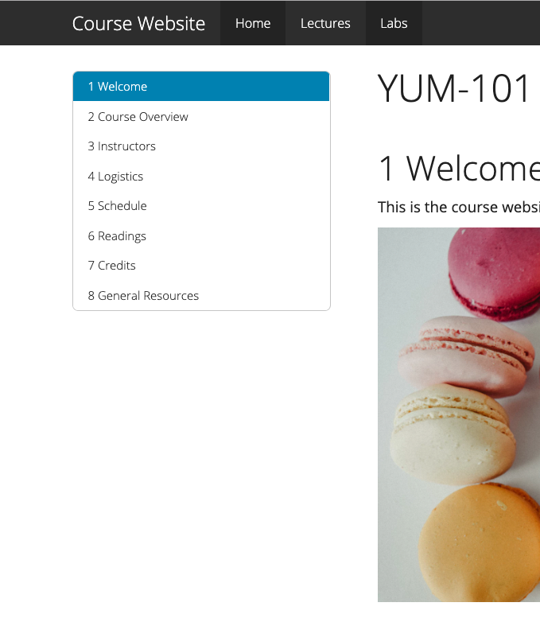

# Make it yours {#rmd-yours}

```{r, include = FALSE}
source("common.R")
knitr::opts_chunk$set(fig.align="center")
```


```{r, echo= FALSE}
knitr::include_graphics("images/illos/yours-rmd.jpg")
```


## Adding new pages {#add-rmd}

Adding new pages to your site means adding new `.Rmd` files to your site's project root directory. You can do this in RStudio using *File > New File > R Markdown*. Delete the default YAML except for the title and all text/code in the document, then edit away.

## Grow your navbar {#rmd-grow}

To make a new page actually findable from your site, you'll need to *also* make a change to navbar, which means opening up the `_site.yml` file and fiddling with it. To add another R Markdown link to your navbar, you need to know two things about the new page you want to add:

1. The **name you want to see** on the navbar for this page; this is the page's `text`.

1. The **name of the `.html` file** that corresponds to the `.Rmd` file you're adding; this is the page's `href`

Let's say we create a new file called `labs.Rmd`. We want to add the link to the rendered page `labs.html` to our upper navbar next to "Home" and "Lectures", so we would add the following to our YAML:

```{r echo = FALSE}
yml_empty() %>%
  yml_navbar(
    left = list(
      navbar_page("Home", href = "index.html"),
      navbar_page("Lectures", href = "lectures.html"),
      navbar_page("Labs", href = "labs.html")
    )) %>% 
  asis_yaml_output(fences = FALSE)
```

\

Save the changes to `_site.yml`, build, and preview to see the new page appear in the upper navbar.

<div class = side-by-side>
<div class = side1>

```{r echo = FALSE}
yml_empty() %>% 
  yml_site_opts(
    name = "YUM-101",
    output_dir =  "docs"
    ) %>% 
  yml_navbar(
    left = list(
      navbar_page("Home", href = "index.html"),
      navbar_page("Lectures", href = "lectures.html"),
      navbar_page("Labs", href = "labs.html")
    )) %>% 
  asis_yaml_output(fences = FALSE)
```

</div>

<div class= side2>


</div>
</div>

You may have noticed that in the YAML options we’ve looked at so far, `left:` has been one of the first things to go under `navbar:`. You can add all (or just some) of your links aligned to the right side of the navbar instead by using `right:`. 

```{r echo = FALSE}
yml_empty() %>% 
  yml_navbar(
    left = list(),
    right = list()
    ) %>% 
  asis_yaml_output(fences = FALSE)
```

\

If we added the page for `labs.Rmd` to the right of our navbar instead:
<div class = side-by-side>
<div class = side1>

```{r echo = FALSE}
yml_empty() %>% 
  yml_site_opts(
    name = "YUM-101",
    output_dir =  "docs"
    ) %>% 
  yml_navbar(
    left = list(
      navbar_page("Home", href = "index.html"),
      navbar_page("Lectures", href = "lectures.html")
    ),
    right = list(
      navbar_page("Labs", href = "labs.html")
    )) %>% 
  asis_yaml_output(fences = FALSE)
```

</div>

<div class= side2>

<!--todo: insert new screenshot here-->

</div>
</div>

