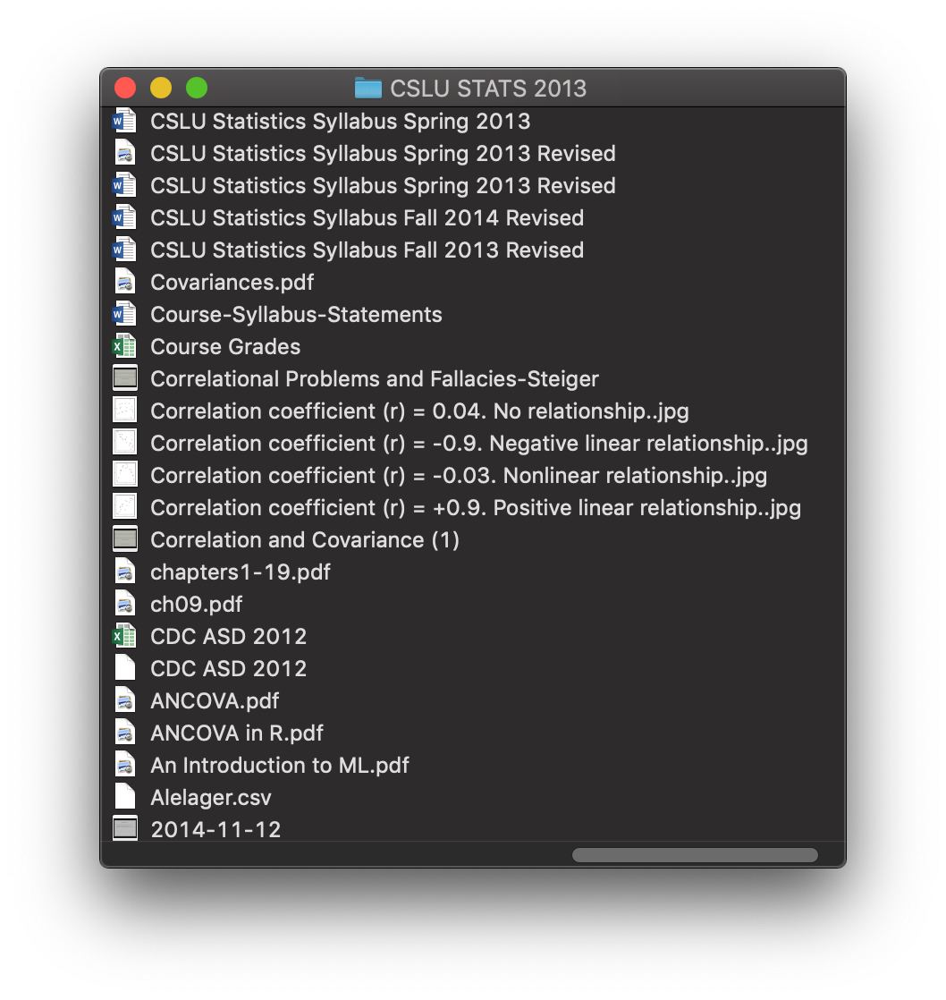
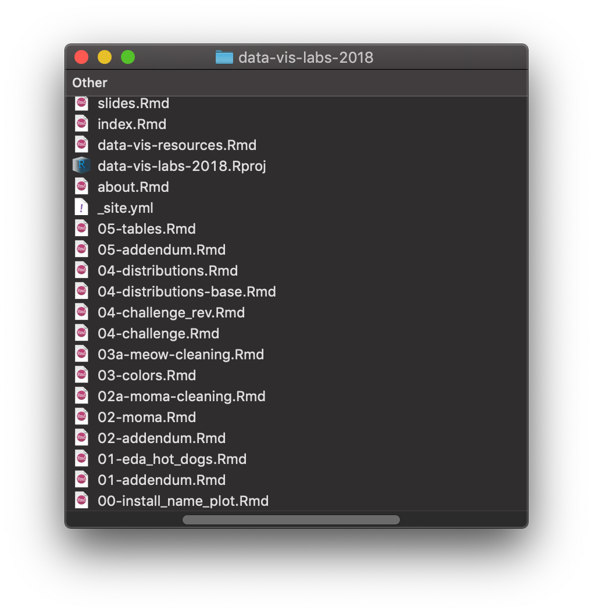

# Lessons 

```{r, include = FALSE}
source("common.R")
knitr::opts_chunk$set(fig.align="center")
```

{width="50%"}

Lessons lay at the heart of your teaching. But between where you start and where your learners end up, there is a lot of work. Foremost in your head at the start may be the delivery method, like whether you are preparing a workshop, a self-paced online tutorial, or an academic course. We want to offer you a different mindset, and that is to mentally separate your **content** from your **delivery**, i.e., what content is delivered is distinct from how it will be delivered. 

But first, a very brief history of "literate programming" (and why you are a literate programmer).

## A very brief history {#lit-history}

The concept of [**"literate programming"**](https://en.wikipedia.org/wiki/Literate_programming) was originally introduced by [Donald Knuth](http://www.literateprogramming.com/knuthweb.pdf) in 1984. In a nutshell, Knuth envisioned a new programming paradigm where computer scientists focus on weaving code together with text as documentation, with the aim of creating software programs as *"works of literature."*  

Knuth coined this new paradigm the `WEB` system, which you have probably never heard of! But lucky for all of us, Knuth took the important steps to *write down* and *publish* his vision for the `WEB`. By doing that, he inspired software developers to not only change their own mindset, but to change their toolsets too: they created tools to enable others to write literate programs. 

Then, some developers created tools to enable others to write **better** literate programs; they realized that it would make sense for users to write their narratives in a markup language made for authoring (such as [Markdown](https://daringfireball.net/projects/markdown/) or $LaTeX$). This advance made it easier and ultimately natural to use _real words_ in _full sentences_, instead of just adding comments to code. 

Now, take those mindset-changing tools, make them actually accessible to people *other than* software developers, and that is where we sit today. You are reading a book that was created by non-software-developers who wrote text in [Markdown](https://daringfireball.net/projects/markdown/) combined with [R code](https://cloud.r-project.org/) and:

+ bound together as a collection using the [`bookdown` package](https://bookdown.org/yihui/bookdown/), 
+ "knitted" in the comfort of our respective [RStudio IDEs](https://www.rstudio.com/products/rstudio/download/), 
+ shared on [GitHub](https://github.com/), 
+ built by [Travis-CI](https://travis-ci.com/), 
+ and published on [GitHub Pages](https://pages.github.com/). 

The toolchain may sound complicated at first, but this wasn't our first rodeo. We worked up to using and integrating all these tools, building up from the basics of literate programming using tools we *already knew*. Most importantly, each link in our toolchain has improved our collective quality of life as collaborators: 

1. We can share our ideas better with each other because we can see each others' ideas easier.

1. We can share our ideas better with each other because we can share our code easier. 

1. We can share our ideas better with everyone else because we can share our website easier.

Even if you only have one collaborator and that person is yourself, we think these payoffs will apply in your life as an educator. Certainly, the idea of applying literate programming principles to teaching programming is not new. Lots of well-respected educators have written But, we think that opening up literate programming toolkits for educators with specific use cases may be new- in our experience, the actual application of using literate programming tools.

The most fully-featured tool for literate programming in the R ecosystem is [R Markdown](https://rmarkdown.rstudio.com/). But, this is not a chapter about R Markdown (see the cookbooks later for those). This is a chapter to get you thinking about lesson development workflows, and how to design your own. Our goal is to arm you with information and intellectual fuel to want to apply literate programming principles to lesson-making, from lesson design to delivery. 


> "There is no telling what will happen if lots of other people catch `WEB` fever and start foisting their creations on each other."
>
> &mdash; Donald E. Knuth, Literate Programming, 1984 (edited by the authors)


<!--
Structure this section around (a) presentation, and (b) content; not on tools

where do you start? We don't think that should depend on the presentation. Whether you are developing an online tutorial, a workshop, or an academic course, you'll probably start with a schedule and a content outline. Most educators we know rely on a variety of tools at this stage, ranging from plain text editors to Google docs. Some start with R Markdown.

We won't provide specific tools recommendations for this stage, because there is really no right or wrong way to start- the most important thing is that you find a way to plan out loud *somewhere*.

No matter where you start though, at some point, if you'll be teaching R or teaching *with* R, you'll need R Markdown.

And at some point, probably sooner rather than later, you'll need GitHub. (provide bit of a pep talk here: You are more than your teaching materials. here are some things you can get out of putting your edu materials on GitHub.

Once you've gotten as far as using GitHub, you are _thisclose_ to also publishing your content with a shareable link. This, to us, is a critical step. Why do it? First for you. Second for learners. Third for the community. Fourth for your career and network.


present some sort of typology of lessons

Code

- read only 

- hands on (may be static or interactive0)

Narrative


- Code leads; narrative supports. The narrative follows or explains real-world code. This type of lesson may show a coding workflow, or a code worked example for "How to do X with Y"

- A story or a question drives the narrative; code supports. This will usually be a worked example or a series of. The narrative is writtento

is it: 

-a scene (zero story)
-an album (maybe some characters, theme)
-a story 
-->

## A very brief pep-talk {#pep-talk}

You may not need to hear this, because you may be reading this and already using R, RStudio, GitHub, and other advanced tooling for education. If so, kudos to you! You have grit and it shows `r emo::ji("tada")`. But, if you are not this kind of educator (yet!), please read on...

 but we encourage educators to step back for a moment, and think about the things that are hard about your current teaching workflow, and to reasonably weigh the pros and cons of adopting new tools and workflows. Let's start with a few "truths":

<div class="side-by-side">
<div class="side1">

```{r sad-course-screenshot, fig.cap="Still life of a sad course", echo = FALSE}

```

\

```{r happier-course-screenshot, fig.cap="Still life of a happier course", echo = FALSE}

```

</div>
<div class="side2">

1. Educators create a lot of files: 
    + outlines, 
    + slides, 
    + assignments, 
    + activities, 
    + scripts, 
    + data,
    + plots, 
    + images, 
    + screenshots, 
    + your 2015 taxes (kidding, sort of). 
    
    \
    
    The natural consequence of not having a workflow for organizing these files is "course chaos", otherwise known as content that is hard to update, share, and deliver (see Figure \@ref(fig:sad-course-screenshot)).
    
    \
    
    Contrast this with a happier setup (Figure \@ref(fig:happier-course-screenshot)), where you can find, edit, and remix/reuse/recycle your own code and words easily. The file structure pictured is from an R Markdown website, which leaves a lot to be desired in terms of file organization, but is often "good enough" to get the job done (and to improve the educator's quality of life *dramatically*).
    
    \
    
    \

1. You are more than your teaching materials.

    You may feel like "I can't simply put all my materials online! Will my students still come to class? Will my employer take them and leave me behind in the dust? Will other people steal my ideas?"
    
    \

1. Baby steps

    You don't need to use all the tools. But, be open to when opportunities arise that challenge your current skillset and provide an "excuse" to level up your skills.
</div>
</div>


    


## Literate lesson-making {#lit-make}

> "~~Programming~~ *Teaching* is a very personal activity, so I can’t be certain that what has worked for me will work for everybody."
>
> &mdash; Donald E. Knuth, Literate Programming, 1984 (edited by the authors)

Permission to educators who teach R or teach with R to consider themselves literate programmers. You are programming a lesson, however you end up delivering it. You could deliver a lesson any number of ways, but you are a literate programmer. For any given lesson, here are some "inputs" that you need to design around:

+ __Audience:__ who are your learners?

+ __Time:__ how long do you have with the learners? If you won't meet them in person (i.e., you are designing a ), this is trickier- you need to think about how long you can reasonably have their attention for.

+ __Scope:__ what are your learning objectives?

+ __Sequencing:__ in what order can you cover the things you need to meet your learners' goals?

+ __Medium:__ how will you deliver your lesson?

:::hat
If you would like pedagogical advice for how to plug in these inputs, and get a lesson out, there are many ways to get there but we recommend following [Greg Wilson's](http://third-bit.com/) advice for [*A Lesson Design Process*](https://teachtogether.tech/#s:process), from his book [__Teaching Tech Together__](https://teachtogether.tech).
:::

## Make it work

### Make it work for you

You know the rule for putting your own oxygen mask on first, before helping others? Same goes for lesson development. Whatever tool you choose to use, it should be one that works for you, first and foremost. If you hate working with X tool every time you open it, you'll hate working on your content period. And that is not a good place to be.


### Make it work for them


## Literate lesson-delivery {#lit-deliver}

involves letting your learners easily access, manipulate, and otherwise "play with" your learning content. You should think about when and how much play you want to encourage...

## Literate lesson-sharing {#lit-share}

put it all on github, yes
reasons:

1) for you- easier to work on
1) for you- lets you see holes
1) for them- lets them see your vision
1) for them- can reduce reliance on actual vision
1) for us- lets the community learn from you, even if they weren't the ones you designed the content for
1) for future you- lets you build a network, prof development


## Sample Rmds

```{r render-lab, include=FALSE}
demo_rmd <- here::here("static/moma-lab.Rmd")
demo_html <- here::here("static/moma-lab.html")
rerender_demo <- if (file.exists(demo_rmd) & file.exists(demo_html)) {
  file.info(demo_rmd)$mtime > file.info(demo_html)$mtime
} else TRUE
if (rerender_demo) {
  #callr::r(function(x) rmarkdown::render(x), args = list(demo_rmd))
  rmarkdown::render(demo_rmd)
}
```

[MoMA lab](static/moma-lab.html)
<div class="iframe-container" style="height: 50vh;">
<iframe width="1024" height="768" src="static/moma-lab.html" style="-webkit-transform:scale(0.75);-moz-transform-scale(0.75);"></iframe>
</div>

```{r render-workshop, include=FALSE}
demo_rmd <- here::here("static/nhanes-workshop.Rmd")
demo_html <- here::here("static/nhanes-workshop.html")
rerender_demo <- if (file.exists(demo_rmd) & file.exists(demo_html)) {
  file.info(demo_rmd)$mtime > file.info(demo_html)$mtime
} else TRUE
if (rerender_demo) {
  #callr::r(function(x) rmarkdown::render(x), args = list(demo_rmd))
  rmarkdown::render(demo_rmd)
}
```

[NHANES workshop](static/nhanes-workshop.html)
<div class="iframe-container" style="height: 50vh;">
<iframe width="1024" height="768" src="static/nhanes-workshop.html" style="-webkit-transform:scale(0.75);-moz-transform-scale(0.75);"></iframe>
</div>


## Sharing 


### Share source code

+ first, know the knitr code chunk options, and remember about code folding.

+ GitHub to view source (but not very readable, see next section)

- [ ] [code download](https://rmarkdown-docs.netlify.com/reference/html_document.html)

### Share readable output

+ .R -> GitHub

  ```yaml
  #' ---
  #' output: github_document
  #' ---
  ```

  + https://github.com/apreshill/teachthat/blob/master/gather/make-data-to-gather.R
  
What if you just want to keep things really simple? Try github_document as the output of a regular R script. This will create an `.md` version of whatever code and output you have, and it will be rendered in a nice, readable way without you having to mess with GitHub pages or HTML directly, etc. See an example of what I mean below:

[Start with .R script...](https://github.com/apreshill/teachthat/blob/master/gather/make-data-to-gather.R) and [...end with a GitHub document](https://github.com/apreshill/teachthat/blob/master/gather/make-data-to-gather.md)

```{r, echo = FALSE}
side_by_side("images/gather-R.png",50,"images/gather-gitdoc.png", 50)
```


+ Rmd -> GitHub

   + https://rmarkdown.rstudio.com/docs/reference/github_document.html
   + https://github.com/jennybc/lotr-tidy

+ GitHub + ghpages

Can also export to pdf as attachments
      
   

## Lesson delivery & sharing

When it comes to presenting your lesson, here are some things to consider and tool recommendations for different lesson delivery methods.

### Live coding

+ Start with R Markdown
+ Disable all custom RStudio color themes and fonts
+ Keycastr
+ In case of catastrophe, test out [Loom](https://www.loom.com/)

### Screencast

+ getkap, Quicktime
+ Start with R Markdown
+ Keycastr
+ web hosting

### Online tutorials

+ web hosting
+ html widgets like plotly, highchartr, etc.
+ learnr tutorials

### Remote workshops & webinars

+ Zoom with break-out chat rooms
+ Google docs