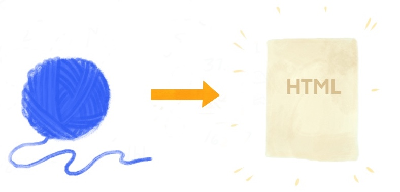

# Lessons 

```{r, include = FALSE}
source("common.R")
```


think about throwing something up in R/R Markdown for learners, here are some considerations

(a) I want them to 
(a) handouts (to html)
(b) stuff they can read/review (to html)
(c) stuff they need to interact with (learnr/ggplotly)
(d) stuff they can run code in themselves and enter (add code here worksheets)

## Introduction {-#intro-lessons}

In this section, we will walk through some of the options educators have for developing and revising lessons to deliver to learners. One of the first decisions you'll need to make is how you want to deliver your content: can it be a simple R script with minimal comments? Or do your learners need more narrative? 

The good news is this: you *can* go back and forth between the two formats. So even if you pick one then change your mind, you can get back.

Note: not teaching others *how to use* R Markdown, but teaching yourself tips/tricks for how to teach others *with* R Markdown.

This will be for static edu materials (as opposed to interactive- i.e., learnR)

## R scripts

## Do you need R Markdown?

R Markdown files allow you to blend code, output (like results and plots), and prose together in a single document that can be easily reproduced (by you and by others) and shared. This makes R Markdown an ideal tool for educators to develop lessons, and for learners to engage with those lessons. However, if you already using GitHub (and we hope you are!), you should know that you can make your scripts browseable as rendered "notebooks"...(TODO)

:::rstudio-tip
[R Markdown](https://rmarkdown.rstudio.com/docs/) is an R package that is already installed and loaded when you use the RStudio IDE. The workhorses "under the hood" of R Markdown, the `knitr` package and pandoc, are also pre-installed and loaded for you. You don't have to explicitly install or load any of these tools to use them from within the RStudio IDE.
:::

So, do you need R Markdown? Maybe not. If you prefer working with and sharing .R scripts and you are using GitHub, we think that using `knitr::spin()` can get you pretty far.

But you have a lot of flexibility if you do choose to use R Markdown to start with, and the following chapters will delve into some of the bells and whistles that we think make R Markdown worth it in the short- and long-run for educators.


## Knit to HTML

<center>{width=60%}</center>


The [R Markdown package](https://rmarkdown.rstudio.com/docs/) has a number of built-in ["output formats"](https://rmarkdown.rstudio.com/docs/reference/index.html#section-output-formats), which means that a single .Rmd document can be "knit" into a bunch of different output file types like HTML, PDF, and even Word documents.

For educators, we strongly encourage using the default HTML output format for three reasons:

1. __Shareability__- HTML output can be easily shared with links, especially if you are using GitHub.

1. __Flexibility__- .Rmd files output to HTML can be organized easily into larger educational projects using R Markdown extension packages like `bookdown` and `blogdown` (see later chapters).

1. __Styleability__- Each R Markdown output format has its own output styling options. The [options](https://rmarkdown.rstudio.com/docs/reference/html_document.html) for the HTML output format are by far the most fully featured and easily accessible, relying on no additional software installation.

1. __Customizability__- All HTML output can be further customized using CSS. The bad news is that you will need to learn a bit about CSS to get there (see our crash course), but the good news is that if you are the kind of educator that needs to, for example, use a specific branded style guide that specifies colors, fonts, etc., you *can* make your HTML output look "on brand" with a custom CSS.

## Style your HTML output

For any given R Markdown [output formats](https://rmarkdown.rstudio.com/docs/reference/index.html#section-output-formats), there are default styling options. These defaults can also be overriden using your .Rmd's YAML metadata header, which is an optional block at the top of your .Rmd file between the two `---`, like this:

```yaml
---
title: "Lab 01"
author: Anya Academic
output: html_document
---
```


?rmarkdown::html_document
```{r tidy=FALSE, printr.help.sections='usage', comment=''}
library(printr)
?rmarkdown::html_document
```

HTML output options like floating toc, numbering, code folding, code download (requires theme)

- [ ] [tabsets](https://bookdown.org/yihui/rmarkdown/html-document.html#tabbed-sections)
         - think about good use cases
- [ ] [dropdown in tabsets](https://github.com/rstudio/rmarkdown/pull/1405)
- [ ] [code folding](https://rmarkdown-docs.netlify.com/reference/html_document.html)
- [ ] spacing with `<br>`
- [ ] highlight
- [ ] themes (plus `type: inverse`) 
- [ ] [toc / toc floating](https://rmarkdown-docs.netlify.com/reference/html_document.html) 

- [breadcrumbs](https://bootswatch.com/flatly/)

## R Markdown in practice

examples:

+ https://bbc.github.io/rcookbook/


## R Markdown Workflows

+ Using RStudio projects (why)
    + https://www.tidyverse.org/articles/2017/12/workflow-vs-script/
    + in RStudio, from git adds .gitignore for you
    + try alfred app: https://twitter.com/hadleywickham/status/968624630276804608?lang=en
+ file paths using `here::here()`
    + https://malco.io/2018/11/05/why-should-i-use-the-here-package/
+ working html output- use xaringan::inf_moon_reader to render

## Design for teaching

The aesthetic design of your lessons can make the difference between learners ...

### Formatting text

All plain text (that is, text that is not code) is formatted using markdown. Markdown is...

### Formatting code

All code in an R Markdown document is processed by the `knitr` package. Code is entered in one of two ways:

+ Code chunks ()
+ Inline code so `r `

The way that code chunks appear in your output are controlled by [`knitr` chunk options](https://yihui.name/knitr/options/). These options give you extremely granular control over your code chunk output, but there are a few key patterns of code chunk options that are especially useful in the education context.

High-level important ideas:

#### Know the defaults

Print them here

make a table with cols- pattern / why / chunk option(s):
- show results / hide code --> `echo=FALSE`
- show code / hide results --> `results='hide'`
- show code / hide plots --> `fig.show='hide'`
- hide everything --> `include=FALSE`

```{r}
library(tidyverse)
library(kableExtra)
chunks <- tribble(~pattern, ~use, ~option, 
                      "show results / hide code", "teach concepts, not code", "`echo=FALSE`",
                      "show code / hide results", "teach code", "`results='hide'`", 
                      "show code / hide plots", "teach code", "`fig.show='hide'`",
                      "hide everything", "use code for ", "`include=FALSE`")

chunks %>%
  kable("html", escape = FALSE) %>% 
  kable_styling(bootstrap_options = c("hover", "condensed")) 
```

1. know the default chunk options
1. know how to use a setup chunk to change those for the whole document
1. know that you can also just override for individual chunks

Maybe include a table

#### Use a setup chunk

You can explicitly set your own chunk options for the whole document at the top of your .Rmd, using `knitr::opts_chunk$set()`. Inside the parentheses, list the chunk option on the left `=` a new default value on the right. Each chunk option is separated by a comma. The chunk option for the setup chunk itself is typically `include=FALSE` so that no one sees it but you.

````
```{r, setup, include=FALSE}`r ''`
knitr::opts_chunk$set(fig.width = 8, collapse = TRUE)
```
````

Due to `knitr`'s default rules around chunk names, you can only have 

### Images

#### Markdown 
{width=50%} {width=50%}

#### `knitr`

include_graphics gives you figure captions

can also play with out.width

labeling chunks

## Extra packages

demoR

countdown

klippy

## Sample Rmds

```{r render-lab, include=FALSE}
demo_rmd <- here::here("static/moma-lab.Rmd")
demo_html <- here::here("static/moma-lab.html")
rerender_demo <- if (file.exists(demo_rmd) & file.exists(demo_html)) {
  file.info(demo_rmd)$mtime > file.info(demo_html)$mtime
} else TRUE
if (rerender_demo) {
  #callr::r(function(x) rmarkdown::render(x), args = list(demo_rmd))
  rmarkdown::render(demo_rmd)
}
```

[MoMA lab](static/moma-lab.html)
<div class="iframe-container" style="height: 50vh;">
<iframe width="1024" height="768" src="static/moma-lab.html" style="-webkit-transform:scale(0.75);-moz-transform-scale(0.75);"></iframe>
</div>

```{r render-workshop, include=FALSE}
demo_rmd <- here::here("static/nhanes-workshop.Rmd")
demo_html <- here::here("static/nhanes-workshop.html")
rerender_demo <- if (file.exists(demo_rmd) & file.exists(demo_html)) {
  file.info(demo_rmd)$mtime > file.info(demo_html)$mtime
} else TRUE
if (rerender_demo) {
  #callr::r(function(x) rmarkdown::render(x), args = list(demo_rmd))
  rmarkdown::render(demo_rmd)
}
```

[NHANES workshop](static/nhanes-workshop.html)
<div class="iframe-container" style="height: 50vh;">
<iframe width="1024" height="768" src="static/nhanes-workshop.html" style="-webkit-transform:scale(0.75);-moz-transform-scale(0.75);"></iframe>
</div>


## Sharing 


### Share source code

+ first, know the knitr code chunk options, and remember about code folding.

+ GitHub to view source (but not very readable, see next section)

- [ ] [code download](https://rmarkdown-docs.netlify.com/reference/html_document.html)

### Share readable output

+ .R -> GitHub

  ```yaml
  #' ---
  #' output: github_document
  #' ---
  ```

  + https://github.com/apreshill/teachthat/blob/master/gather/make-data-to-gather.R
  
What if you just want to keep things really simple? Try github_document as the output of a regular R script. This will create an `.md` version of whatever code and output you have, and it will be rendered in a nice, readable way without you having to mess with GitHub pages or HTML directly, etc. See an example of what I mean below:

[Start with .R script...](https://github.com/apreshill/teachthat/blob/master/gather/make-data-to-gather.R) and [...end with a GitHub document](https://github.com/apreshill/teachthat/blob/master/gather/make-data-to-gather.md)

```{r, echo = FALSE}
side_by_side("images/gather-R.png",50,"images/gather-gitdoc.png", 50)
```


+ Rmd -> GitHub

   + https://rmarkdown.rstudio.com/docs/reference/github_document.html
   + https://github.com/jennybc/lotr-tidy

+ GitHub + ghpages

Can also export to pdf as attachments
      
   
## Troubleshooting

[Mine's troubleshooting tips:](https://mine-cetinkaya-rundel.github.io/teach-data-sci-icots2018/01-03-rmarkdown/01-03-rmarkdown.html#30)


+ Make sure RStudio and the rmarkdown package (and its dependencies) are up-to-date.

+ Set a global option for error = TRUE (or for a given chunk) so that your document renders even when there are errors.

+ Don’t try to change working directory within an R Markdown document. (If you do still decide to use setwd in a code chunk, beware that the new working directory will only apply to that specific code chunk, and any following code chunks will revert back to use the original working directory.)

Also see: 

+ https://rmd4sci.njtierney.com/common-problems-with-rmarkdown-and-some-solutions.html
+ https://happygitwithr.com/rmd-test-drive.html#rmd-troubleshooting
+ switch latex engines (do a screenshot here)
+ consider printing out your `sessionInfo()` [for pro-level, use DT]

```{r}
DT::datatable(devtools::session_info()$packages)
```

